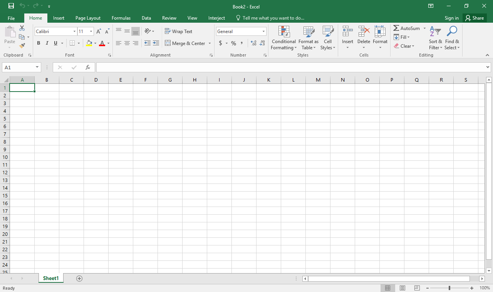
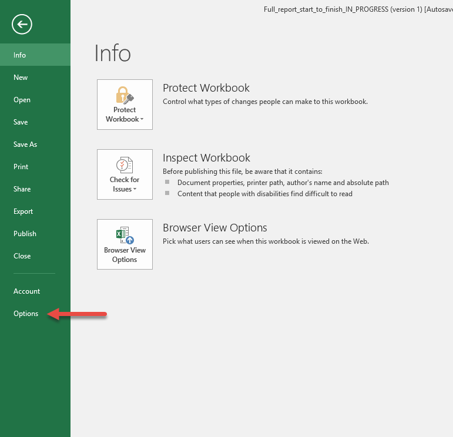
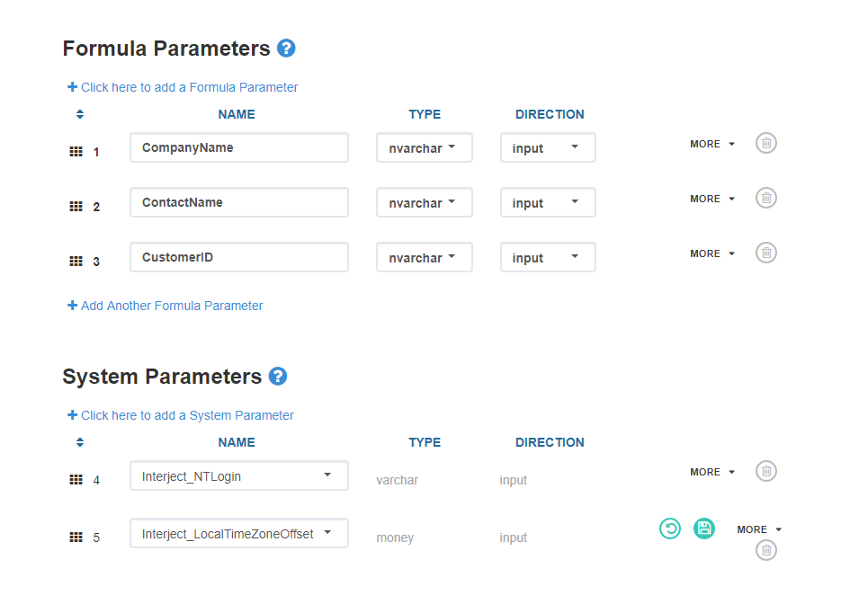
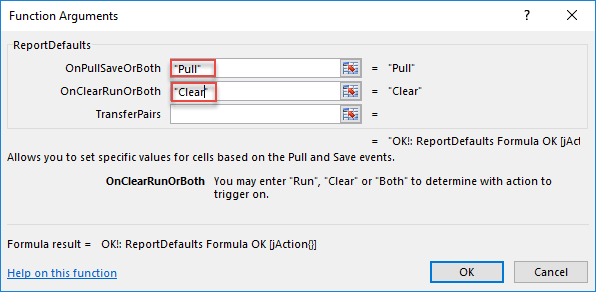
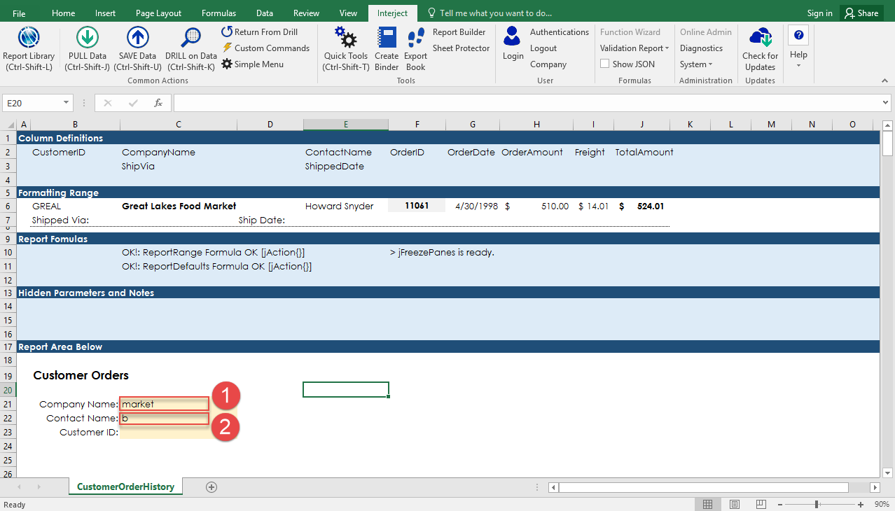
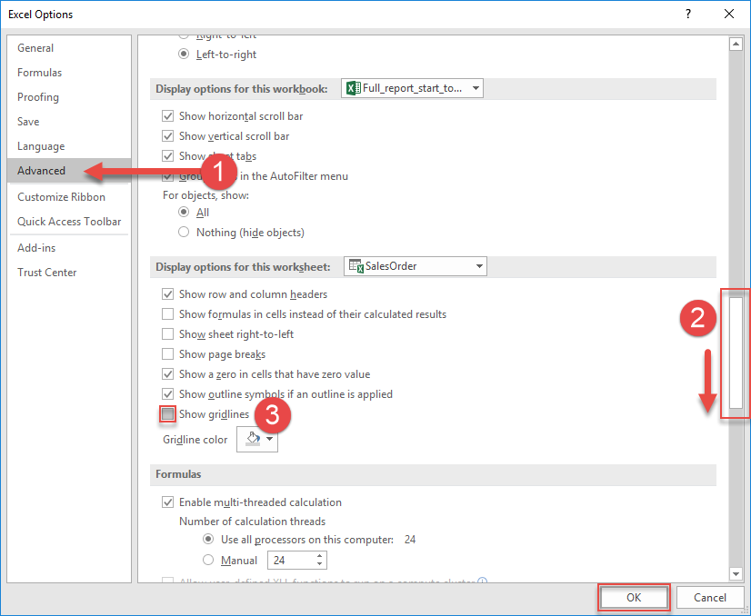

### Introduction

This is a detailed walkthrough lab that will teach you how to start from a blank Excel sheet and create a complete, functional INTERJECT report, building each component from the ground up, the way you might in some specific business use-cases.

In this lab, you will learn how to:
<!-- * Format a report to INTERJECT standards. -->
* Write some common INTERJECT report formulas and learn about how they work.
* Set up backend Data Connections and Data Portals in the INTERJECT portal website.
* Write the SQL that is the backbone for a data pull.

This lab is geared toward beginners, and expects that you have little to no prior experience with both INTERJECT and Excel. The only expectation is a basic understanding of SQL Server stored procedures and SELECT statements, but if you do not have this knowledge, resources will be provided that you can use to educate yourself before delving into the SQL portion of the lab. The goal of the lab is for you to quickly build your first functional INTERJECT report from scratch so that you can see how all the major components work together to create an INTERJECT report.

There is a more comprehensive version of this lab available [here](), which includes much more spreadsheet formatting and more detailed explanations of the INTERJECT formulas used, Data Connections and Portals, and etc. The comprehensive version is longer and better for one to sit down and study if they would like to understand the process of creating a report in-depth, while this version is slimmer, quicker, and may be easier to follow if you only want to know *how* to do everything necessary.

You will learn how to use the following INTERJECT report formulas in this lab:

* [ReportRange()]()
* [ReportDrill]()
* [ReportDefaults]()
* [jFreezePanes]()
* [jFocus]()

### SQL Server resources

While it will be helpful for you to have a basic understanding of SQL for this lab, it is not strictly required, and you can skip these most of these articles (you must follow the steps to create a Northwind database, however) and just copy-paste the SQL stored procedure that will be used in this lab. However, you will get the most out of this lab if you at least understand what SQL SELECT statements and stored procedures do.

**What is SQL Server?** - [Here](http://www.sqlservertutorial.net/getting-started/what-is-sql-server/) is an article from sqlservertutorial.net explaining what SQL Server is, how is works, what it is built on, and a little bit of its history.

The two fundamental concepts that you will need for this walkthrough are SQL SELECT statements and SQL stored procedures.

**The SQL SELECT statement**
1. [Here](http://www.sqlservertutorial.net/sql-server-basics/sql-server-select/) is an example from sqlservertutorial.net explaining the structure of the SELECT statement and how it is executed by SQL. It also shows examples of how to write common SELECT statements.
2. [Here](https://www.techonthenet.com/sql_server/select.php) is an article from techonthenet.com explaining the SELECT statement and how to use is, including all additional clauses that can be added to SELECT.

**SQL stored procedures**
1. [Here](https://www.essentialsql.com/what-is-a-stored-procedure/) is an article from essentialsql.com on what a stored procedure is, why they are used, and how they can be used. It is a higher-level overview.
2. [Here](http://www.sqlservertutorial.net/sql-server-stored-procedures/basic-sql-server-stored-procedures/) is a tutorial from sqlservertutorial.net showing how to write basic stored procedures, explaining the structure and syntax of stored procedure creation and how to execute stored procedures.

**Create a Northwind sample database (you will write a stored procedure in this database later on)** -
To create a Northwind sample database in an existing database instance (this can just be your local computer), follow these steps:
1. [Download SQL Server](https://www.microsoft.com/en-us/sql-server/sql-server-downloads).
2. [Download SQL Server Management Studio (SSMS)](https://docs.microsoft.com/en-us/sql/ssms/download-sql-server-management-studio-ssms?view=sql-server-2017) or another SQL editor.
3. [Connect to SQL Server in SSMS](http://www.sqlservertutorial.net/connect-to-the-sql-server/).
4. Duplicate the Northwind database in your database by clicking on [the Github link](http://www.sqlservertutorial.net/sql-server-stored-procedures/basic-sql-server-stored-procedures/), clicking on "View raw," then copying pasting the entire CREATE DATABASE script into a new query window in SSMS. Run the query, and you should have your own Northwind database.


<!-- ### What is an INTERJECT Report?

The first thing to work on in this lab is building the front-facing INTERJECT report in Excel, but first, let’s define what an INTERJECT *report* is.

An INTERJECT report is a spreadsheet-based interface to data, designed for analysis, exploration, or manipulation of metrics in almost any form or arrangement.

Reports are more than just a spreadsheet, however. The spreadsheet is the front-end interface that INTERJECT uses to allow end users to interact with their data in a familiar, intuitive environment. Behind the spreadsheet, the INTERJECT formulas on a given report connect to **Data Portals** which serve as the definition of how you wish to interact with your database (what data you want to retrieve and/or store). Data Portals then connect to **Data Connections**, which serve as a way for INTERJECT to remember how to connect to your data source, and using this information, INTERJECT can then connect to the database data API itself.


Reports are more than just an Excel spreadsheet, however. Excel is the front-end interface that INTERJECT uses to allow end users to interact with their data in a familiar, intuitive environment. Behind Excel, the INTERJECT formulas on a given report connect to **Data Portals** which serve as the definition for how you wish to interact with your database (what data you want to retrieve and/or store). Data Portals then connect to Data Connections, which serve as a way for INTERJECT to remember how to connect to your data source, and in turn, connect to a database on a physical server or to a data API (the data source itself). -->

### Introducing the CustomerOrderHistory Report

In this lab, we will create 2 reports. The first, CustomerOrderHistory, will be used to demonstrate creating a summary report that shows a list of summarized information about past customer orders, i.e. a historical record of customer orders.

Here is how the final CustomerOrderHistory report will look to the end user, populated with data.


As you can see, in cells **C21-C23**, the user has the option to enter **Filter** arguments. We entered “market” into the **Company Name** filter, which limits the result set that is returned to records which contain the partial string “market” in their CompanyName attribute.

<!-- Filters can be useful in many different types of reports to search and extract specific data from the data set that you’re connecting to. -->

Filters work in INTERJECT reports by using a SQL Server LIKE operator inside the WHERE clause of the query that the report data is being sourced from.

We will start the lab by creating and doing some of the basic formatting for the CustomerOrderHistory report.

### CustomerOrderHistory - Introducing the Worksheet Definitions Area

INTERJECT reports have a sort of “behind the scenes” section at the top of each worksheet where hidden formatting, INTERJECT formula definitions, and column definitions (definitions of which pieces of data to pull in from the data source) are kept. This area is colored differently from the rest of the report, given titles for each section, and then hidden from the end user using Excel’s Freeze Panes option. While this section is typically hidden from the end user, those who build reports will spend much of their time configuring the worksheet functionality in this section. Once we unhide the section by [**unfreezing the panes**](), this is what the report looks like.


#### INTERJECT Report Formulas
Report formulas are INTERJECTs way of providing fine-grain control to report creators. Report formulas work the same way as general Excel formulas, but they are specific to INTERJECT report actions. Report formulas do everything from controlling the look of the Excel sheet by allowing formatting to be programmed to populating data into the spreadsheet and extracting it from the spreadsheet back to the database.

Many INTERJECT report formulas use the Worksheet Definitions Section to find the information that they need in order to perform their actions. For example, report formulas that populate data in the spreadsheet use an area of the Worksheet Definitions Section called the Column Definitions in order to tell which data to to place in which column of the spreadsheet.

The worksheet definitions section is broken up into the subsections titled and colored dark blue at the top of the report, as shown above. The last title at the bottom names the Report Area, which is the final product report that end users will see. The subsections are each defined as follows:

**Column Definitions:** This section defines the names of the columns, or attributes, that the data source will return, and also defines where those attributes should be placed in the report. The columns where attributes are placed in the Column Definitions section will match where they get placed in the worksheet.


**Formatting Range:** The Formatting Range is a feature that allows you to define the formatting of the data in your Report Area in one place without repetition. It works similarly to how the Column Definitions section works, by copying the formatting applied to its cells down to the Report Area for each record that is pulled in from the data source.

<!-- You can define your formatting by simply formatting the cells in the formatting range, then this formatting will be applied to the attributes in the Column Definitions, when they are pulled into the report. A Formatting Range is only necessary for INTERJECT reports wherein you are pulling multi-row data records into your report, but we will speak more on this later. Note that our Formatting Range here has sample data that matches the data type of the attribute in its Column Definition above. -->


**Report Formulas:** This section is used to define the INTERJECT report formulas that will be in action to make your report behave the way you are aiming for. To add a report formula, simply start typing = and the name of the formula. Labels can be added in cells adjacent to cells containing report formulas to help describe what each formula is doing, as shown below.


**Hidden Parameters and Notes:** This section is optional on most reports. It is used as a place to give a brief description of the use case or functionality of a report, and to add Filter Parameters to the report that should always be there (and in turn should be hidden from users so they cannot modify them).


### CustomerOrderHistory - Creating the Worksheet Definitions Area

This section shows how to create the report definitions area.

**Step 1:** Open a blank Excel workbook.

Open Excel on your computer.


Once Excel is open, choose **Blank Workbook**.


Now, you should have a blank Excel workbook that looks like the following:



**Step 2:** Add titles to the worksheet definitions subsections.

Select row 1 and color it dark blue (#1F4E78). This is a common cell color that INTERJECT uses for report definition subsection titles, but you can customize it as you wish.

1. Click on the “1” that denotes row 1 to highlight the entire row.
2. Click the paint bucket to fill the color.
3. Choose the darkest blue in the first blue column (#1F4E78).


For this report, we will need 5 different titled sections. Now that you have the color selected in your paint bucket, simply click on every other row and then click on the paint bucket until you have 5 dark blue rows with blank white rows in between them.

1. Click on **row 3, 5, 7, or 9** to highlight it.
2. Click on the paint bucket.
3. Repeat steps 1-2 for **rows 3, 5, 7, and 9**.


Now, add the titles.

1. Enter **Column Definitions** in cell **A1**.
2. Select **White** from the **Font Color** selector.
3. Select **Bold**.


Now enter the names **Formatting Range** in cell **A3**, **Report Formulas** in cell **A5**, **Hidden Parameters and Notes** in cell **A7**, and **Report Area Below** in cell **A9** in the next 4 title rows. Don’t worry about the formatting of these 4 for now.


Next, use the format painter to copy the formatting of the first title to the remaining 4.

1. Select **row 1**.
2. Click the **format painter** paintbrush icon.
3. Click **row 3, 5, 7, or 9**.
4. Repeat steps 1-3 for **rows 3, 5, 7 and 9.**


**Step 3:** Format the subsections.

Start by adding more space under each section. Copy two empty rows from somewhere in the sheet.

1. Click on the first row out of the two you will copy (here, **row 12**).
2. Hold down CTRL and click the row under the first one you selected (here, **row 13**)
3. Press CTRL + C to copy both rows.


Paste them above row 2.

1. Right-click on row 2.
2. Select **Insert Copied Cells**.


Repeat the above 2 steps by copy-pasting 2 more rows under each title so that your report looks as follows.


Apply light blue color under each titled section.

1. Select the 3 rows under Column Definitions.
2. Click the paint bucket.
3. Select the lightest blue color in the first blue column (#DDEBF7).


<!-- is this sufficient instruction?  : -->
Now, you can use the Excel format painter feature to apply the same light blue color applied to the first title section to the remaining 4.

1. Select **cell 6-8, 10-12, or 14-16**.
2. Click on the paint bucket icon (do not click the dropdown list part of the button) to copy the color previously used into the block of cells.
3. Repeat steps 1-2 for **cells 6-8, 10-12, and 14-16**.

<!-- add the finished result of adding light blue to all these columns -->


### Setting the Freeze Panes

jFreezePanes() is an INTERJECT formatting function that takes advantage of the Excel native Freeze/Unfreeze panes option, and it can be executed in the Quick Tools menu. The jFreezePanes() function allows us to specify:
* Which worksheets in a workbook will be frozen (whichever worksheets have the jFreezePanes() function in their Report Formulas section) when "Freeze/unfreeze panes" is run in Excel.
* *Where* to freeze the panes in the workbook (which cells will be frozen at the top of the sheet and which will be hidden when panes are frozen). [Read more about jFreezePanes() here](https://docs.gointerject.com/wIndex/jFreezePanes.html).

INTERJECT uses freeze panes on its reports to:
* Contain and hide the **report definitions section**. It is hidden to ensure that end users are not confused with details that they do not need to see.
* Keep a header with column titles and a report title visible to the user as they scroll through report data.

**Step 1:** Add the formula to the sheet.

Type “=jFreezePanes()” in cell **F10**.


**Step 2:** Set the freeze panes at the correct location.

There are two formula arguments for jFreezePanes(), **FreezePanesCell** and **AnchorViewCell**. AnchorViewCell specifies the very top row that will be visible when the panes are frozen. The cells above AnchorViewCell will be hidden when the panes are frozen. The cells between AnchorViewCell and FreezePanesCell will become a frozen block of cells that are anchored to the top of the sheet as the user scrolls down through the report.

Click on the function builder icon to open it.


In the input box for **FreezePanesCell**, type **A26**.


For **AnchorViewCell**, type **A18**.


**Step 3:** Try freezing the panes to see how it works.

1. Press and hold **CTRL + SHIFT + T** OR click on the **Quick Tools** option in the INTERJECT ribbon to open the Quick Tools menu.
2. Select **Freeze/Unfreeze Panes (current tab)** and press **Enter**, or click **Freeze/Unfreeze Panes (current tab)**.


Your report should now look like the following. The sectioned off block from rows 18-25 (ends at highlighted line) is the frozen pane section that will stay at the top as you scroll down. This is where the header with the name of the report and filter parameters will go later. The cells above row 18, which contain the report definitions area, are hidden.


Now that the freeze panes is set up, formatting the spreadsheet is the next step in creating the CustomerOrderHistory report.

### Formatting the Report Area

**Step 1:** Add the report title.

1. Type **Customer Orders** into cell **B19** then **select the text** you just entered.
2. Select the **Bold** option.
3. Type **14** into the text size input field.


**Step 2:** Add input fields for the filter parameters.

Report filter parameters are a way for the report user to restrict the dataset being pulled into the report from the data portal by specifying a set of characters that the pulled in data records must contain. You will start by labeling the filter input areas, where the user can input their filter text. Labeling the filters is important so that the user understands where they can type in the report and have it impact what data is returned.

In cells **B21, B22 and B23**, respectively, type in: **“Company Name:”**, **“Contact Name:”**, and **“Customer ID:”**


Now, resize column A to be smaller, and extend column B and C by a bit. This will give the user more space to enter their input text.

1. Drag column A back.
2. Drag column B forward.
3. Drag column C forward.


Color the input fields for the report filters. Apply the lightest orange color () to cells **C21, C22 and C23**:


<!-- Should this be included? -->
**Step 3:** Make the spreadsheet look better by removing the gridlines in Excel.

Go to the **File** tab in Excel:


Go to **Options**:



1. Go to the **Advanced** tab.
2. Scroll down until you see **“Display options for this worksheet”**.
3. **Uncheck** the **“Show gridlines”** checkbox.


Now there should be no gridlines on the current worksheet.

**Step 4:** Give the worksheet a name and delete any other worksheets you may have in the current workbook.

Right-click on the first sheet’s title and select **Rename**.


Type in **CustomerOrderHistory**.


Right-click on any other sheets that you have in the workbook and select **Delete**.


<!-- This whole section needs to be moved -->
### Adding ReportRange() to the Report

ReportRange() is a report formula used to PULL data into a defined *range* of a report from a Data Portal. ReportRange() can be used with formatting to format the data returned from the Data Portal into the spreadsheet. Read more about ReportRange() [here](https://docs.gointerject.com/wIndex/ReportRange.html#function-summary).

**Step 1:** Add the formula to the report.

1. Type **=ReportRange()** in cell **C10**.
2. Click on the function builder icon.


**Step 2:** Specify the Data Portal that ReportRange() will pull data from.

As you can see, **DataPortal** is the first parameter that you must provide to ReportRange() so that it knows where to pull in the data from.

1. Type **NorthwindCustomerOrders_MyName** into the DataPortal parameter box.
2. Press **OK**.


You will now switch to configuring an INTERJECT Data Connection, and a Data Portal that will together make up the datasource for ReportRange().

You will fill in the rest of the ReportRange() parameters once the Data Portal and Connection are both set up.

### Setting Up the Data Connection

<!-- Edit these sections after moving "### Adding ReportRange()" -->
In order to continue, you need to set up the back-end Data Portal that ReportRange() will be using. For now, pause working on the front-end Excel report to configure the Data Portal and Data Connection that ReportRange() will use in the report.

Start by creating the Data Connection. INTERJECT Data Connections enable users to connect to a database in order to pull data out of that database based on criteria specified in stored procedures which are set up in the database and accessed with Data Portals. An overview of Data Connections and Data Portals can be found [here](https://docs.gointerject.com/wPortal/The-INTERJECT-Website-Portal.html#overview).

**Step 1:** Log in to the INTERJECT portal site.

Navigate to the portal site [here](https://portal.gointerject.com/).

1. Type in your email.
2. Type in your password.
3. Press the **LOGIN** button.


**Step 2:** Create a new INTERJECT Data Connection.

Click on the **New Connection** button.


**Step 3:** Fill in the connection details.

1. Type the name of your connection (**NorthwindDB_MyName** with your name substituted for "MyName" is recommended) into the **Name** field.
2.  Add a short description in the **Description** field.


Select database as your connection type.

1. Under **Connection Type**, click the small triable to show the options.
2. Select **Database** from the dropdown list for **Connection Type**.


Enter the connection string for your Northwind database.

<!-- Change this to a ref link to the top of the page where sql resources are listed? -->
For the connection string, you must already have your own sample Northwind database to use. You can download a Northwind sample database from Microsoft [here](https://docs.microsoft.com/en-us/dotnet/framework/data/adonet/sql/linq/downloading-sample-databases).

1. Substitute in your server and database name in italicized parts (*MyServerAddress* and *MyDatabaseName*) of the following sample connection string:

  **”Server=*MyServerAddress*;Database=*MyDatabaseName*;Trusted_Connection=True;”**

2. Once you have your connection string entered, press Save to continue.


### Setting Up the Data Portal

<!-- Move this description to the intro? -->
Data Portals are provided as a way to connect to specific stored procedures within an already existing Data Connection which connects directly to the database. Data Portals provide a finer-grain level of control, and connect to a single stored procedure on the database. You can have multiple Data Portals connected to one Data Connection, but not vice-versa. For more, see [the website portal documentation](https://docs.gointerject.com/wPortal/The-INTERJECT-Website-Portal.html#-data-connections-).

**Step 1:** Create the Data Portal.

Navigate again to [the portal site](https://portal.gointerject.com/) and choose Data Portals.


Create a new data portal by clicking the **NEW DATA PORTAL** button.


**Step 2:** Edit the data portal details.

1. Enter a name for your Data Portal (**”NorthwindCustomerOrders_MyName”** with your name substituted in for MyName) in the **Name** field.
2. Enter a brief description in the **Description** field.


<!-- This will need to change -->
For the **Connection**, use the Data Connection you created in the last section, **NorthwindDB_YourName**. It should appear in the dropdown list when clicked.

1. Expand the dropdown menu under **Connection**.
2. Select your database, **NorthwindDB_YourName**.


Now specify the stored procedure that this data portal will be referencing. You will write the stored procedure itself shortly.

Under **Stored Procedure / Command**, type in **”[demo].[northwind_customer_orders_myname]”**.


1. Under **Category**, enter **Demo**.
2. Expand the dropdown list under **Command Type**.
3. Choose **Stored Procedure Name** from the dropdown list.


1. For **Data Portal Status**, choose **Enabled**.
2. For **Is Custom Command?**, choose **No**
3. Save your new data portal by clicking **CREATE NEW DATA PORTAL**.


**Step 3:** Add the formula parameters to the data portal.

<!-- Proofread this. this is long... -->
Formula parameters are a way for the stored procedure designer to tell the data portal about any custom parameters that they add to the data portals corresponding stored procedure. Here, custom parameters mean additional parameters that are coded into the stored procedure for a specific purpose, in this case, to serve filter parameters. There are other parameters, System Parameters, that are not considered "custom" because they are hardcoded and pass a specific piece of information from the system to whichever stored procedure they are used in. System Parameters will be discussed more in the following section.

If you look at the report, you will remember we have 3 filters on our report, **Company Name**, **Contact Name** and **Customer ID**. The Data Portal and stored procedures need to know that these filter parameters exist in order for the parameters to affect the data that they pull out.

It will be important later on, when writing the stored procedure, that the order the parameters are listed in the data portal and in the report is the same as their order listed in the stored procedure. Since you have already entered the filter parameters in the report, we will use the order chosen there as a template for the order in the data portal and the stored procedure.

Parameter order of filters in report:


You will now add the filter parameters into the data portal as Formula Parameters, in the same order as their input titles are displayed the report.

1. Click on the **Click here to add a Formula Parameter** link.
2. Enter the first parameter name, **CompanyName**, in the **NAME** field.


1. Set the **TYPE** to **nvarchar** so that a character string can be entered by the user.
2. Set the **DIRECTION** to **input** since this will be an input parameter to the stored procedure.


Press the save button so that it turns from red to green.


Add the next Formula Parameter for **ContactName**.

1. Click on the **Click here to add a Formula Parameter** link again.
2. Enter **ContactName** in the **NAME** field.
3. Select **nvarchar** in the **TYPE** field.
4. Select **input** in the **DIRECTION** field.
5. Click the save icon and wait until it turns green as in the picture.


Repeat the last set of steps, changing only the **NAME** field to **CustomerID**.


**Step 4:** Add the system parameters to the report.

System Parameters are used to pass information from the user’s system to the stored procedure via Data Portal. Here you will be adding 2 System Parameters, **Interject_NTLogin**, which is used to capture the user’s Windows login, and **Interject_LocalTimeZoneOffset**, which is used to capture the difference from the user’s local time zone to the universal time. You can read more about System Parameters (and these specific ones) [here](https://docs.gointerject.com/wGetStarted/L-Dev-CustomerAging.html#system-parameters).

1. Create a new system parameter by pressing **Click here to add a System Parameter**.
2. Choose **Interject_NTLogin** from the dropdown menu.


Press the save button and wait until it turns green.


Add a second System Parameter.

1. Create a new system parameter by pressing **Click here to add a System Parameter**.
2. Choose **Interject_LocalTimeZoneOffset** from the dropdown menu.
3. Press the save icon to save the new parameter.


**Step 5:** Verify all parameters are correct.

Verify that you have all your parameter information correct and that you have saved them all before moving on.

Your screen should look as follows.



<!-- Move this entire section -->
### Setting up ReportRange() with the Data Portal

Now, you have a Data Connection to a database, and a Data Portal which specifies a stored procedure to provide data to it; but you still need to write the stored procedure in order to actually get anything back from our ReportRange() call in the report.

In order to show how the front-end Excel interface ties into the writing of the back-end stored procedure, start by going back to the report and figuring out what data you want to display to the user.

**Step 1:** Go back to the report, click in cell **C10** and open the function builder.


Enter **2:4** into the **ColDefRange** to tell ReportRange() that all of its column definitions can be found in this range of rows. You can read more about ColDefRange here.


Now, you can specify the columns that you want to get back from our Data Portal via ReportRange() in the Column Definitions section of our report. Let’s fill these values in.

Starting with row 2, type **CustomerID** into cell **B2**, **CompanyName** into cell **C2**, **ContactName** into cell **E2**, **OrderID** into cell **F2**, **OrderDate** into cell **G2**, **OrderAmount** into cell **H2**, **Freight** into cell **I2**, **TotalAmount** into cell **J2**.


In row 3, we just need **ShipVia** in cell **C3** and **ShippedDate** in cell **E3**.


Now, add the other parameters. Open the function arguments for ReportRange() again.


ReportRange() works by inserting the result set returned from the Data Portal *in between* two or more rows. These rows are specified by the TargetDataRange argument. Input **27:28** for our **TargetDataRange** (down in the Report Area, below the filter parameters).


The Formatting Range is the part of the report definitions section that specifies how final output will be formatted when returned to the end user. Our formatting range occupies rows 6:8, so input **6:8** in **FormatRange**.


The **Parameters** parameter specifies which cells will be the “filter” cells whose values are sent to the Data Portal to filter results to the user’s specifications. The Param() function ([read more here](https://docs.gointerject.com/wIndex/Param.html)) is used here to capture the cells. Type **Param(C21,C22,C23)** into **Parameters**.


As a best practice, it is recommended that you set **UseEntireRow** to **TRUE** and **PutFieldNamesAtTop** to **FALSE**


### Writing the SQL Stored Procedure Behind ReportRange()

<!-- Add steps showing how to navigate SSMS to copy paste the code -->

Using a SQL editor like [SQL Server Management Studio](https://docs.microsoft.com/en-us/sql/ssms/sql-server-management-studio-ssms?view=sql-server-2017), copy and paste in the following code:
```
code
```
Here is the SELECT statement in the code. The columns returned from the SELECT statement are the ones that populate into the report.

## (screenshot including both SELECT and column definition area)

Save your stored procedure, making sure that its name matches the name you specified for it in the Data Portal you created and that it is in the same database that you specified in the Data Connection you created.

### Designing the Formatting Range

Formatting Ranges work by letting you define the formatting that you wish to apply to your output data (specified in the Column Definition area); they let you do it concisely, in one place, such that the formatting can be copied down and repeated for each data record set pulled from the Data Portal. You don’t need to design a Formatting Range for every report you will write, but when you are using report formulas that trigger a pull action, you need a Formatting Range if you have more than one row in your column definition. If you have only one row, and you don’t specify a formatting range, the formatting of the first row in the TargetDataRange will be copied to the output rows.

**Step 1:** Apply a white background to cells in the Formatting Range.

1. Select **rows 6-8**.
2. Click on the dropdown list next to the paint bucket icon.
3. Select **white** from the dropdown list of paint bucket colors.


**Step 2:** Apply desired formatting to sample data in the formatting range.

When designing Formatting Ranges, it is useful to use contrived sample data in the formatting range and apply the formatting to it. This helps illustrate how the real data will look in the TargetDataRange once it’s pulled in.

To format how you want **CustomerID** to look in the output data, enter the sample ID **GREAL** into cell **B6**.


 Notice how cell **B6** is located in the same row as the field we are applying formatting to, **CustomerID**. This is how the report knows which field to format.

Enter the formatting for **CompanyName** as follows:

1. Enter **Great Lakes Food Market** into cell **C6**.
2. Select all the text.
3. Toggle the **bold** option.


For **ContactName**, enter **Howard Snyder** into cell **E6**. This field doesn't need any special formatting, so we are simply entering sample data to show that it will not be specially formatted.


Enter the formatting for **OrderID** as follows:

1. Enter **11061** into cell **F6**.
2. Select all text in the cell and make it bold.
3. Click the center-align text button.
4. Click the paint bucket.
5. Select the lightest grey color.


Enter the formatting for **OrderDate** as follows:

1. Enter the sample date **4/30/98** in cell **G6**.
2. Enter **Date** in the format options for the cell.


Enter the formatting for **OrderAmount** as follows:

1. Enter the sample data **510** in cell **H6**.
2. Choose **Accounting** for the format options for the cell.


Enter the formatting for **Freight** as follows:

1. Enter **14.01** into cell **I6**.
2. Choose **Accounting** for the format options for the cell.


Enter the formatting for **TotalAmount** as follows:

1. Enter **524.01** into cell **J6**.
2. Toggle the **bold** option for the text.
3. Choose **Accounting** for the format options for the cell.


You now only have to format the cells for **ShipVia** and **ShippedDate**. You will add titles for these fields in the row to the left of them and leave the values themselves without any formatting.

1. Enter **Shipped Via:** in cell **B7**.
2. Enter **Ship Date:** in cell **D7**.
3. Expand column C a bit.


Now, add a border under row 7 (at the top of row 8) to demarcate the end of each record set.

Select cells **B8-J8**.


1. Click on the **Borders** dropdown menu.
2. Choose **Top Border**.


Lastly, reduce **row 8** to provide a small padding under the border we just added.


### Testing ReportRange() with a Data PULL

It is always good practice to test each individual formula you add to the report you’re building once it’s done, before you move on to building the next part/formula on the report. This ensures that at the end when you’re ready to test the finished report, you know that all the constituent parts work by themselves.

**Step 1:** Enter some sample filter text into the one of the filter parameter input fields.

<!-- Move this? -->
It is a good idea to test the filter functionality while you test the data pull.

Providing a filter when pulling data is helpful for 2 reasons:
1. It reduces the amount of data you are requesting back from the database which reduces the execution speed of the data pull.
2. It helps test your query to see if it selected all of the expected data records.

Enter **market** into the Company Name filter parameter in cell **C21**.


**Step 2:** Run a data PULL on the report.

1. Press **CTRL + SHIFT + J** together on your keyboard or click the **PULL Data** button.
2. Press **Enter** or click **Pull Data**.


**Step 3:** Unfreeze the panes to view the data how the end user would.

1. Press **CTRL + SHIFT + T** together on your keyboard or click the **Quick Tools** button.
2. Press **Enter** or click on **Freeze/Unfreeze Panes (current tab)** in the menu.


Your data should look like the following screenshot:


Now that you know which pieces of data are needed in the report, you can design the stored procedure.

### Setting up ReportDefaults()

The ReportDefaults() function is used to capture values from one or a set of cells (or a hard-coded value) then send the value/s to another cell or set of cells. Its execution is triggered based on an action or event (read the distinction between an INTERJECT action/event [here](https://docs.gointerject.com/wIndex/ReportDefaults.html#trigger-combination-list)) occurring in the report (for example a save or clear action). ReportDefaults() is commonly used to clear values in the filter list after data has been pulled in and then cleared, which is how it will be used here. Read more about ReportDefaults() [here](https://docs.gointerject.com/wIndex/ReportDefaults.html#function-summary).

In this report, you will be using ReportDefaults to clear out the filter values in cells C21-C23 after a CLEAR is run on the report. CLEAR does not do this by default, because it’s scope of control over the report is limited to the *results* of the data pull (CLEAR is only allowed to modify the data that a PULL action brings in, because a CLEAR reverses a PULL).

**Step 1:** Add the formula to the report.

1. Type **=ReportDefaults()** into cell **C11**.
2. Open the function builder.


**Step 2:** Fill in the formula arguments.

For the arguments OnPullSaveOrBoth and OnClearRunOrBoth, you want ”Pull” and ”Clear” respectively. This is because you want to execute “Trigger 2” explained in [the ReportDefaults() documentation](https://docs.gointerject.com/wIndex/ReportDefaults.html#trigger-combination-list). With these arguments, ReportDefaults() will trigger when the user performs a Pull-Clear event-action sequence.

Enter **”Pull”** into the **OnPullSaveOrBoth** field, and **”Clear”** into **OnClearRunOrBoth**.



The TransferPairs argument is what decides the default values to place in the selected cells. We want to clear out our filter parameter cells, so we will pair each of these cells (C21-C23) with a blank string ("") to pass in when a Pull-Clear occurs.

Each of these pairs (a cell and a blank string (“”)) needs its own Pair() function inside the overarching PairGroup() function that ReportDefaults() takes as a parameter. Learn more about PairGroup() and Pair()  [here]().

Input **PairGroup()** into **TransferPairs**, then press **Ok**.


Now, to give arguments to the PairGroup() function, click inside the PairGroup() function within ReportDefaults() and open the function builder.

1. Click in cell C11.
2. In the **Formula Bar**, place the cursor somewhere in the function name text “PairGroup().”
3. Click the function builder icon.


The parameters to Pair() are **From, Target**, or, if you do not have a “From” cell, as in our case, they can be thought of as "SourceValue", and "Target". Our “Source Value” is “” (an empty string) and our Targets are cells C21-C23

Type **Pair(””, C21)** into **Pair1**, **Pair(””, C22)** into **Pair2** and **Pair(””, C23)** into **Pair3**.


Your ReportDefaults() function should now look like the following:


### Testing ReportDefaults()

Now test our ReportDefaults() function. It should clear any filter arguments from cells C21-C23 after a PULL-CLEAR.

**Step 1:** Enter some filters into the filter fields.

Enter **market** into cell **C21**, and **b** into cell **C22**.



**Step 2:** PULL in the data.

1. Press **CTRL + SHIFT + J** OR click the **PULL Data** menu button.
2. Press **Enter** OR click **Pull Data**.


**Step 3:** CLEAR the data.

1. Press **CTRL + SHIFT + T** or click the **Quick Tools** menu button.
2. Press **Down Arrow** once then **Enter** OR click **Clear**.


Now you should see that, as well as the data in the Target Data Range being cleared, the filter values in cells C21-C23 will also clear out.


### Introducing the SalesOrder Report and Drilling Between Reports

We will now switch to creating a second report so that we can demonstrate *drilling* between reports.

Drilling is a way to connect and pass values between separate worksheets or workbooks. In a drill, you always have a *source* report and a *destination* report, where the source report is the report that the user would start on and perform the drill on, and the destination report is the report that the user ends up on after the drill. A typical use case for a drill arises when you have a general report that provides a summary of some high-level data, and you want to allow the user to get more detail on some of the data in that report, but don’t have enough room to display this detail on the report. This can be resolved by creating a second report for that more detailed data and setting up a drill into the more detailed report from the summary one. You can then pass some piece of data from the general/summary report into a cell in the detailed report so that the detailed report can automatically pull in and filter data based on the cell the user drilled on in the source report. You can read more about ReportDrill() [here]().

In this case, CustomerOrderHistory is the general/summary report. You will create a new report, SaleOrder, which will be the detailed report that can be drilled into from CustomerOrderHistory.

### SalesOrder Report Preview

The goal for the second report, SalesOrder, is to have a DRILL from CustomerOrderHistory that carries over the OrderID of the record being drilled on to SalesOrder, where a detailed report on a single order will be displayed.

The SalesOrder report will provide information for a given order, broken up into the following 3 categories:

**1. Customer Information:** This section includes information about the customer who placed the order that is being drilled on.

**2. Order Information:** This section contains information about the order and shipping logistics.

**3. Product/Order Contents Information:** This section contains information about the products in the order.

The final report with the above categories is shown below.


The SalesOrder report is designed to be drilled to from a report that lists **OrderIDs** (such as the CustomerOrderHistory report), so that the user can choose one OrderID to drill on, then SalesOrder will open and display a report for that specific OrderID. This allows the user to focus in on one order in SalesOrder while still giving them the flexibility to also view all previous orders from a comprehensive list in CustomerOrderHistory.

The following screenshot shows the steps for how one would perform a DRILL on an OrderID from the CustomerOrderHistory report. Do not repeat these steps yet, because it will not work for you until you’ve built your SalesOrder report with a ReportDrill(). It is provided to show how SalesOrder the report is accessed from the CustomerOrderHistory report.


This sends the OrderID = 11027 to the SalesOrder report, where SalesOrder will run a ReportRange() (a PULL action) using OrderID = 11027 as a filter for the results it pulls in.

As you can see below, the PULL action brings you to the SalesOrder worksheet and pulls data for the OrderID = 11027.


### Creating the SalesOrder Report

**Step 1:** Create another worksheet in the workbook and name it SalesOrder.

Click the plus sign to add another worksheet.


1. Right-click on the new worksheet.
2. Select **Rename** from the list that appears.


Enter **SalesOrder** in the input field.


**Step 3:** Format the report definitions area.

The report definitions area for this report will have very similar formatting to the one used in CustomerOrderHistory. You can thus start by copying and pasting the report definitions area from CustomerOrderHistory to the SalesOrder worksheet.

Switch workbooks back to CustomerOrderHistory.


Copy **rows 1-17**.

1. Select **rows 1-17**.
2. Right-click on the selected rows and select **Copy**.


Go back to the SalesOrder tab.


1. Right-click on **row 1** of the report.
2. Select the first **Paste** option form the list on icons.


The SalesOrder report doesn’t need a Formatting range, so you can delete the Formatting Range altogether.

1. Select **rows 5-8** and right click on them.
2. Select **Delete**.


The Column Definitions area only needs one row, so delete the other 2.

1. Select **rows 2 and 3** (the rows with unneeded text in them) and right-click on them.
2. Select **Delete**.


The Hidden Parameters and Notes section only needs 2 rows, so, delete one of them.

1. Select **row 8** and right-click on it.
2. Select **Delete**.


Now that all of the sections are the right size, remove the excess text.

1. Right-click on one of the light blue rows that has no text in it.
2. Select **Copy**.


1. Select **rows 4 and 5** and right-click on them.
2. Select the first **Paste** option from the list of icons.


**Step 4:** Now, add the Column Definition values. You can optionally change the sizes of the columns to roughly match the ones in the screenshot as you go along.

1. Enter **CategoryName** into cell **B2**.
2. Enter **ProductID** into cell **C2**.
3. Enter **ProductName** into cell **D2**.
4. Enter **Discount** into cell **E2**.
5. Enter **Quantity** into cell **F2**.
6. Enter **UnitPrice** into cell **G2**.
7. Enter **ExtendedPrice** into cell **H2**.


1. Enter **OrderID** into cell **J2**.
2. Enter **ProductID** into cell **K2**.
3. Enter **CategoryID** into cell **L2**.


Collapse columns J-M because they are not going to be displayed in the report area directly under the column definitions section like most of the column definition values are. Do this just to ensure that users are not confused.

Select **columns J-M**.


Click the edge of column M while columns J-M are selected, and drag the edge all the way into the start of column J until the columns are collapsed and hidden as shown below.


### SalesOrder - Setting the Freeze Panes

In the Report Formulas section in **cell G4**, type **=jFreezePanes(A24, A11)** to set the cells between A11-A24 as our frozen section at the top of the report, and cells above A11 as the hidden section when panes are frozen.


### SalesOrder - Formatting the Report Area

**Step 1:** Start by turning off gridlines in this workbook.

Click into the **File** tab above the Excel ribbon.


Click **Options**


1. In the window that pops up, click the **Advanced** tab.
2. Scroll down until you see the header **Display options for this worksheet**.
3. **Uncheck** the **Show gridlines** box.



**Step 2:** Add a title to the report area.

1. Type **SALES ORDER** into cell **B12**  then **select the text**.
2. Type **Arial Black** into the **Font** selection box.
3. Type **20** into the **Font Size** selection box.
4. Click on the **Bold** option.
5. Click on the **Text Color** selector.
6. Select the second from last blue color (#4B758B).


Now, drag **row 12** down to be about **42 pixels** tall.


**Step 2: Customer Information Section** Now you will format the first section of the report area, the customer information section.

First, add a title to the section.

1. In cell **B14**, enter **CUSTOMER:** then **select the text**.
2. Enter **Arial** in the **Font** selection box.
3. Enter **10** in the **Font Size** box.
4. Select **Bold**.


Apply a background color to our customer information section.

1. Select the block of cells **B15-D19**.
2. Click the paint bucket to open the fill color selector.
3. Select the lightest blue color (#D9E1F2).


