# Introduction

This is a detailed walkthrough lab that will teach you how to start from a blank Excel sheet and create a complete, functional INTERJECT report, building each component from the ground up, the way you might in some specific business use-cases.

In this lab, you will learn how to:
<!-- * Format a report to INTERJECT standards. -->
* Write some common INTERJECT report formulas.
* Set up backend Data Connections and Data Portals in the INTERJECT portal website.
* Write the SQL that is the backbone for a data pull.

This lab is geared toward beginners, and expects that you have little to no prior experience with both INTERJECT and Excel. The only expectation is a basic understanding of SQL Server stored procedures and SELECT statements, but if you do not have this knowledge, resources will be provided that you can use to educate yourself before delving into the SQL portion of the lab. The goal of the lab is for you to quickly build your first functional INTERJECT report from scratch so that you can see how all the major components work together to create an INTERJECT report.

<!-- There is a more comprehensive version of this lab available [here](), which includes much more spreadsheet formatting and more detailed explanations of the INTERJECT formulas used, Data Connections and Portals, and etc. The comprehensive version is longer and better for one to sit down and study if they would like to understand the process of creating a report in-depth, while this version is slimmer, quicker, and may be easier to follow if you only want to know *how* to do everything necessary. -->

You will accomplish the following in this lab:

* Create a full 2-spreadsheet INTERJECT report

You will learn how to use the following INTERJECT report formulas in this lab:

* [ReportRange()]()
* [ReportDrill]()
* [ReportDefaults]()
* [jFreezePanes]()
* [jFocus]()

View the following [Table of Contents](#table-of-contents) to see what you will learn and accomplish by completing this lab.

# Table of Contents

This lab will be broken up into sections that each achieve a small goal of their own, and when put together, create the entire report as a whole. If you are here to find something specific, the table of contents may help you locate that. This lab can be used as a reference when you are just learning INTERJECT and you need to learn how to do something specific, such as how to create a Data Portal in the INTERJECT Portal site, but don't need to work through the entire lab. This can be accomplished by looking up the appropriate section here and skipping to it.

Click on any of the section headings listed here to jump to them.

#### [Section 1: Required Software and Sample Database](#section-1-required-software-and-sample-database-1)

##### [1.1 - Downloading SQL Server](#11---downloading-sql-server-2)
##### [1.2 - Downloading SQL Server Management Studio](#12---downloading-sql-server-management-studio-2)
##### [1.3 - Creating Your own Northwind Sample Database](#13---creating-your-own-northwind-sample-database-2)

Section 1 simply ensures that you have the correct software and sample data installed on your computer. After completing Section 1, you will have SQL Server installed on your computer as well as an editor to create and run SQL code, and you will have a sample SQL database on your local machine that you can run SQL on.

#### [Section 2: SQL Server Basics](#section-2-sql-server-basics-1)

##### [2.1 - What is SQL Server?](#21---what-is-sql-server-2)
##### [2.2 - The SQL SELECT Statement](#22---the-sql-select-statement-2)
##### [2.3 - SQL Stored Procedures](#23---sql-stored-procedures-2)

Section 2 provides you with resources for learning the basics of SQL Server. Those familiar with SQL server SELECT statements can skip this section entirely. You can also skip this section if you are only interested in learning the INTERJECT parts of creating a report.

#### [Section 3: INTERJECT Report Terminology and Definitions](#section-3-interject-report-terminology-and-definitions-1)

##### [3.1 - What is an INTERJECT Report?](#31---what-is-an-interject-report-2)

##### [3.2 - How INTERJECT Reports Work Behind the Scenes](#32---how-interject-reports-work-behind-the-scenes-2)
* ###### [Report Formulas](#report-formulas-4)
* ###### [Data Portals](#data-portals-2)
* ###### [Data Portal Parameters](#data-portal-parameters-2)
* ###### [Data Connections](#data-connections-2)
* ###### [Data Sources](#data-sources-2)

##### [3.3 - Anatomy of an INTERJECT Report in Excel](#33---anatomy-of-an-interject-report-in-excel-2)
* ##### [3.3.1 - The Report Area](#331---the-report-area-2)
* ##### [3.3.2 - Worksheet Definitions Area](#332---worksheet-definitions-area-2)
    * ###### [Column Definitions](#column-definitions-3)
    * ###### [Formatting Range](#formatting-range-3)
    * ###### [Report Formulas](#report-formulas-3)
    * ###### [Hidden Parameters and Notes](#hidden-parameters-and-notes-3)
* ##### [3.3.3 - Filter Parameters](#333---filter-parameters-2)

##### [3.4 - Report Formulas Used in this Lab](#34---report-formulas-used-in-this-lab-2)

Section 3 provides you with the necessary understanding of INTERJECT terminology and definitions. It explains all the key components that make up an INTERJECT report and how they work together. It is *recommended* that you read this section before completing the lab. This section can also be used as a reference to look up a terms that you do not know.

<!-- ? -->
#### [Section 4: Introducing the INTERJECT Report](#section-4-introducing-the-interject-report-2)

##### [4.1 - The Report as a Whole](#41---the-report-as-a-whole-2)
##### [4.2 - CustomerOrderHistory Sheet Preview](#42---customerorderhistory-sheet-preview-2)
##### [4.3 - SalesOrder Sheet Preview](#43---salesorder-sheet-preview-2)
##### [4.4 - Drilling from CustomerOrderHistory to SalesOrder](#44---drilling-from-customerorderhistory-to-salesorder-2)
##### [4.5 - Construction Plan for the Report](#45---construction-plan-for-the-report-2)

Section 4 introduces the final, multi-sheet INTERJECT Report that you will create in the remaining sections and explains each backend component that will be created, and how they all fit together.

#### [Section 5: Creating the Data Connection](#section-5-creating-the-data-connection-1)
This section walks you through creating a Data Connection in the INTERJECT Portal Site. The Data Connection you create will store connection details for your sample database. You create the Data Connection before the Data Portal because the Data Portal uses the Data Connection to access your database.

#### [Section 6: Writing the SQL Stored Procedure for the CustomerOrderHistory Data PULL](#section-6-writing-the-sql-stored-procedure-for-the-customerorderhistory-data-pull-1)
This section will walk you through writing a stored procedure that will perform an INTERJECT Data PULL action (inserts data from database tables into an Excel report). The stored procedure is the the first thing that you will create in this lab because it is the fundamental piece that needs to be working properly for the INTERJECT Data Portal and the report itself to work as well.

#### [Section 7: Creating the Data Portal for the CustomerOrderHistory Data PULL](#section-7-creating-the-data-portal-for-the-customerorderhistory-data-pull-1)

##### [7.1 - Creating the Data Portal](#71---creating-the-data-portal-2)
##### [7.2 - Adding the Formula Parameters](#72---adding-the-formula-parameters-2)
##### [7.3 - Adding the System Parameters](#73---adding-the-system-parameters-2)

This section walks you through creating the first of two Data Portals that you will create in this lab. Data Portals store the name of a specific stored procedure as well as the name of an existing Data Connection. It locates a database using the database connection information stored in the Data Connection, then locates the stored procedure within that database.

#### [Section 8: Building the CustomerOrderHistory Spreadsheet](#section-8-building-the-customerorderhistory-spreadsheet-1)

##### [8.1 - Creating the Worksheet Definitions Area](#81---creating-the-worksheet-definitions-area-2)
##### [8.2 - Setting the Frozen Panes with jFreezePanes()](#82---setting-the-frozen-panes-with-jfreezepanes-2)
##### [8.3 - Creating the Report Area](#83---creating-the-report-area-2)
##### [8.4 - Adding the Column Definitions](#84---adding-the-column-definitions-2)
##### [8.5 - Adding Titles for the Columns in the Report Area](#85---adding-titles-for-the-columns-in-the-report-area-1)
##### [8.6 - Adding ReportRange() to the Sheet](#86---adding-reportrange-to-the-sheet-2)
##### [8.7 - Designing the Formatting Range](#87---designing-the-formatting-range-2)
##### [8.8 - Testing ReportRange() with a Data PULL](#88---testing-reportrange-with-a-data-pull-2)
##### [8.9 - Adding ReportDefaults() to the Sheet](#89---adding-reportdefaults-to-the-sheet-2)
##### [8.10 - Testing ReportDefaults()](#810---testing-reportdefaults-2)
##### [8.11 - Setting the Focused Cell with jFocus()](#811---setting-the-focused-cell-with-jfocus-2)

After completing this section, you will have created the first of two spreadsheets that will together make up the report. CustomerOrderHistory will be a summary sheet of historical customer order data.

#### [Section 9: Writing the SQL Stored Procedure for the SalesOrder Data PULL](#section-9-writing-the-sql-stored-procedure-for-the-salesorder-data-pull-1)
This section will walk you through writing the second stored procedure, which will be the backend to the Data Portal for the SalesOrder spreadsheet. This stored procedure will also perform a PULL that will bring data from the database to the SalesOrder spreadsheet.

#### [Section 10: Creating the Data Portal for the SalesOrder Data PULL](#section-10-creating-the-data-portal-for-the-salesorder-data-pull-1)

##### [10.1 - Create the Data Portal](#101--create-the-data-portal-2)
##### [10.2 - Add the Formula Parameters](#102---add-the-formula-parameters-2)
##### [10.3 - Add the System Parameters](#103---add-the-system-parameters-2)

In this section you will create the Data Portal that will access the stored procedure written which performs a data PULL.

#### [Section 11: Building the SalesOrder Spreadsheet](#section-11-building-the-salesorder-spreadsheet-1)

##### [11.1 - Creating the SalesOrder Worksheet](#111---creating-the-salesorder-worksheet-2)
##### [11.2 - Creating the Worksheet Definitions Area](#112---creating-the-worksheet-definitions-area-2)
##### [11.3 - Setting the Frozen Panes with jFreezePanes()](#113---setting-the-frozen-panes-with-jfreezepanes-2)
##### [11.4 - Formatting the Report Area](#114---formatting-the-report-area-2)
##### [11.5 - Adding ReportRange() to the Sheet](#115---adding-reportrange-to-the-sheet-2)
##### [11.6 - Adding ReportDefaults() to the Sheet](#116---adding-reportdefaults-to-the-sheet-2)
##### [11.7 - Setting the Focused Cell with jFocus()](#117---setting-the-focused-cell-with-jfocus-2)
##### [11.8 - Final Formatting of the Report Area](#118---final-formatting-of-the-report-area-2)

In this section you will create the second of two spreadsheets in the report. SalesOrder will be a detailed look at a single customer order.

#### [Section 12: Connecting CustomerOrderHistory and SalesOrder with ReportDrill()](#section-12-connecting-customerorderhistory-and-salesorder-with-reportdrill-1)

##### [12.1 - Setting up the ReportDrill() Formula](#121---setting-up-the-reportdrill-formula-2)
##### [12.2 - Testing ReportDrill()](#122---testing-reportdrill-2)
##### [12.3 -  Adding a "Return from Drill" Hyperlink](#123---adding-a-return-from-drill-hyperlink-2)

In this section, you will add the ReportDrill() data function to the CustomerOrderHistory sheet, which will allow CustomerOrderHistory to pass a value to DRILL on to SalesOrder.

## Section 1: Required Software and Sample Database

#### Introduction

In order to complete this lab, you will need SQL server installed on your computer, a SQL editor, and a sample Northwind database that you can query. You will need SQL Server installed on your computer to complete this lab, and you will also need an editor for SQL Server that allows you to connect to a database and write a stored procedure to it.

*In this section:*

##### [1.1 - Downloading SQL Server](#11---downloading-sql-server-2)
##### [1.2 - Downloading SQL Server Management Studio](#12---downloading-sql-server-management-studio-2)
##### [1.3 - Creating Your own Northwind Sample Database](#13---creating-your-own-northwind-sample-database-2)

#### 1.1 - Downloading SQL Server

Skip this step if you already have a working version of SQL Server on your computer.

Navigate to [Microsoft's SQL Server downloads page](https://www.microsoft.com/en-us/sql-server/sql-server-downloads), download the correct version for your computer, then run the install wizard and follow the steps to install SQL Server on your computer.

#### 1.2 - Downloading SQL Server Management Studio

Skip this step if you already have a SQL editor that you are familiar with. If not, we recommend installing and using SQL Server Management Studio (SSMS), as it is the industry standard editor for SQL Server on Windows.

Navigate to [Microsoft's SSMS download page](https://docs.microsoft.com/en-us/sql/ssms/download-sql-server-management-studio-ssms?view=sql-server-2017), download the correct version for your computer, then run the install wizard and follow the steps to install SSMS on your computer.

#### 1.3 - Creating Your own Northwind Sample Database

This lab requires that you have access to a Northwind sample database that can be used as a data source. Northwind is a Microsoft sample/demo database that is used in many SQL Server tutorials for educational and demo purposes. If you do not already have a Northwind database, follow this step to get one on your SQL database instance.

Complete the following steps to obtain the CREATE DATABASE script for the Northwind database from GitHub.
1. Click on the following Github link to the [CREATE DATABASE script for the Northwind database](https://github.com/microsoft/sql-server-samples/blob/master/samples/databases/northwind-pubs/instnwnd.sql).
2. Click on "View raw" on the github page.
3. Copy the entire script (CTRL + A then CTRL + C on the page).

Now, follow the steps to duplicate the Northwind database on your own database instance using SSMS or your favorite SQL query editor.

If using SSMS:
1. Click on the Windows key or icon on the bottom-left corner of the desktop.
2. Type in "SSMS".
3. Press **ENTER** OR click on the SSMS icon that shows up in the list.

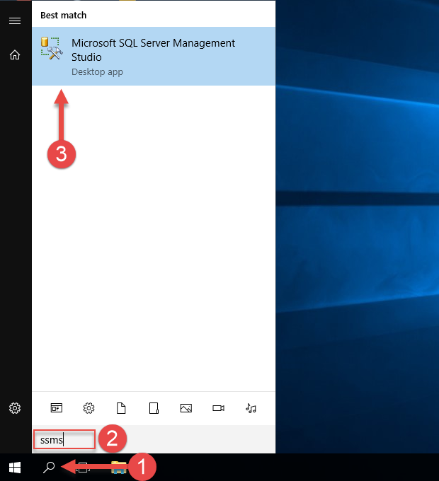

Click on the **New Query** button in SSMS.

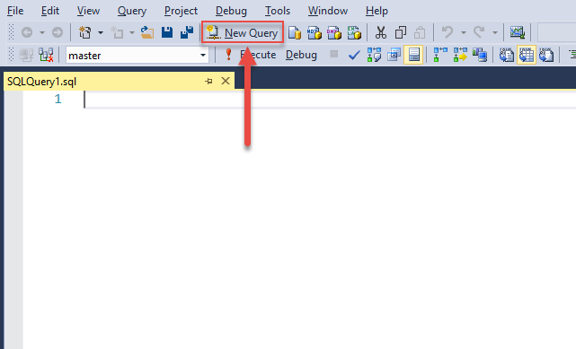

Paste in the code copied from GitHub.

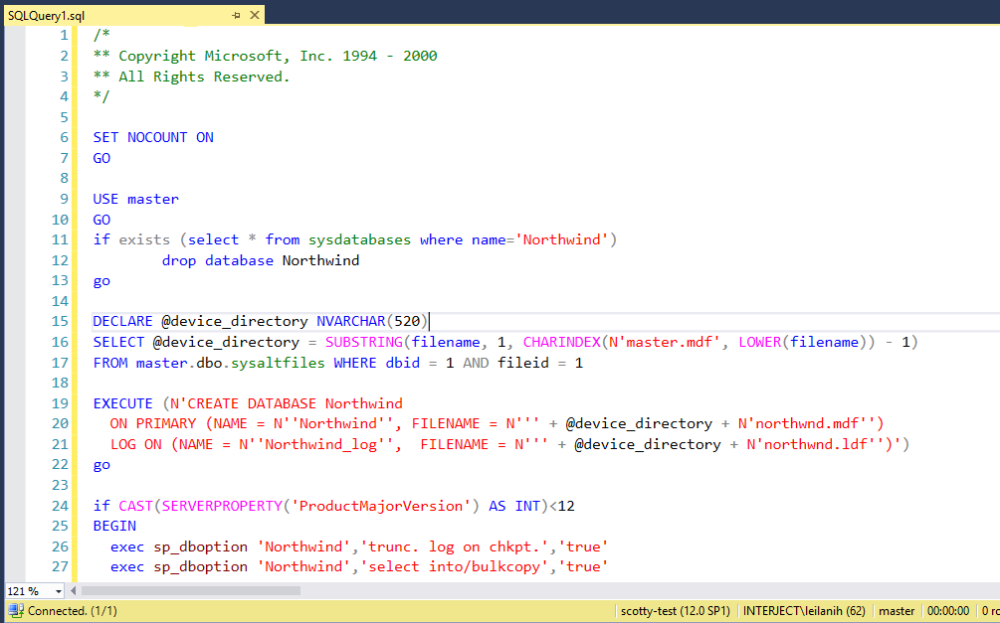

Click the **Execute** button in SSMS.

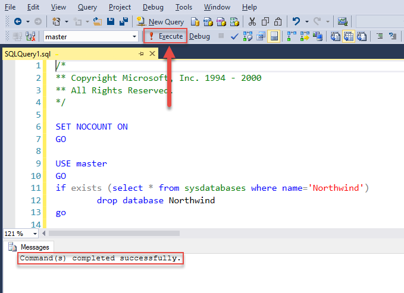

## Section 2: SQL Server Basics

#### Introduction

You will get the most out of this lab if you understand what SQL server is and how to write basic SQL SELECT statements and SQL stored procedures. However, this understanding is not strictly required in order to be able to reproduce the steps in this lab, and you can skip learning SQL if you are only focused on learning the Excel and INTERJECT portions of the lab.

The following sections will provide links to external resources for you to use as learning resources for SQL Server.

*In this section:*

##### [2.1 - What is SQL Server?](#21---what-is-sql-server-2)
##### [2.2 - The SQL SELECT Statement](#22---the-sql-select-statement-2)
##### [2.3 - SQL Stored Procedures](#23---sql-stored-procedures-2)

#### 2.1 - What is SQL Server?

Here is an [article from sqlservertutorial.net](http://www.sqlservertutorial.net/getting-started/what-is-sql-server/) explaining what SQL Server is, how it works, what it is built on, and a little bit of its history.

#### 2.2 - The SQL SELECT Statement
* Here is an [article from sqlservertutorial.net](http://www.sqlservertutorial.net/sql-server-basics/sql-server-select/) explaining the structure of the SELECT statement and how it is executed by SQL. It also shows examples of how to write common SELECT statements.
* Here is an [article from techonthenet.com](https://www.techonthenet.com/sql_server/select.php) explaining the SELECT statement and how to use it, including all additional clauses that can be added to SELECT.

#### 2.3 - SQL Stored Procedures
1. [Here](https://www.essentialsql.com/what-is-a-stored-procedure/) is an article from essentialsql.com on what a stored procedure is, why they are used, and how they can be used. It is a higher-level overview.
2. [Here](http://www.sqlservertutorial.net/sql-server-stored-procedures/basic-sql-server-stored-procedures/) is a tutorial from sqlservertutorial.net showing how to write basic stored procedures, explaining the structure and syntax of stored procedure creation and how to execute stored procedures.


<!--

Reports are more than just an Excel spreadsheet, however. Excel is the front-end interface that INTERJECT uses to allow end users to interact with their data in a familiar, intuitive environment. Behind Excel, the INTERJECT formulas on a given report connect to **Data Portals** which serve as the definition for how you wish to interact with your database (what data you want to retrieve and/or store). Data Portals then connect to Data Connections, which serve as a way for INTERJECT to remember how to connect to your data source, and in turn, connect to a database on a physical server or to a data API (the data source itself). -->

## Section 3: INTERJECT Report Terminology and Definitions

#### Introduction

This section will define all of the important terminology that relates to INTERJECT reports. Reading through this section will give you an understanding of all the components that make up an INTERJECT report.

This section should also be used as a reference to go back to and look up terms as needed, as you work through this lab.

*In this section:*

##### [3.1 - What is an INTERJECT Report?](#31---what-is-an-interject-report-2)

##### [3.2 - How INTERJECT Reports Work Behind the Scenes](#32---how-interject-reports-work-behind-the-scenes-2)
* ###### [Report Formulas](#report-formulas-4)
* ###### [Data Portals](#data-portals-2)
* ###### [Data Portal Parameters](#data-portal-parameters-2)
* ###### [Data Connections](#data-connections-2)
* ###### [Data Sources](#data-sources-2)

##### [3.3 - Anatomy of an INTERJECT Report in Excel](#33---anatomy-of-an-interject-report-in-excel-2)
* ##### [3.3.1 - The Report Area](#331---the-report-area-1)
* ##### [3.3.2 - Worksheet Definitions Area](#332---worksheet-definitions-area-1)
    * ###### [Column Definitions](#column-definitions-3)
    * ###### [Formatting Range](#formatting-range-3)
    * ###### [Report Formulas](#report-formulas-3)
    * ###### [Hidden Parameters and Notes](#hidden-parameters-and-notes-3)
* ##### [3.3.3 - Filter Parameters](#333---filter-parameters-1)

##### [3.4 - Report Formulas Used in this Lab](#34---report-formulas-used-in-this-lab-1)

#### 3.1 - What is an INTERJECT Report?

###### INTERJECT Report
An INTERJECT report is a spreadsheet-based interface to data, designed for analysis, exploration, or manipulation of metrics in almost any form or arrangement. Reports are tools that are highly customizable and, with sufficient knowledge of INTERJECTs report formulas and features, can be designed for a multitude of different and specific business, scientific or exploratory purposes.

###### Multiple Worksheets and Workbooks
A report can span multiple Excel workbooks or worksheets, as more than one workbook/worksheet may need to be used to achieve the purpose of the report. For example, one can use an INTERJECT DRILL to connect two worksheets or workbooks together. DRILLs work by letting the user choose a value from one sheet to "drill on", then this value is carried to another sheet where data processing can be done with the transferred value as input to the data operations. This allows the two sheets to work on the same data sets but perform different data processing on them. Using multiple sheets is a good approach to building complex INTERJECT reports because it allows you to show the data in different levels of detail for different purposes, while still having the data connected and centralized in one report. You will create a 2-spreadsheet report with a DRILL from a summary report to a detailed report in this lab.


<!-- #### 3.2 Anatomy of an INTERJECT Report -->
<!-- change to fit new scope -->
To show you how INTERJECT reports are structured, one of the final spreadsheets that you will create in this lab will be used as an example.


#### 3.2 - How INTERJECT Reports Work Behind the Scenes

There is more to a report than just the spreadsheet. The Excel spreadsheet, or set of spreadsheets, is just the interface for the user to interact with the data in the report. Behind this, we have **Report Formulas**, **Data Portals**, **Data Connections**, and **the data source** all working together to bring the end report to the user. Below is a breakdown of how each of these components contributes to the functionality of an INTERJECT Report.
<!-- capitalize Report Formulas? -->
###### Report Formulas
Report Formulas control everything that happens at the report level, from controlling the look of the Excel sheet by allowing programmed formatting to populating data into the spreadsheet and extracting it from the spreadsheet back to the database.

Report formulas work the same way as general Excel formulas, but they are specific to INTERJECT report actions.

The most important Report Formulas to understand here are Data Functions. Data Functions are a class of INTERJECT Report Formulas that directly control and manipulate the data that is displayed the sheet. Data Functions are typically not executed until the report user performs an action that tells the Data Function to execute. An example of this is can be shown with the Data Functions ReportFixed() and ReportRange(), which both bring data into the report. They are triggered to execute when the user runs a PULL on the report. Data Portals must be provided to Data Functions as one of the functions arguments; the Data Portal provides the data to which the Data Function can further manipulate (decide where to place on the sheet, etc.).

Many INTERJECT report formulas use the Worksheet Definitions Section to find the information that they need in order to perform their actions. For example, report formulas that populate data in the spreadsheet use an area of the Worksheet Definitions Section called the Column Definitions in order to tell which data to to place in which column of the spreadsheet.

###### Data Portals
Data Portals exist outside of the report, in the INTERJECT Portal Site. They serve as a way to define specific data operations that can be done to extract or retrieve data from your data source. Think of the Data Portal as holding a set of instructions for how to interact with the data source. Only when the Data Portal is called on by a Report Formula is the Data Portal actually activated. When the Portal is "activated," it creates a point-to-point connection with the data source (vis its Data Connection) and performs the set of instructions it contains on the data source, then returns the result (usually a dataset) back to the the report. Data Portals must be assigned a Data Connection, which allows the Data Portal to communication with the data source.

When using a SQL database as your data source, Data Portals provide a way to connect to specific stored procedures within an already existing Data Connection which connects directly to the database. Data Portals provide a finer-grain level of control, and connect to a single stored procedure on the database. You can have multiple Data Portals connected to one Data Connection, but not vice-versa.

For more information on Data Portals, see [the website portal documentation](https://docs.gointerject.com/wPortal/The-INTERJECT-Website-Portal.html#-data-connections-).

###### Data Portal Parameters
Data Portals can be provided with input/output parameters, and there are two categories of parameters that they can be provided, **Formula Parameters** and **System Parameters**. **Formula Parameters** are a way for the stored procedure writer to tell the Data Portal about any "custom" parameters that they add to the data portals corresponding stored procedure. "Custom" parameter means additional parameters that are coded into the stored procedure for a specific purpose, such as for use as filter parameters in a report. **System Parameters** are not considered "custom" because they are hardcoded and pass a specific piece of information from the system to whichever stored procedure they are used in. System Parameters will be discussed more in the following section.

See our [overview of parameters](https://docs.gointerject.com/wPortal/Data-Portals.html#overview-of-parameters) for more information.

###### Data Connections
Data Connections also exist outside of the report, in the INTERJECT Portal Site. Data Connections store the connection information for a given data source. Using this information, INTERJECT can create a connection to the data source (a database or data API) when needed, such as when requested by a report formula being triggered and calling a Data Portal.

See our [overview of Data Connections](https://docs.gointerject.com/wPortal/Data-Connections.html) for more information.

###### Data Sources
The data source itself can be a database, or a data API. See our docs on [Data Connections](https://docs.gointerject.com/wPortal/Data-Connections.html) to learn more about the different types of data sources that Data Connections can be made with.

You can now see that INTERJECT reports are controlled by a few simple, modular components in the backend all working together, and all which you have control over.

#### 3.3 - Anatomy of an INTERJECT Report in Excel

##### 3.3.1 - The Report Area
The report area is the part of the report that displays the data. It has all the report formulas and configuration details hidden, showing only what the end user needs to see in order to use the report.

The report can be broken up into the following sections:

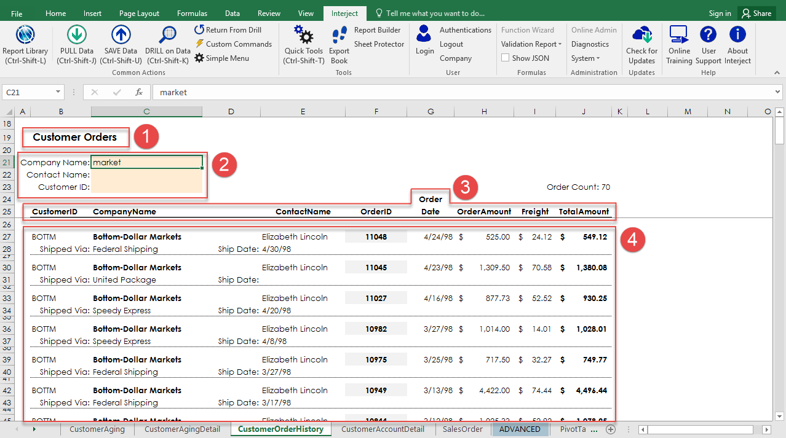

###### 1 - Title of the current sheet in the report
It is standard to place a title somewhere on each spreadsheet to tell the users the topic of the current sheet.

###### 2 - Filter parameter input area
Here, users can enter filter text for specific columns. The Data Function which pulls in the data is programmed to look at these cells and only return data records from the Data Portal who data abide by the restrictions of the filter parameters. For each data record returned, the columns specified in the filter parameters (for example, CompanyName) must *contain* the filter text provided by the user (for example "market").

###### 3 - Column names section
This section generally occupies 1 row and simply displays the titles of the data that appears below in each column.

###### 4 - Target data range
The target data range is the area of the sheet where report formulas are allowed to insert or extract data to/from the report.

##### 3.3.2 - Worksheet Definitions Area

INTERJECT reports have a sort of “behind the scenes” section at the top of each worksheet where all the spreadsheet configuration details are kept. This area is colored differently from the rest of the report and hidden from the end user using the INTERJECT jFreezePanes() function. While this section is typically hidden from the end user, those who build reports will typically spend much of their time configuring the worksheet functionality in this section. Once we unhide the section by [**unfreezing the panes**](), this is what the report looks like.

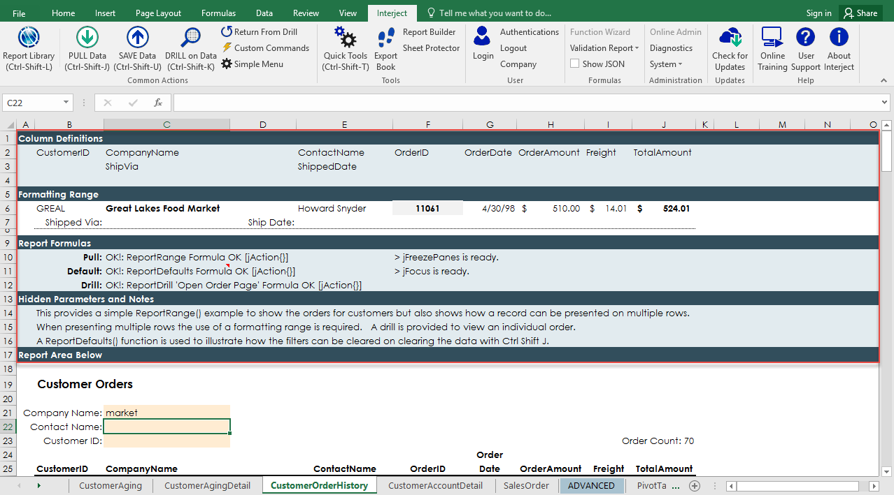

The following sections make up the Worksheet Definitions area:

###### Column Definitions
This section defines the names of the columns, or attributes, that the data source will return, and also defines where those attributes should be placed in the report. The columns where attributes are placed in the Column Definitions section will match where they get placed in the worksheet.

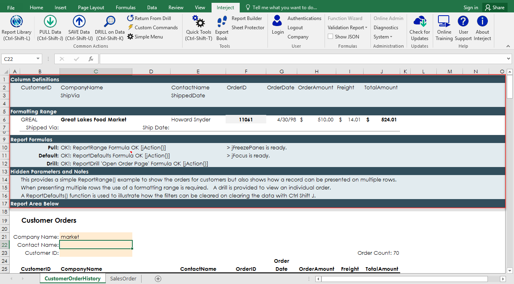

###### Formatting Range
The Formatting Range is a feature that allows you to define how you would like the data in your Report Area to be formatted in one place without repetition. It works similarly to how the Column Definitions section works, by copying the formatting applied to its cells down to the Report Area for each record that is pulled in from the data source. The formatting of a given cell in the Formatting Range is applied to the cell just above it in the Column Definitions. This is demonstrated in the screenshot.

You can define your formatting by simply formatting the cells in the formatting range, then this formatting will be applied to the attributes in the Column Definitions, when they are pulled into the report. A Formatting Range is only necessary for INTERJECT reports wherein you are pulling multi-row data records into your report, but we will speak more on this later. If you have only one row, and you don’t specify a formatting range, the formatting of the first row in the TargetDataRange will be copied to the output rows.

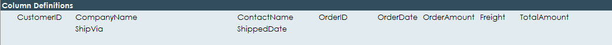

###### Report Formulas
This section is where the INTERJECT Report Formulas that you need for a given sheet will be placed. To add a Report Formula, simply start typing = and the name of the formula. Labels can be added in cells adjacent to cells containing report formulas to help describe what each formula is doing, as shown below.

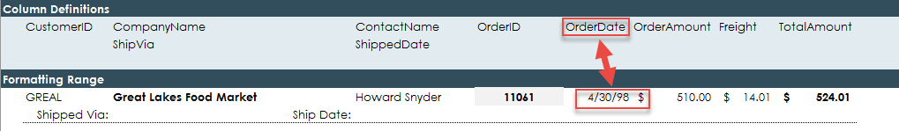

###### Hidden Parameters and Notes
This section is optional on most reports. It is used as a place to give a brief description of the use case or functionality of a report, and to add Filter Parameters to the report that should always be there (and in turn should be hidden from users so they cannot modify them).

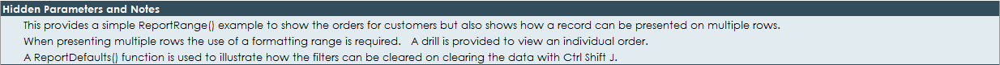

##### 3.3.3 - Filter Parameters

Filter parameters are used in reports that pull data in, and are used to restrict the result set to only records which match the filter parameter arguments given on the report.

Filter parameters can be used to search the dataset for specific records, or simply to reduce the size of the result set returned.

As you can see in the screenshot above, “market” was entered into the **Company Name** filter, which limits the result set that is returned to records which *contain* the partial string “market” in their CompanyName attribute.

Filters work in INTERJECT reports by using a SQL Server LIKE operator inside the WHERE clause of the query that the report data is being sourced from.

#### 3.4 - Report Formulas Used in this Lab

##### jFocus()
The jFocus() formatting function lets you choose the active cell that will be focused upon (selected) when the spreadsheet is open. It is recommended to place the focus on an input cell, or otherwise important cell on the sheet. Read more about jFocus() in [its entry in the INTERJECT function index](https://docs.gointerject.com/wIndex/jFocus.html).

##### jFreezePanes()
jFreezePanes() is an INTERJECT formatting function that takes advantage of the Excel native Freeze/Unfreeze panes option, which can be accessed in the Excel Quick Tools menu.

INTERJECT uses frozen panes on its reports to:
* Contain and hide the **Worksheet Definitions Area**. It is hidden to ensure that end users are not confused with details that they do not need to see.
* Keep a header with column titles and a report title visible to the user as they scroll through report data.

The jFreezePanes() function allows you to specify:
* Which worksheets in a workbook will be frozen (whichever worksheets have the jFreezePanes() function in their Report Formulas section) when "Freeze/unfreeze panes" is run in Excel.
* *Where* to freeze the panes in the workbook (which cells will be frozen at the top of the sheet and which will be hidden when panes are frozen).

There are two formula arguments for jFreezePanes(), **FreezePanesCell** and **AnchorViewCell**. AnchorViewCell specifies the very top row that will be visible when the panes are frozen. The cells above AnchorViewCell will be hidden when the panes are frozen. The cells between AnchorViewCell and FreezePanesCell will become a frozen block of cells that are anchored to the top of the sheet as the user scrolls down through the report.

In the CustomerOrderHistory sheet, the **AnchorViewCell** is cell **A18**, which as you can see is the end of the Worksheet Definitions Section that is hidden when panes are frozen. Cell **A26** is the **FreezePanesCell**. This means that rows 18-26 are frozen at the top as the user scrolls down.

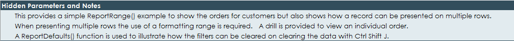

Read more about jFreezePanes() in [its entry in the INTERJECT function index](https://docs.gointerject.com/wIndex/jFreezePanes.html).

##### ReportRange()

ReportRange() is a data function used to PULL data into a defined *range* of a report from a Data Portal. ReportRange() can be used with formatting ranges to programatically format the data returned from the Data Portal into the spreadsheet.

ReportRange() works by inserting the result set returned from the Data Portal *in between* two or more rows. These rows are specified by the **TargetDataRange** argument.

Filter cells in the spreadsheet are passed into the **Parameters** parameter of ReportRange() so that ReportRange() knows where to find its input values to pass along to the Data Portal. The Param() function ([read more here](https://docs.gointerject.com/wIndex/Param.html)) is used here to capture the input cells' addresses.

Read more about ReportRange() in [its entry in the INTERJECT function index](https://docs.gointerject.com/wIndex/ReportRange.html#function-summary).

##### ReportDefaults()

The ReportDefaults() function is used to capture values from one or a set of cells (or a hard-coded value) then send the value/s to another cell or set of cells. Its execution is triggered based on an action or event ([read the distinction between an INTERJECT action/event](https://docs.gointerject.com/wIndex/ReportDefaults.html#trigger-combination-list)) occurring in the report (for example a save or clear action). ReportDefaults() is commonly used to clear values in the filter list after data has been pulled in and then cleared, which is how it will be used here.

Read more about ReportDefaults() in [its entry in the INTERJECT function index](https://docs.gointerject.com/wIndex/ReportDefaults.html#function-summary).

##### ReportDrill()
Drilling is a way to connect and pass values between separate worksheets or workbooks in a report. When designing a drill, you always have a *source* sheet and a *destination* sheet, where the source sheet is the sheet that the user starts on and runs the DRILL command on, and the destination sheet is the sheet that the user ends up on after the drill. A typical use case for a drill arises when you have a general sheet that provides a summary of some high-level data, and you want to allow the user to get more detail on some of the data in that sheet, but don’t have enough room to display this detail on the summary sheet. This can be resolved by creating a second sheet for that more detailed data and setting up a drill into the more detailed sheet from the summary one. You can then pass some piece of data from the general/summary sheet into a cell in the detailed sheet so that the detailed sheet can automatically pull in and filter data based on the cell the user drilled on in the source sheet. Read more about ReportDrill() in [its entry in the INTERJECT function index](https://docs.gointerject.com/wIndex/ReportDrill.html).

## Section 4: Introducing the INTERJECT Report

#### Introduction

This section introduces the report that you will be creating in this lab: its layout, structure and purpose.

*In this section:*

##### [4.1 - The Report as a Whole](#41---the-report-as-a-whole-1)
##### [4.2 - CustomerOrderHistory Sheet Preview](#42---customerorderhistory-sheet-preview-1)
##### [4.3 - SalesOrder Sheet Preview](#43---salesorder-sheet-preview-1)
##### [4.4 - Drilling from CustomerOrderHistory to SalesOrder](#44---drilling-from-customerorderhistory-to-salesorder-1)
##### [4.5 - Construction Plan for the Report](#45---construction-plan-for-the-report-1)

#### 4.1 - The Report as a Whole

###### The Scope and Purpose of the Report
In this lab, you will create one report which contains two spreadsheets. The report is a customer order report, showing data about past orders, the orders' contents, and the customers who placed the orders. The report will be broken up into two worksheets inside a single Excel workbook. Each worksheet presents slightly different data at a different scope, but both reporting on the same type of data: customer order data.

###### Summary Sheet - CustomerOrderHistory
The first sheet in the report is called **CustomerOrderHistory**. It is a summary sheet, showing one record for each of all past orders, and allowing filtering of the data reported based customer and company information. The data presented for each record in this sheet is brief, but tells the general story of who placed the order, when the order was placed, how much was spent, etc.

###### Detailed Sheet - SalesOrder
The second sheet is called **SalesOrder**. This sheet provides a detailed look at a single order, providing more detailed information about each order than CustomerOrderHistory provides, such as the contact information of the customer, shipper information, etc.

###### Connection Between the Two Sheets
The two sheets are linked together with an INTERJECT ReportDrill() function, which allows the user the select a record in CustomerOrderHistory and *DRILL* into the SalesOrder report for that specific order. This interaction between the two sheets within the report makes it a powerful and efficient tool for looking at lots of data at once in CustomerOrderHistory, and only drilling into SalesOrder when it is necessary to inspect a single order in detail.

#### 4.2 - CustomerOrderHistory Sheet Preview

Here is how the final CustomerOrderHistory report will look to the end user, populated with data.

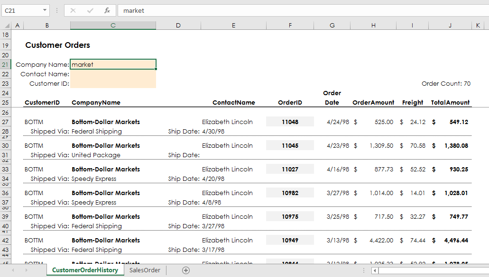

As you can see, each record here is concise and well formatted. It is easy to see all the necessary high-level information about a large group of orders.

#### 4.3 - SalesOrder Sheet Preview

The SalesOrder report will provide information for a given order, broken up into the following 3 categories:

**1. Customer Information:** This section includes information about the customer who placed the order that is being drilled on.

**2. Order Information:** This section contains information about the order and shipping logistics.

**3. Product/Order Contents Information:** This section contains information about the products in the order.

The final report with the above categories is shown below.

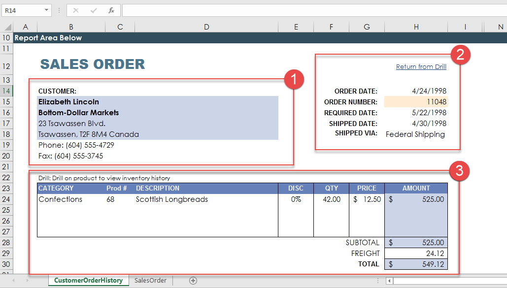

#### 4.4 - Drilling from CustomerOrderHistory to SalesOrder

The SalesOrder report is designed to be drilled to from CustomerOrderHistory, which lists **OrderIDs**. The user drills *on* a specific OrderID, then SalesOrder will open and display a report for that specific OrderID. This allows the user to focus in on one order in SalesOrder while still giving them the flexibility to also view all previous orders from a comprehensive list in CustomerOrderHistory.

The following screenshot shows the steps for how one would run a DRILL on an OrderID in the CustomerOrderHistory report.

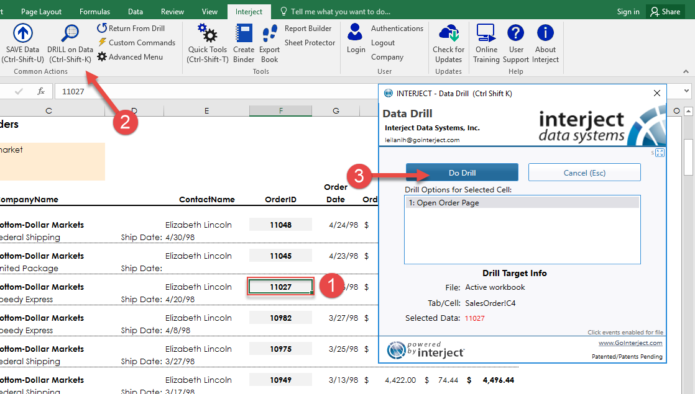

This sends the OrderID = 11027 to the SalesOrder report, where SalesOrder will run a ReportRange() (a PULL action) using OrderID = 11027 as a filter for the results it pulls in.

As you can see below, the PULL action brings you to the SalesOrder worksheet and pulls data for the OrderID = 11027.

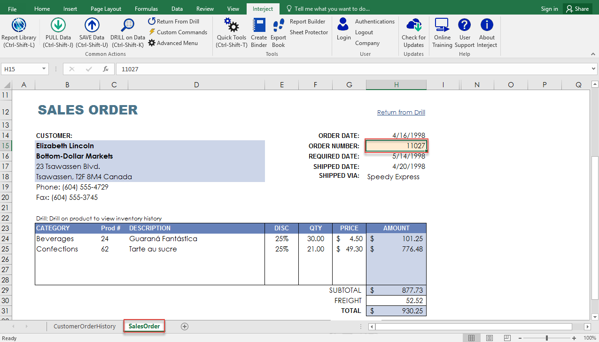

#### 4.5 - Construction Plan for the Report

This subsection will explain how the each part of the report will be built out in terms of the remaining sections in the lab.

###### The Data Connection

**Section 5** will walk you through creating the Data Connection for this Report. Only one Data Connection is needed for the report as a whole, because only one database (your Northwind database) is being used as a data source in this Report.

###### CustomerOrderHistory

The CustomerOrderHistory sheet will be built in **sections 6-8**.

The CustomerOrderHistory sheet will have its own SQL stored procedure written for its data PULL, which you will write in **Section 6**. Along with this, CustomerOrderHistory will have a Data Portal written for it in **Section 7**. Finally, you will create the CustomerOrderHistory spreadsheet itself in **Section 8**.

###### SalesOrder

The SalesOrder sheet will be built in **sections 9-11**.

In **Section 9** you will write the stored procedure for the data PULL that will be used in the SalesOrder sheet. **Section 10** will then walk you through creating the Data Portal that goes with the stored procedure. You will create the SalesOrder spreadsheet itself in **Section 11**.

###### Tying Together the Report

**Section 12** will walk you through connecting the CustomerOrderHistory and SalesOrder sheets together with a DRILL. This is the final step necessary for the report to be fully functional as a whole.

## Section 5: Creating the Data Connection

#### Introduction

You will now create the Data Connection that will serve as the layer that accesses your Northwind database. This Data Connection will be used to connect to your database by both of the Data Portals that will be created later in the lab.

**Step 1:** Log in to the INTERJECT portal site.

Navigate to the portal site [here](https://portal.gointerject.com/).

1. Type in your email.
2. Type in your password.
3. Press the **LOGIN** button.

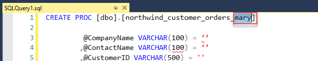

**Step 2:** Create a new Data Connection.

Click on the **New Connection** button.

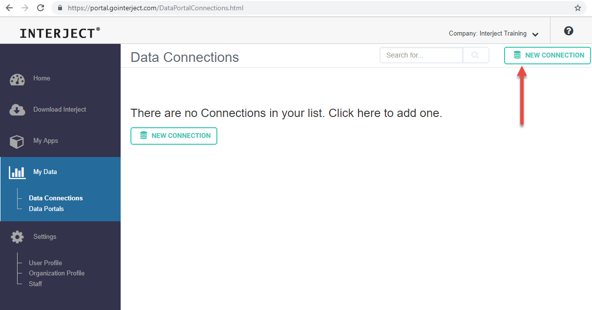

**Step 3:** Fill in the connection details.

1. Type the name of your connection (**NorthwindDB_MyName** with your name substituted for "MyName" is recommended) into the **Name** field.
2.  Add a short description in the **Description** field.

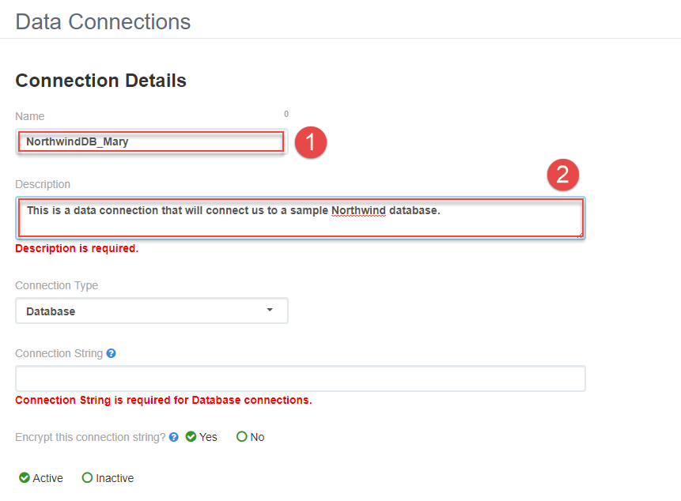

Select database as your connection type.

1. Under **Connection Type**, click the small triable to show the options.
2. Select **Database** from the dropdown list for **Connection Type**.

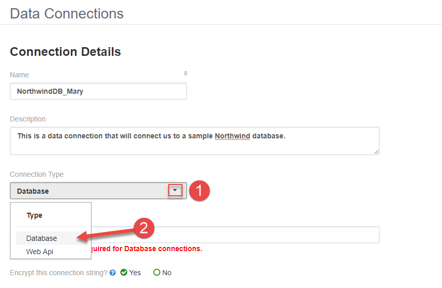

Enter the connection string for your Northwind database.

<!-- Change this to a ref link to the top of the page where sql resources are listed? -->
For the connection string, you must already have your own sample Northwind database to use. You can download a Northwind sample database from Microsoft [here](https://docs.microsoft.com/en-us/dotnet/framework/data/adonet/sql/linq/downloading-sample-databases).

1. Substitute in your server and database name in italicized parts (*MyServerAddress* and *MyDatabaseName*) of the following sample connection string:

  **”Server=*MyServerAddress*;Database=*MyDatabaseName*;Trusted_Connection=True;”**

2. Once you have your connection string entered, press Save to continue.

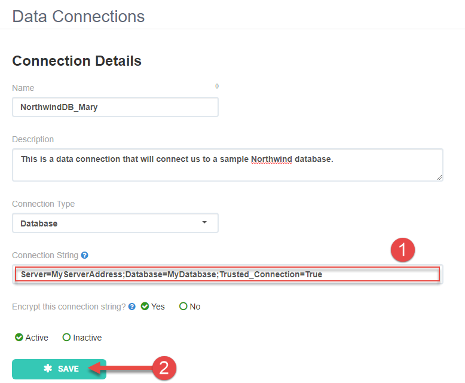

## Section 6: Writing the SQL Stored Procedure for the CustomerOrderHistory Data PULL

#### Introduction

You will now write the stored procedure that will be called from the ReportRange() function on the CustomerOrderHistory report. This stored procedure performs the Data PULL operation.

**Step 1:** Copy-paste the stored procedure code provided into your favorite SQL editor..

Using a SQL editor like [SQL Server Management Studio](https://docs.microsoft.com/en-us/sql/ssms/sql-server-management-studio-ssms?view=sql-server-2017), copy and paste in the following code:

```sql
CREATE PROC [dbo].[northwind_customer_orders_myname]

    	 @CompanyName NVARCHAR(100) = ‘’
    	,@ContactName NVARCHAR(100) = ‘’
    	,@CustomerID NVARCHAR(500) = ''
    	,@Interject_NTLogin VARCHAR(10)
    	,@Interject_LocalTimeZoneOffset MONEY

    AS
    BEGIN

    SET NOCOUNT ON  -- helps reduce conflicts with ADO

    DECLARE @ErrorMessage VARCHAR(100)

    IF LEN(@CompanyName)>40
    BEGIN
    	SET @ErrorMessage = 'Usernotice:The company search text must not be more than 40 characters.'
    	RAISERROR (@ErrorMessage, 18, 1)
    	RETURN		
    END

    SELECT
    	 c.[CustomerID]
    	,c.[CompanyName]
    	,c.[ContactName]
    	,c.[Country]
    	,o.[OrderID]
    	,o.[OrderDate]
    	,o.[ShipCity]
    	,o.[ShipCountry]
    	,s.[CompanyName] AS ShipVia
    	,o.[ShippedDate]
    	,SUM(d.[UnitPrice] * cast(d.[Quantity] AS MONEY) * (cast(1 AS MONEY) -d.[Discount])) AS OrderAmount
    	,o.[Freight]
    	,SUM(d.[UnitPrice] * cast(d.[Quantity] AS MONEY) * (cast(1 AS MONEY) -d.[Discount])) + o.[Freight] AS TotalAmount
    FROM [dbo].[Orders] o
    	INNER JOIN [dbo].[Customers] c
    		ON o.[CustomerID] = c.[CustomerID]
    	INNER JOIN [dbo].[Shippers] s
    		ON o.[ShipVia] = s.[ShipperID]
    	INNER JOIN [dbo].[Order Details] d
    		ON o.[OrderID] = d.[OrderID]
    WHERE
    	(@CompanyName='' OR c.CompanyName LIKE '%' + @CompanyName + '%')
    	and
    	(@ContactName='' OR c.ContactName LIKE '%' + @ContactName + '%')
    	and
    	(@CustomerID='' OR c.[CustomerID] = @CustomerID)
    GROUP BY
    	 c.[CustomerID]
    	,c.[CompanyName]
    	,c.[ContactName]
    	,c.[Country]
    	,o.[OrderID]
    	,o.[OrderDate]
    	,o.[ShipName]
    	,o.[ShipCity]
    	,o.[ShipCountry]
    	,s.[CompanyName]
    	,o.[ShippedDate]
    	,o.[Freight]
    ORDER BY c.[CompanyName], o.[OrderID]  DESC

    END
```

**Step 2:** Modify the stored procedure.

Change "myname" in the following portion of code to your name (here "mary").

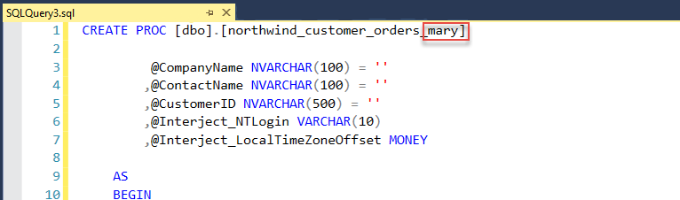

**Step 3:** Execute your stored procedure.

## Section 7: Creating the Data Portal for the CustomerOrderHistory Spreadsheet

#### Introduction

This section walks you through creating the data portal for the CustomerOrderHistory sheet. This Data Portal will access the stored procedure just written in **Section 6**.

*In this section:*

##### [7.1 - Creating the Data Portal](#71---creating-the-data-portal-1)
##### [7.2 - Adding the Formula Parameters](#72---adding-the-formula-parameters-1)
##### [7.3 - Adding the System Parameters](#73---adding-the-system-parameters)

#### 7.1 - Creating the Data Portal

**Step 1:** Create the Data Portal.

Navigate again to [the portal site](https://portal.gointerject.com/) and choose Data Portals.

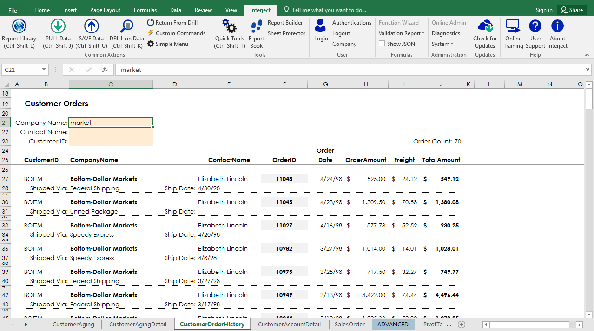

Create a new data portal by clicking the **NEW DATA PORTAL** button.

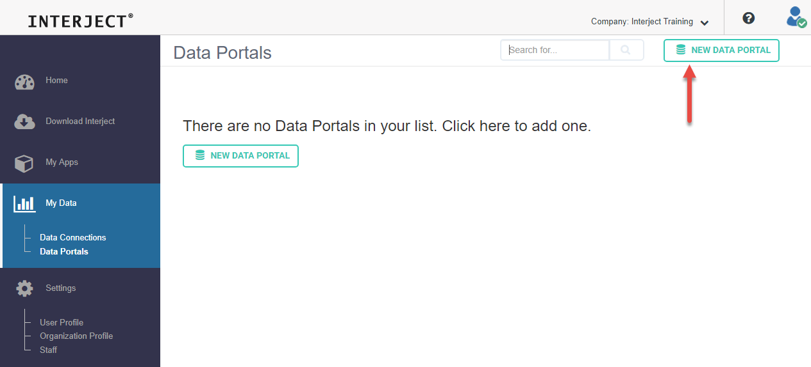

**Step 2:** Edit the data portal details.

1. Enter a name for your Data Portal (**”NorthwindCustomerOrders_MyName”** with your name substituted in for MyName) in the **Name** field.
2. Enter a brief description in the **Description** field.

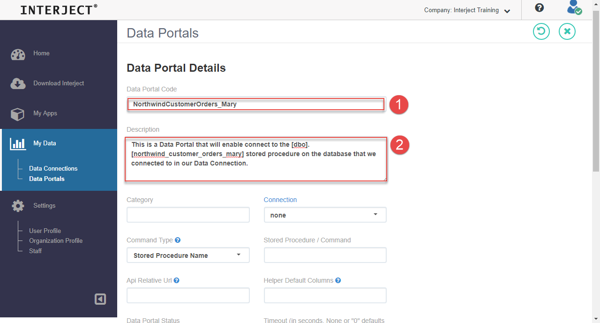

<!-- This will need to change -->
For the **Connection**, use the Data Connection you created in the last section, **NorthwindDB_YourName**. It should appear in the dropdown list when clicked.

1. Expand the dropdown menu under **Connection**.
2. Select your database, **NorthwindDB_YourName**.

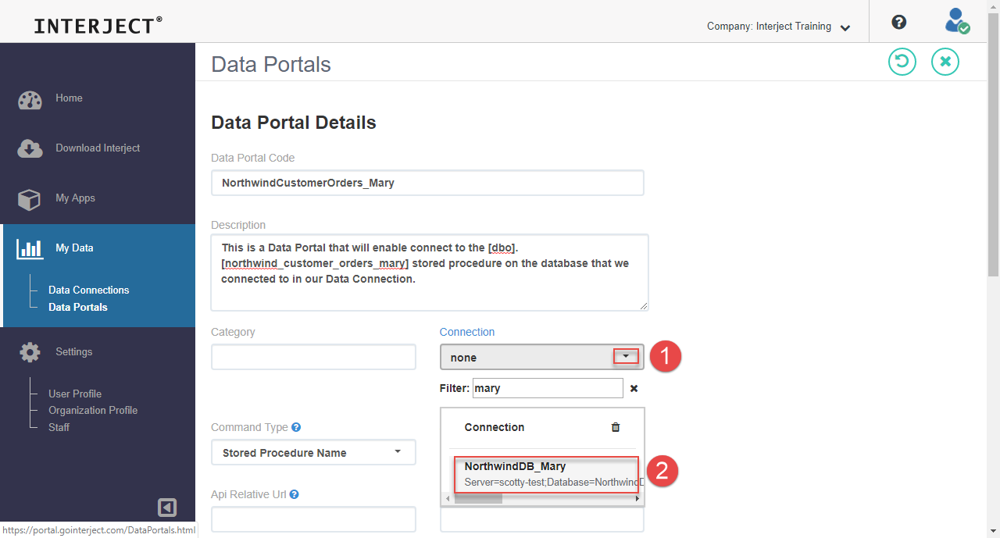

Now specify the stored procedure that this data portal will be referencing. You will write the stored procedure itself shortly.

Under **Stored Procedure / Command**, type in **”[demo].[northwind_customer_orders_myname]”**.

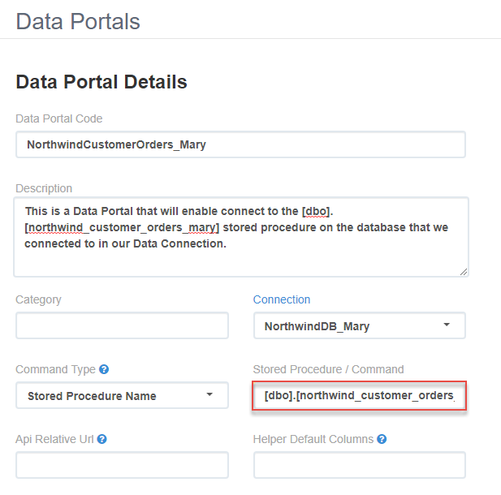

1. Under **Category**, enter **Demo**.
2. Expand the dropdown list under **Command Type**.
3. Choose **Stored Procedure Name** from the dropdown list.

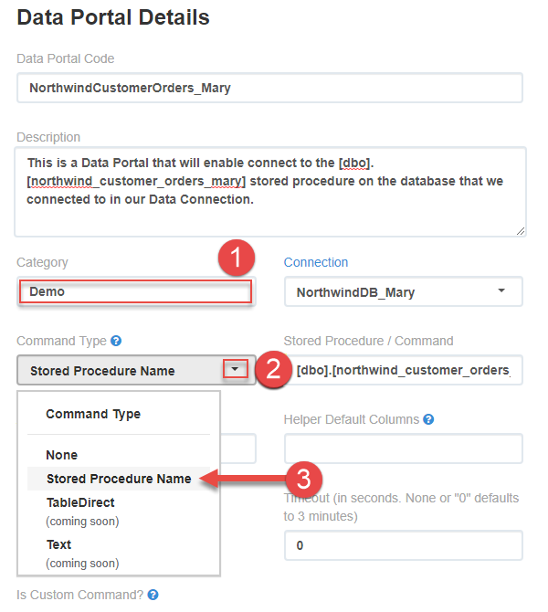

1. For **Data Portal Status**, choose **Enabled**.
2. For **Is Custom Command?**, choose **No**
3. Save your new data portal by clicking **CREATE NEW DATA PORTAL**.

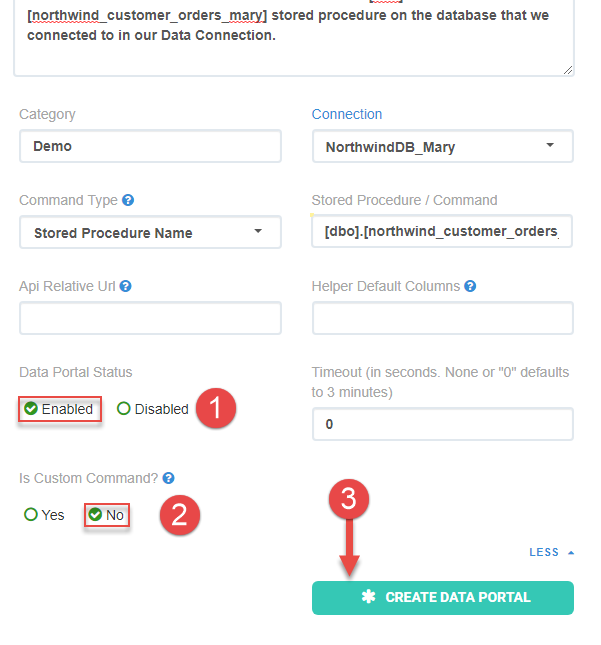

#### 7.2 - Adding the Formula Parameters

Here, you will enter a Formula Parameter for each of the inputs specified for the stored procedure, which serve as filter parameters on the CustomerOrderHistory report: **Company Name**, **Contact Name** and **Customer ID**.

It is important that the order of parameters is the same across all of: the stored procedure, the Data Portal and the spreadsheet. It is crucial to match the order because SQL stored procedures rely only on order to know which parameter is which, so messing up the order will result in parameters being assigned to the wrong parameter name.

**Step 1:** Check order of parameters in stored procedure.

Go back to your stored procedure and check the order of the input parameters entered, and copy this order in the Data Portal.

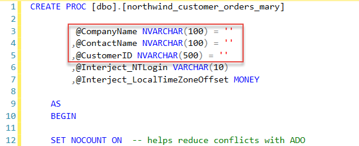

**Step 2:** Add the Formula Parameters.

1. Click on the **Click here to add a Formula Parameter** link.
2. Enter the first parameter name, **CompanyName**, in the **NAME** field.

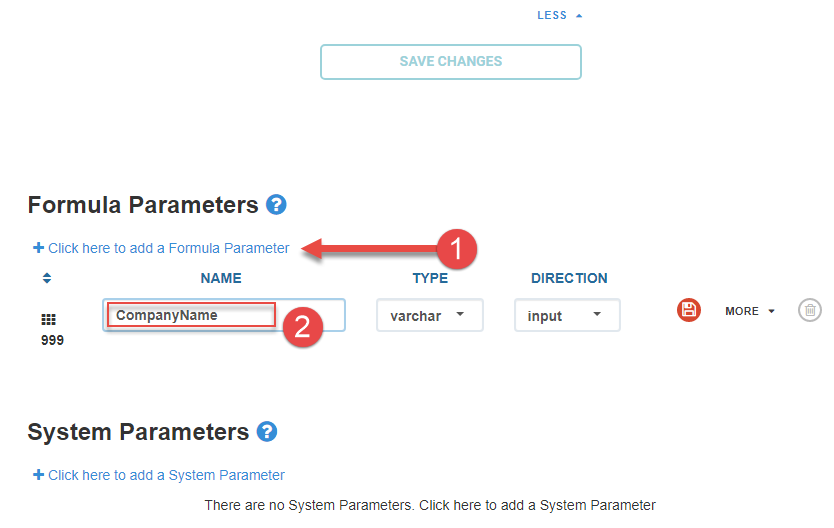

1. Set the **TYPE** to **nvarchar** so that a character string can be entered by the user.
2. Set the **DIRECTION** to **input** since this will be an input parameter to the stored procedure.

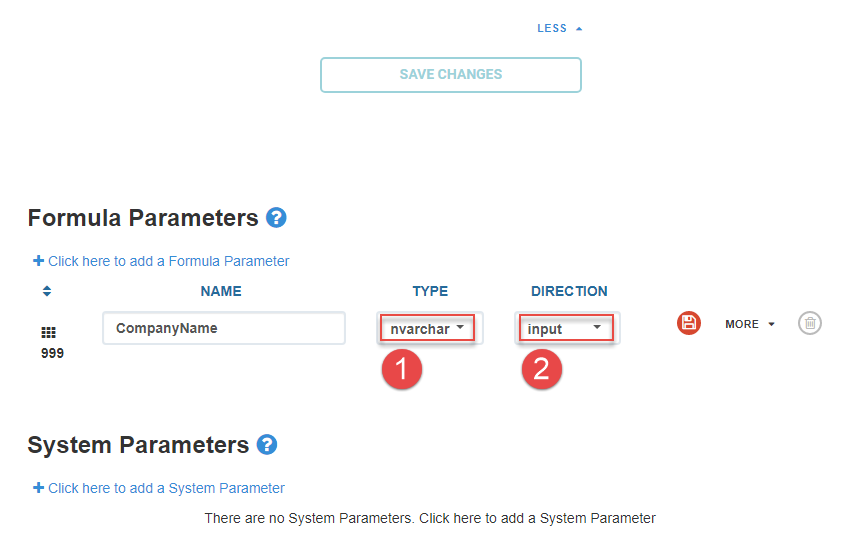

Press the save button so that it turns from red to green.

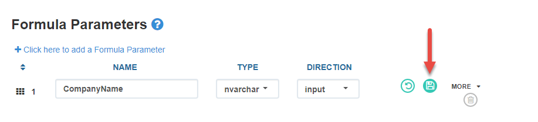

Add the next Formula Parameter for **ContactName**.

1. Click on the **Click here to add a Formula Parameter** link again.
2. Enter **ContactName** in the **NAME** field.
3. Select **nvarchar** in the **TYPE** field.
4. Select **input** in the **DIRECTION** field.
5. Click the save icon and wait until it turns green as in the picture.

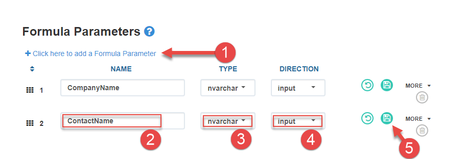

Repeat the last set of steps, changing only the **NAME** field to **CustomerID**.

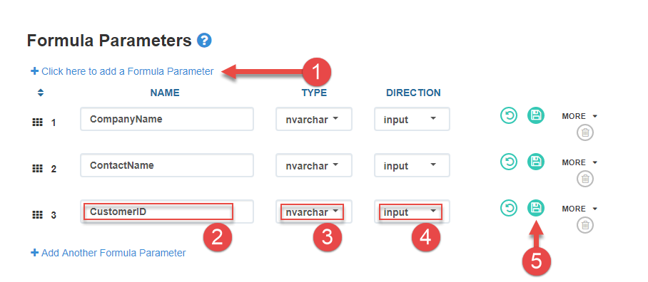

**Step 4:** Add the system parameters to the report.

System Parameters are used to pass information from the user’s system to the stored procedure via Data Portal. Here you will be adding 2 System Parameters, **Interject_NTLogin**, which is used to capture the user’s Windows login, and **Interject_LocalTimeZoneOffset**, which is used to capture the difference from the user’s local time zone to the universal time. You can read more about System Parameters (and these specific ones) [here](https://docs.gointerject.com/wGetStarted/L-Dev-CustomerAging.html#system-parameters).

1. Create a new system parameter by pressing **Click here to add a System Parameter**.
2. Choose **Interject_NTLogin** from the dropdown menu.

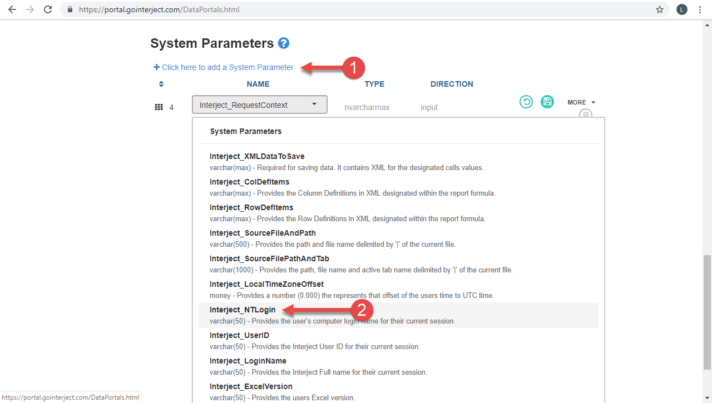

Press the save button and wait until it turns green.

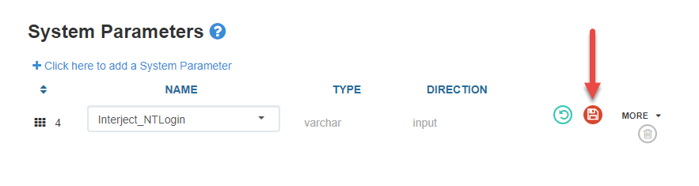

Add a second System Parameter.

1. Create a new system parameter by pressing **Click here to add a System Parameter**.
2. Choose **Interject_LocalTimeZoneOffset** from the dropdown menu.
3. Press the save icon to save the new parameter.

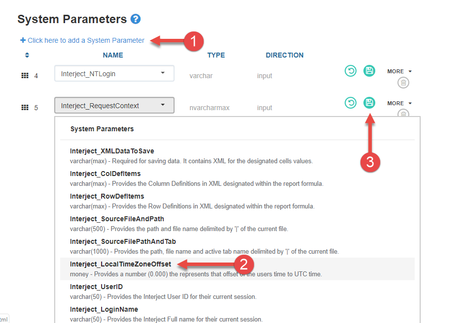

**Step 5:** Verify all parameters are correct.

Verify that you have all your parameter information correct and that you have saved them all before moving on.

Your screen should look as follows.

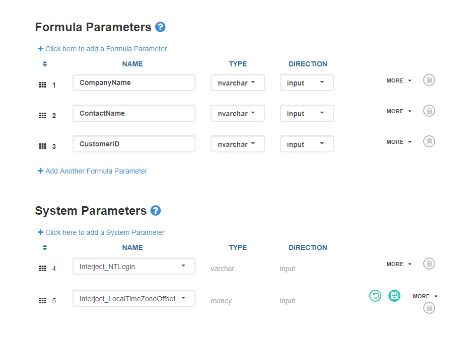

## Section 8: Building the CustomerOrderHistory Spreadsheet

#### Introduction

This section will walk you through building the CustomerOrderHistory spreadsheet, which is the first spreadsheet in the report that you will create in this lab.

You can optionally end the lab after this section, and you will still have created a standalone report with only one worksheet.

*In this section:*

##### [8.1 - Creating the Worksheet Definitions Area](#81---creating-the-worksheet-definitions-area-2)
##### [8.2 - Setting the Frozen Panes with jFreezePanes()](#82---setting-the-frozen-panes-with-jfreezepanes-2)
##### [8.3 - Creating the Report Area](#83---creating-the-report-area-2)
##### [8.4 - Adding the Column Definitions](#84---adding-the-column-definitions-2)
##### [8.5 - Adding Titles for the Columns in the Report Area](#85---adding-titles-for-the-columns-in-the-report-area-2)
##### [8.6 - Adding ReportRange() to the Sheet](#86---adding-reportrange-to-the-sheet-2)
##### [8.7 - Designing the Formatting Range](#87---designing-the-formatting-range-2)
##### [8.8 - Testing ReportRange() with a Data PULL](#88---testing-reportrange-with-a-data-pull-2)
##### [8.9 - Adding ReportDefaults() to the Sheet](#89---adding-reportdefaults-to-the-sheet-2)
##### [8.10 - Testing ReportDefaults()](#810---testing-reportdefaults-2)
##### [8.11 - Setting the Focused Cell with jFocus()](#811---setting-the-focused-cell-with-jfocus-2)

#### 8.1 - Creating the Worksheet Definitions Area

This section shows how to create the report definitions area.

**Step 1:** Open a blank Excel workbook.

Open Excel on your computer.

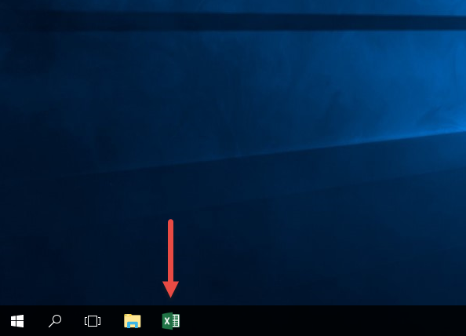

Once Excel is open, choose **Blank Workbook**.

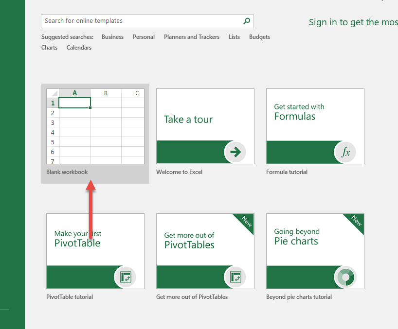

Now, you should have a blank Excel workbook that looks like the following:

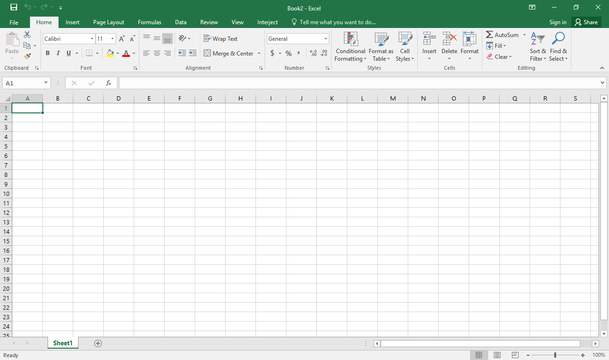

**Step 2:** Add titles for the worksheet definitions subsections.

Select row 1 and color it dark blue (#1F4E78). This is a common cell color that INTERJECT uses for report definition subsection titles, but you can customize it as you wish.

1. Click on the “1” that denotes row 1 to highlight the entire row.
2. Click the paint bucket to fill the color.
3. Choose the darkest blue in the first blue column (#1F4E78).

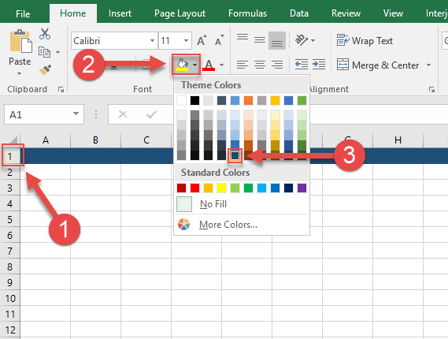

For this report, we will need 5 different titled sections. Now that you have the color selected in your paint bucket, simply click on every other row and then click on the paint bucket until you have 5 dark blue rows with blank white rows in between them.

1. Click on **row 3, 5, 7, or 9** to highlight it.
2. Click on the paint bucket.
3. Repeat steps 1-2 for **rows 3, 5, 7, and 9**.

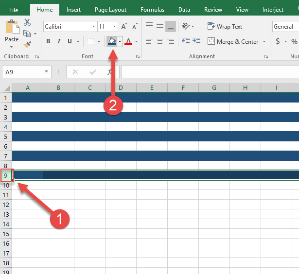

Now, add the titles.

1. Enter **Column Definitions** in cell **A1**.
2. Select **White** from the **Font Color** selector.
3. Select **Bold**.

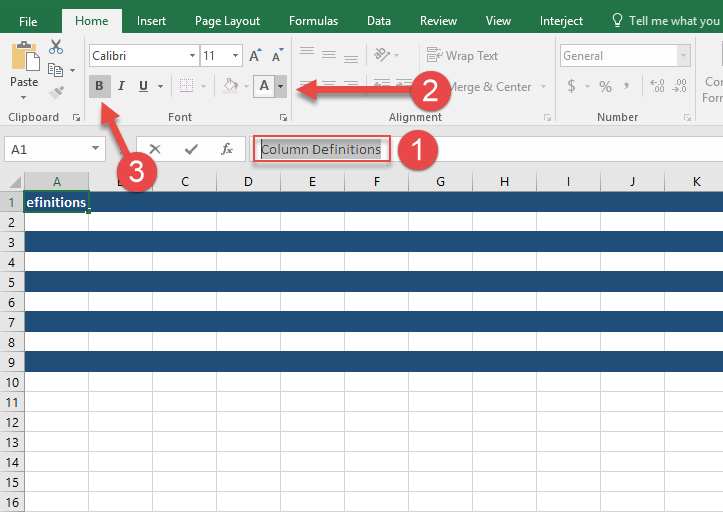

Now enter the names **Formatting Range** in cell **A3**, **Report Formulas** in cell **A5**, **Hidden Parameters and Notes** in cell **A7**, and **Report Area Below** in cell **A9** in the next 4 title rows. Don’t worry about the formatting of these 4 for now.

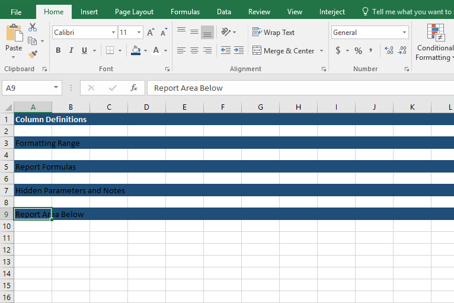

Next, use the format painter to copy the formatting of the first title to the remaining 4.

1. Select **row 1**.
2. Click the **format painter** paintbrush icon.
3. Click **row 3, 5, 7, or 9**.
4. Repeat steps 1-3 for **rows 3, 5, 7 and 9.**

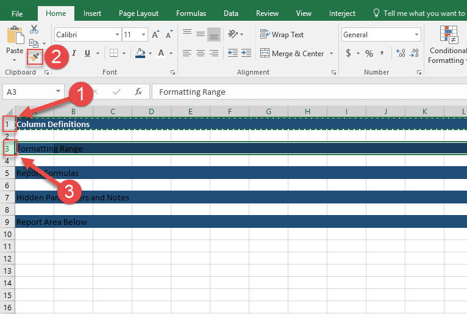

**Step 3:** Format the subsections.

Start by adding more space under each section. Copy two empty rows from somewhere in the sheet.

1. Click on the first row out of the two you will copy (here, **row 12**).
2. Hold down CTRL and click the row under the first one you selected (here, **row 13**)
3. Press CTRL + C to copy both rows.

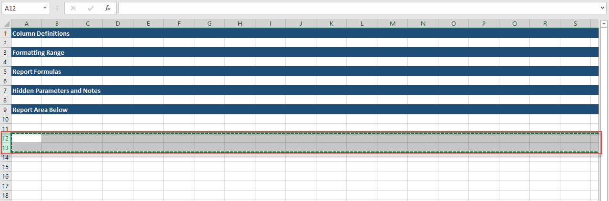

Paste them above row 2.

1. Right-click on row 2.
2. Select **Insert Copied Cells**.

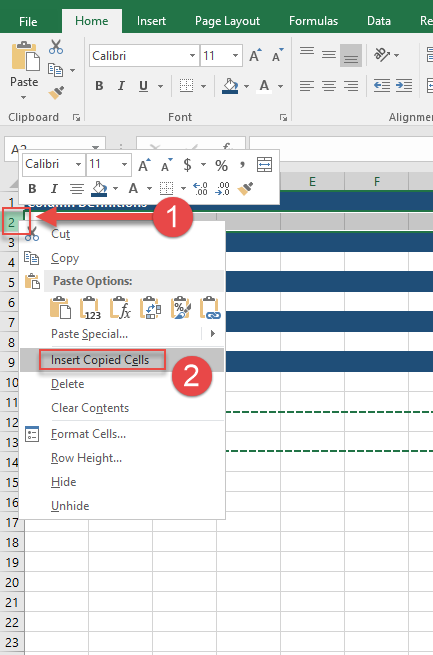

Repeat the above 2 steps by copy-pasting 2 more rows under each title so that your report looks as follows.

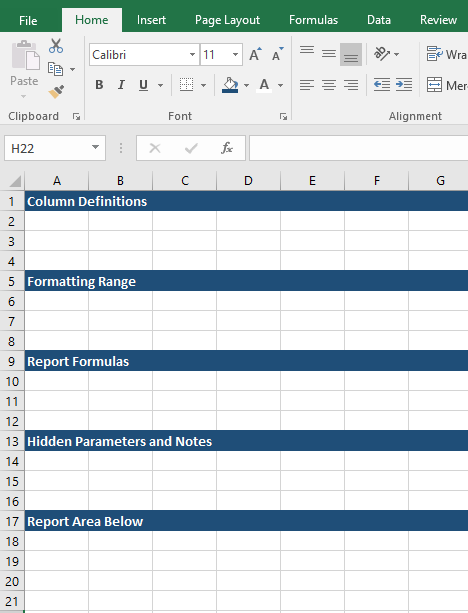

Apply light blue color under each titled section.

1. Select the 3 rows under Column Definitions.
2. Click the paint bucket.
3. Select the lightest blue color in the first blue column (#DDEBF7).

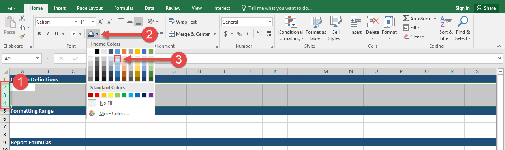

<!-- is this sufficient instruction?  : -->
Now, you can use the Excel format painter feature to apply the same light blue color applied to the first title section to the remaining 4.

1. Select **cell 6-8, 10-12, or 14-16**.
2. Click on the paint bucket icon (do not click the dropdown list part of the button) to copy the color previously used into the block of cells.
3. Repeat steps 1-2 for **cells 6-8, 10-12, and 14-16**.

<!-- add the finished result of adding light blue to all these columns -->

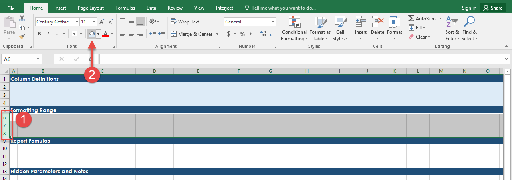

#### 8.2 - Setting the Frozen Panes with jFreezePanes()

This section walks you through configuring the frozen panes in the spreadsheet using jFreezePanes().

**Step 1:** Add the formula to the sheet.

Type “=jFreezePanes()” in cell **F10**.

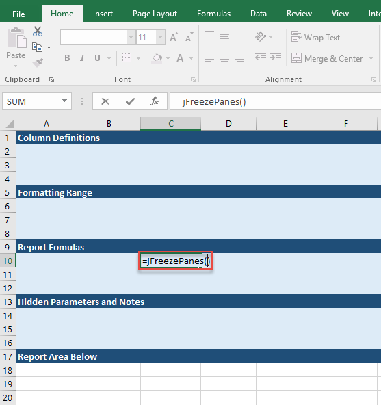

**Step 2:** Set the freeze panes at the correct location.


Click on the function builder icon to open it.

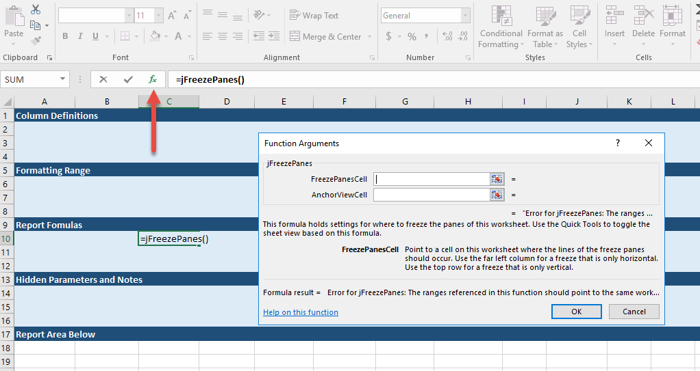

In the input box for **FreezePanesCell**, type **A26**.

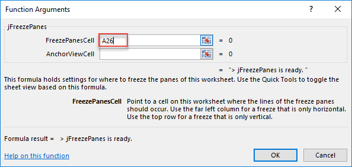

For **AnchorViewCell**, type **A18**.

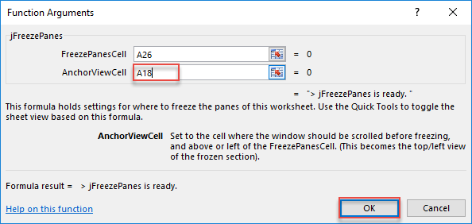

**Step 3:** Try freezing the panes to see how it works.

1. Press and hold **CTRL + SHIFT + T** OR click on the **Quick Tools** option in the INTERJECT ribbon to open the Quick Tools menu.
2. Select **Freeze/Unfreeze Panes (current tab)** and press **Enter**, or click **Freeze/Unfreeze Panes (current tab)**.

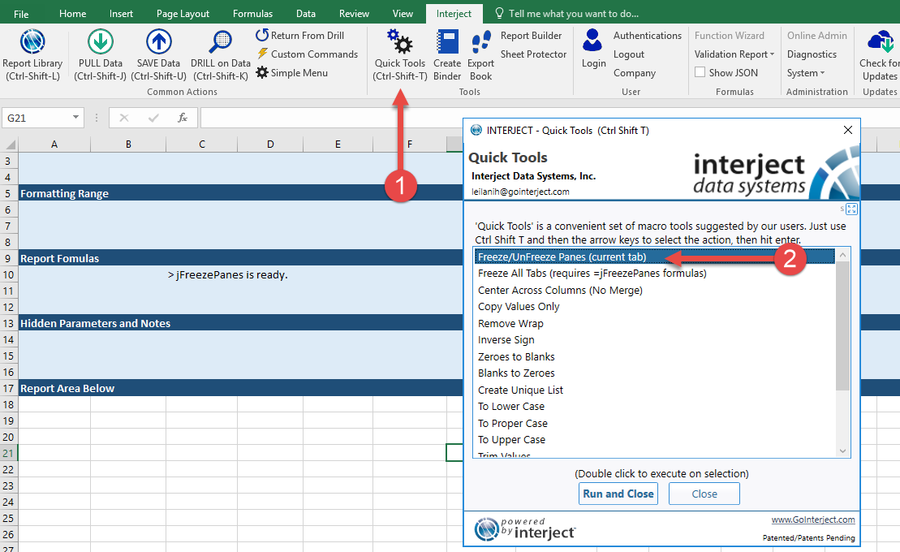

Your report should now look like the following. The sectioned off block from rows 18-25 (ends at highlighted line) is the frozen pane section that will stay at the top as you scroll down. This is where the header with the name of the report and filter parameters will go later. The cells above row 18, which contain the report definitions area, are hidden.

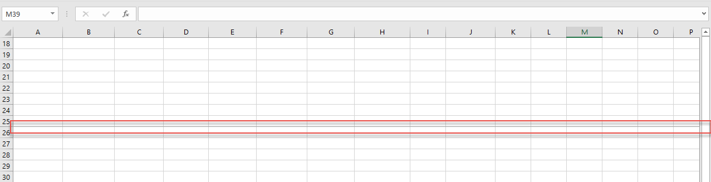

Now that the freeze panes is set up, formatting the spreadsheet is the next step in creating the CustomerOrderHistory report.

#### 8.3 - Creating the Report Area

This section walks you through creating the report area.

**Step 1:** Add the report title.

1. Type **Customer Orders** into cell **B19** then **select the text** you just entered.
2. Select the **Bold** option.
3. Type **14** into the text size input field.

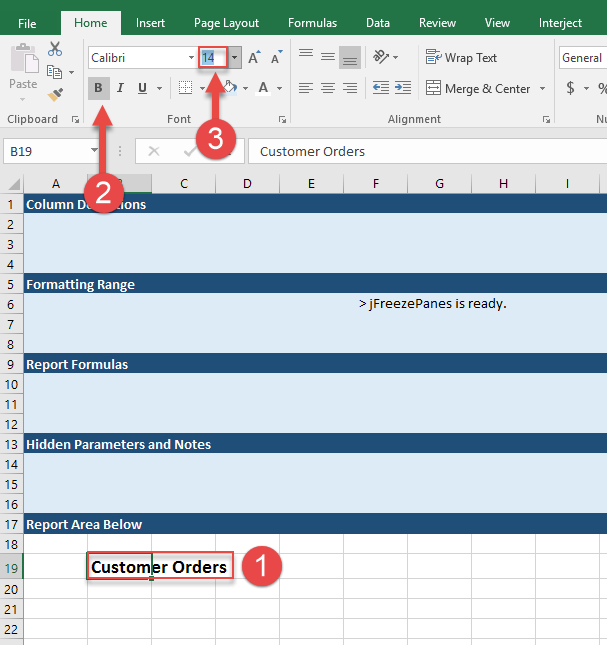

**Step 2:** Add input fields for the filter parameters.

Report filter parameters are a way for the report user to restrict the dataset being pulled into the report from the data portal by specifying a set of characters that the pulled in data records must contain. You will start by labeling the filter input areas, where the user can input their filter text. Labeling the filters is important so that the user understands where they can type in the report and have it impact what data is returned.

In cells **B21, B22 and B23**, respectively, type in: **“Company Name:”**, **“Contact Name:”**, and **“Customer ID:”**

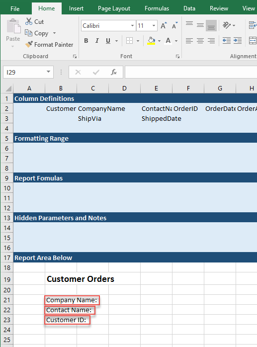

Now, resize column A to be smaller, and extend column B and C by a bit. This will give the user more space to enter their input text.

1. Drag column A back.
2. Drag column B forward.
3. Drag column C forward.

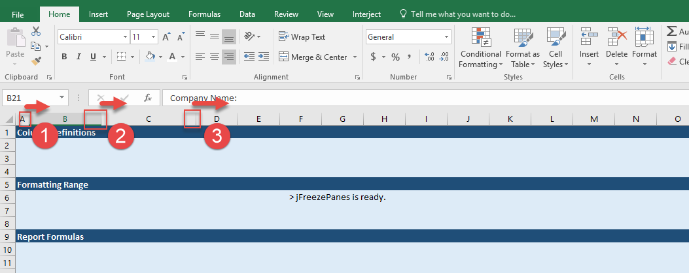

Color the input fields for the report filters. Apply the lightest orange color () to cells **C21, C22 and C23**:

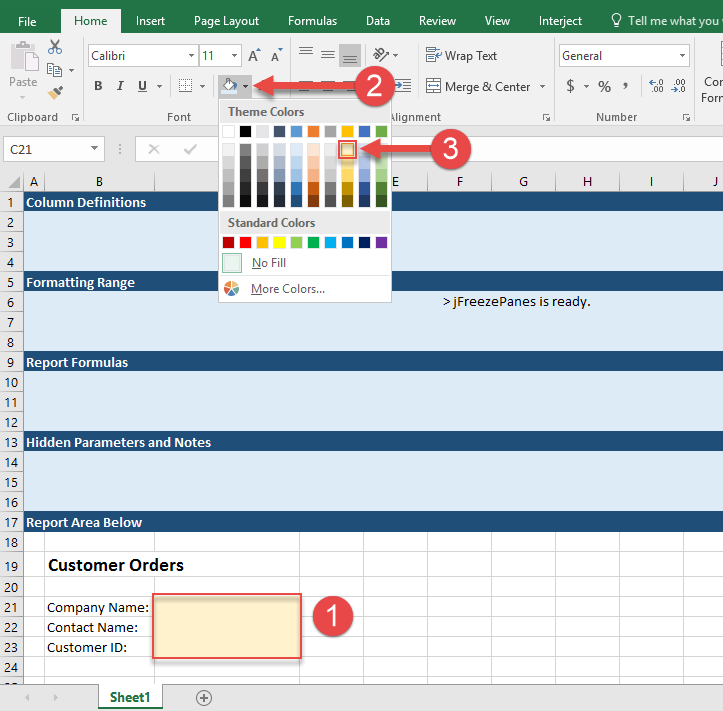

<!-- Should this be included? -->
**Step 3:** Make the spreadsheet look better by removing the gridlines in Excel.

Go to the **File** tab in Excel:

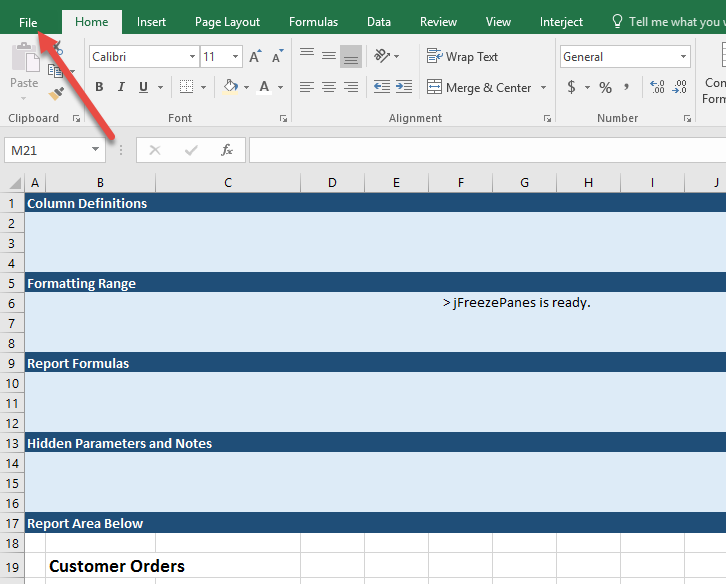

Go to **Options**:

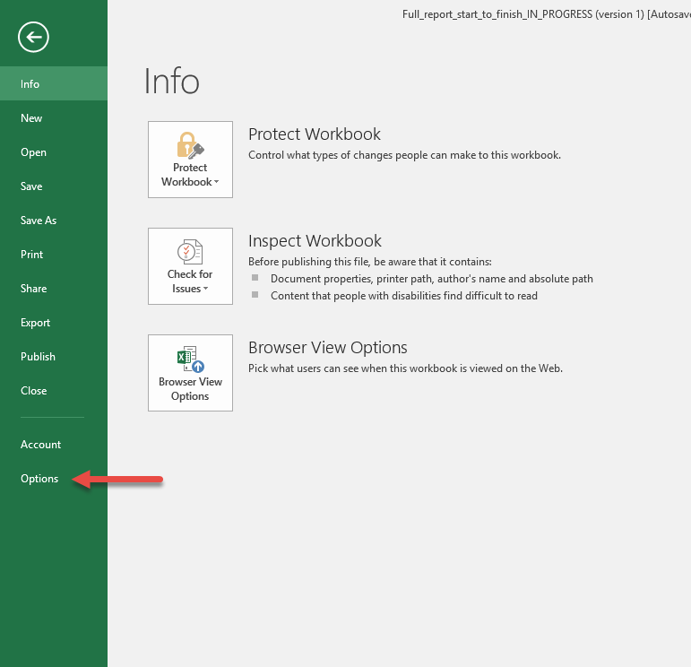

1. Go to the **Advanced** tab.
2. Scroll down until you see **“Display options for this worksheet”**.
3. **Uncheck** the **“Show gridlines”** checkbox.


Now there should be no gridlines on the current worksheet.

**Step 4:** Give the worksheet a name and delete any other worksheets you may have in the current workbook.

Right-click on the first sheet’s title and select **Rename**.

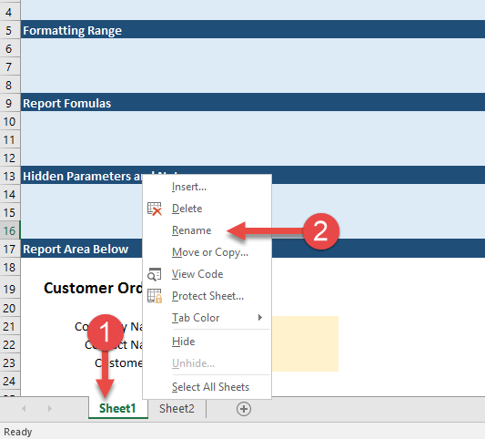

Type in **CustomerOrderHistory**.

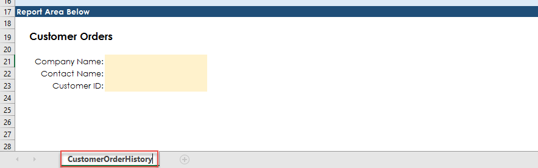

Right-click on any other sheets that you have in the workbook and select **Delete**.

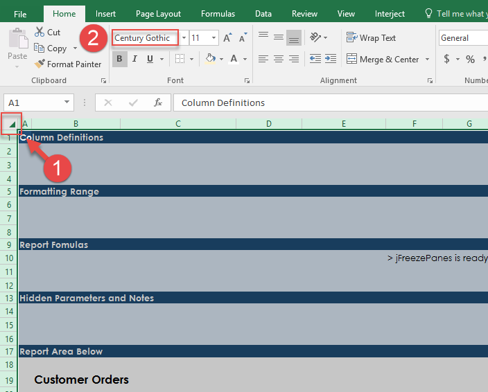

#### 8.4 - Adding the Column Definitions

This section will walk you through adding the needed Column Definitons to the Column Definitions section you already created.

The Column Definitions section will be referenced by the [dbo].[northwind_customer_orders_myname] Data Portal when we call ReportRange() and pass in the Data Portal. It is important that the order of the column names listed here in the Column Definitions section match the order in which they were entered into the Data Portal, because SQL stored procedures (and therefore INTERJECT Data Portals) rely only on parameter *order* to know which parameter is which.

**Step 1:** Enter the first row of Column Definitions.

Starting with row 2, type:
* **CustomerID** into cell **B2**,
* **CompanyName** into cell **C2**,
* **ContactName** into cell **E2**,
* **OrderID** into cell **F2**,
* **OrderDate** into cell **G2**,
* **OrderAmount** into cell **H2**,
* **Freight** into cell **I2**,
* **TotalAmount** into cell **J2**.

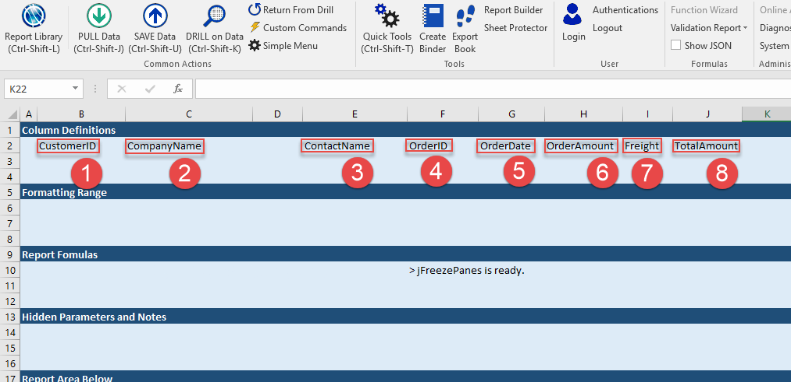

In row 3, type:
* **ShipVia** in cell **C3**,
* **ShippedDate** in cell **E3**.

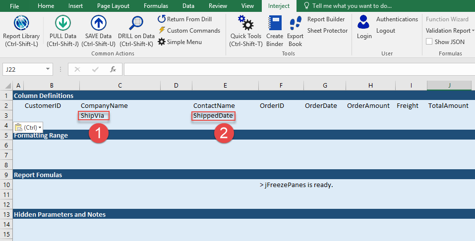

#### 8.5 - Adding Titles for the Columns in the Report Area

Now you will add titles to the Report Area that describe the data that will appear in each column when data is pulled in by the user.

**Step 1:** Freeze the panes on the report.

1. Click on the **Quick Tools** menu option in the INTERJECT Ribbon OR press **CTRL + SHIFT + T** on your keyboard.
2. Select **Freeze/UnfreezePanes (current tab)**.
3. Click **Run and Close** OR press **ENTER** on your keyboard.

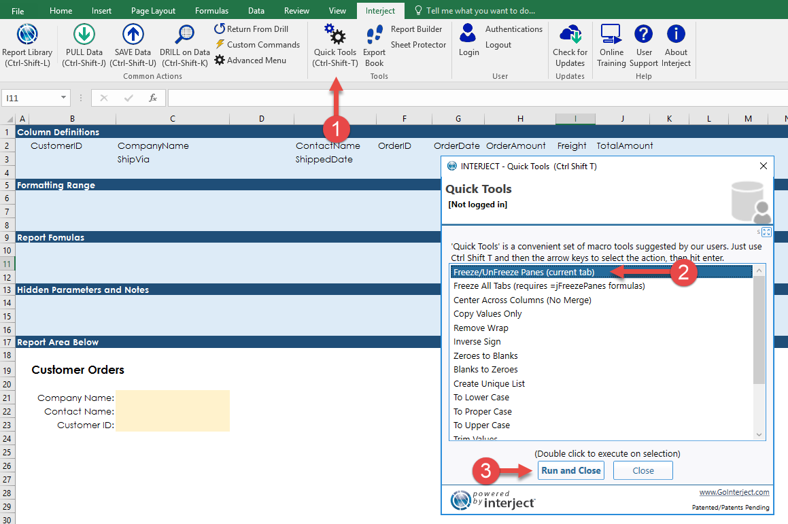

**Step 2:** Enter the column titles.

Type the following:
* **CustomerID** into cell **B25**,
* **CompanyName** into cell **C25**,
* **ContactName** into cell **E25**,
* **OrderID** into cell **F25**,
* **OrderDate** into cell **G25**,
* **OrderAmount** into cell **H25**,
* **Freight** into cell **I25**,
* **TotalAmount** into cell **J25**.

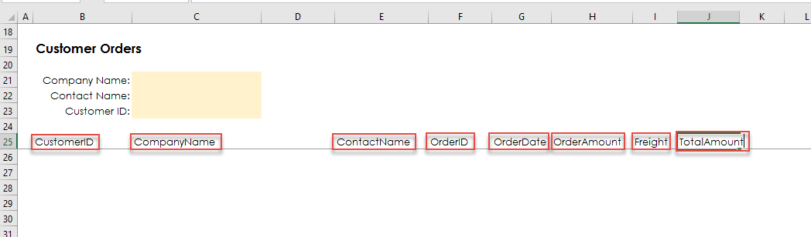

You will add titles for the **ShipVia**

**Step 3:** Make the titles bold.

1. Select cells **B25-J25**.
2. Click on the **Bold** option.

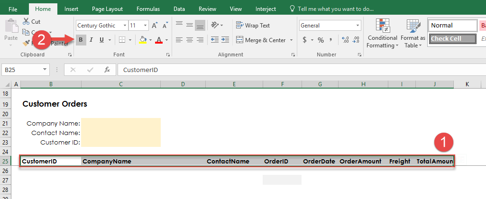

**Step 4:** Add a border under the titles.

1. Select cells **B25-J25**.
2. Click on the **Borders** menu.
3. Select **Thick Bottom Border**.

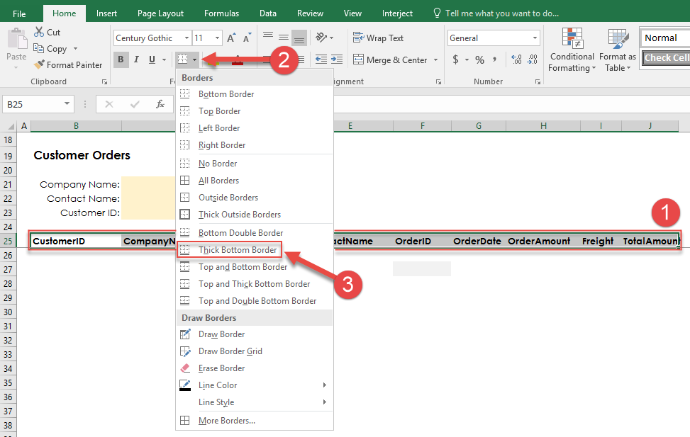

#### 8.6 - Adding ReportRange() to the Sheet

This section will walk you through configuring a ReportRange() on the CustomerOrderHistory sheet as well as setting up the arguments that you need to provide to it, such as the Column Definiton section.

**Step 1:** Add the formula to the report.

1. Type **=ReportRange()** in cell **C10**.
2. Click on the function builder icon.

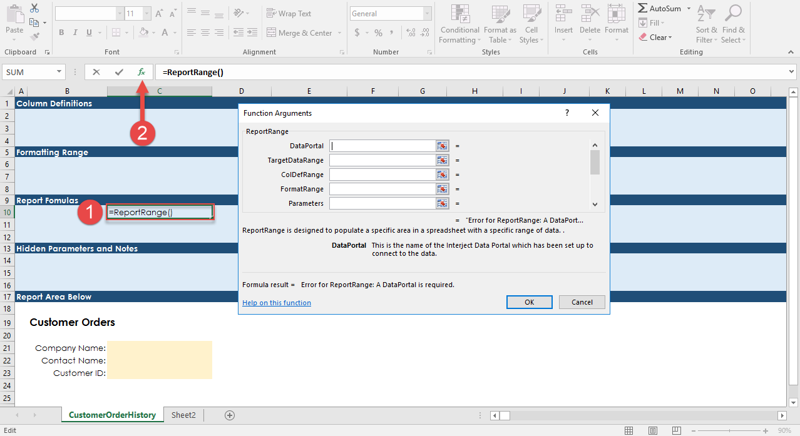

**Step 2:** Specify the Data Portal that ReportRange() will pull data from.

1. Type **NorthwindCustomerOrders_MyName** into the DataPortal parameter box.

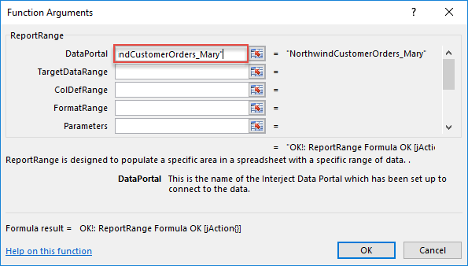

Enter **2:4** into the **ColDefRange** to tell ReportRange() that all of its column definitions can be found in this range of rows. You can read more about ColDefRange here.

**Step 3:**

Type:
* **27:28** into the **TargetDataRange** argument,
* **2:4** into the **ColDefRange** argument,
* **6:8** into the **FormatRange** argument.

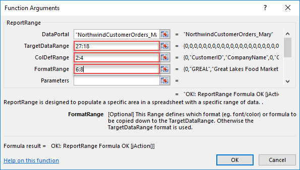

The **Parameters** parameter specifies which cells will be the “filter” cells whose values are sent to the Data Portal to filter results to the user’s specifications. The Param() function ([read more here](https://docs.gointerject.com/wIndex/Param.html)) is used here to capture the cells. Type **Param(C21,C22,C23)** into **Parameters**.

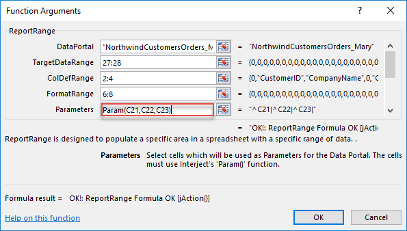

As a best practice, it is recommended that you set **UseEntireRow** to **TRUE** and **PutFieldNamesAtTop** to **FALSE**.

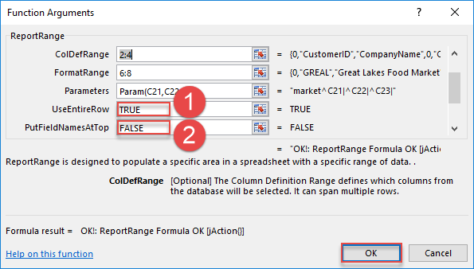

#### 8.7 - Designing the Formatting Range

This section will walk you through designing the Formatting Range section of the Worksheet Definitions area.

**Step 1:** Apply a white background to cells in the Formatting Range.

1. Select **rows 6-8**.
2. Click on the dropdown list next to the paint bucket icon.
3. Select **white** from the dropdown list of paint bucket colors.

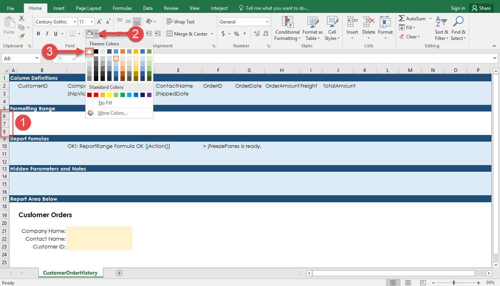

**Step 2:** Apply desired formatting to sample data in the formatting range.

When designing Formatting Ranges, it is useful to use contrived sample data in the formatting range and apply the formatting to this sample data. This helps to illustrate how the real data will look in the TargetDataRange once it’s pulled into the report.

To format how you want **CustomerID** to look in the output data, enter the sample ID **GREAL** into cell **B6**.

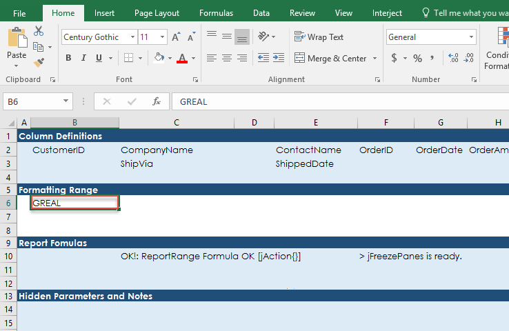

Enter the formatting for **CompanyName** as follows.

1. Enter **Great Lakes Food Market** into cell **C6**.
2. Select all the text.
3. Toggle the **bold** option.

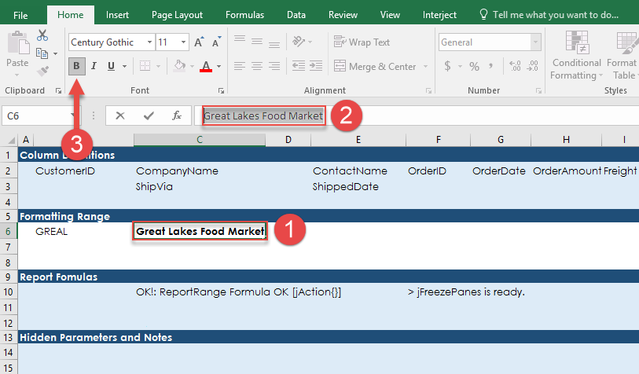

For **ContactName**, enter **Howard Snyder** into cell **E6**. This field doesn't need any special formatting, so we are simply entering sample data to show that it will not be specially formatted.

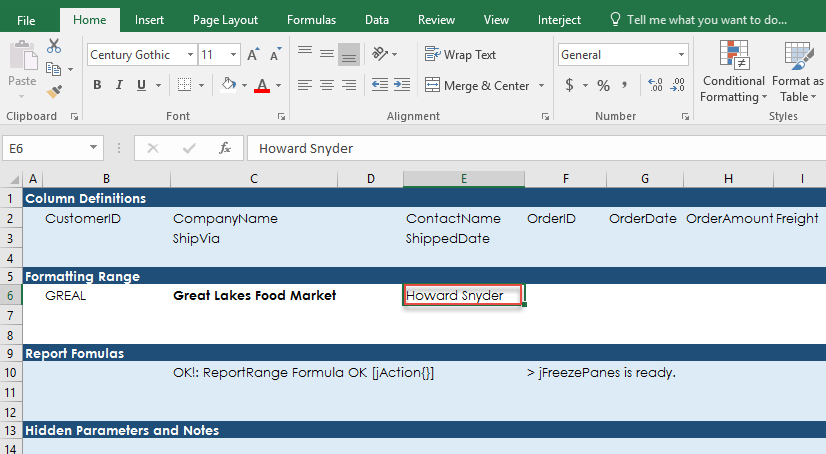

Enter the formatting for **OrderID** as follows:

1. Enter **11061** into cell **F6**.
2. Select all text in the cell and make it bold.
3. Click the center-align text button.
4. Click the paint bucket.
5. Select the lightest grey color.

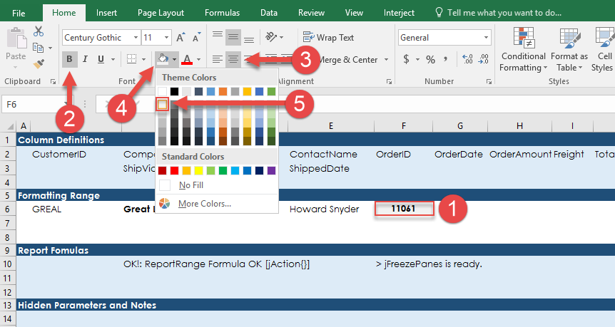

Enter the formatting for **OrderDate** as follows:

1. Enter the sample date **4/30/98** in cell **G6**.
2. Enter **Date** in the format options for the cell.

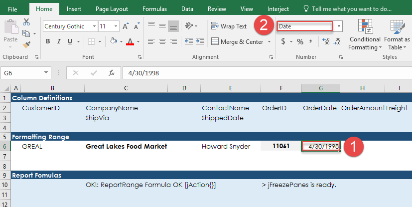

Enter the formatting for **OrderAmount** as follows:

1. Enter the sample data **510** in cell **H6**.
2. Choose **Accounting** for the format options for the cell.

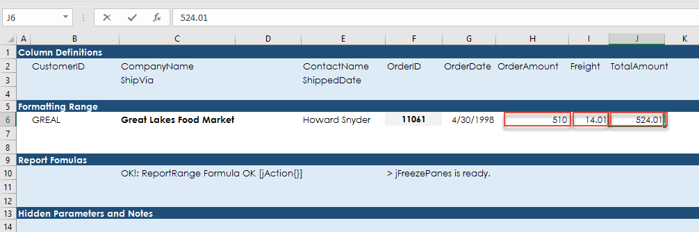

Enter the formatting for **Freight** as follows:

1. Enter **14.01** into cell **I6**.
2. Choose **Accounting** for the format options for the cell.

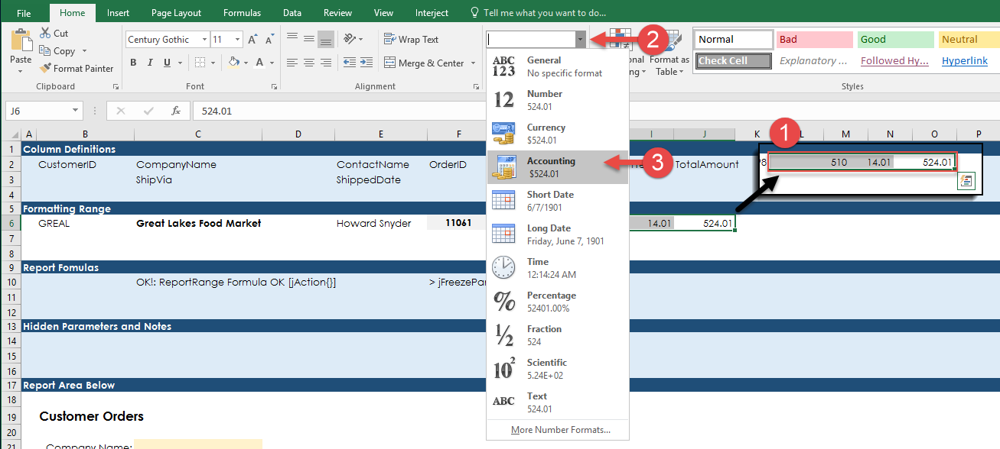

Enter the formatting for **TotalAmount** as follows:

1. Enter **524.01** into cell **J6**.
2. Toggle the **bold** option for the text.
3. Choose **Accounting** for the format options for the cell.

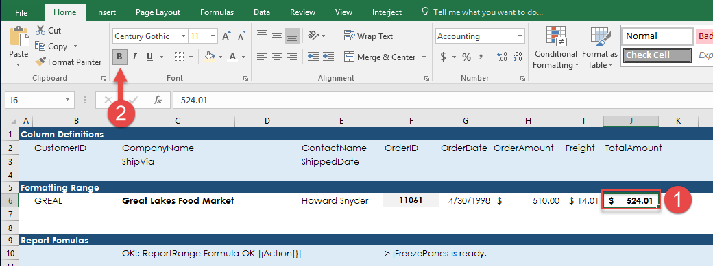

You now only have to format the cells for **ShipVia** and **ShippedDate**. You will add titles for these fields in the row to the left of them and leave the values themselves without any formatting.

1. Enter **Shipped Via:** in cell **B7**.
2. Enter **Ship Date:** in cell **D7**.
3. Expand column C a bit.

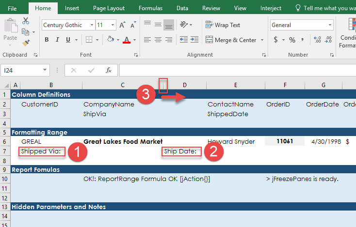

Now, add a border under row 7 (at the top of row 8) to demarcate the end of each record set.

Select cells **B8-J8**.

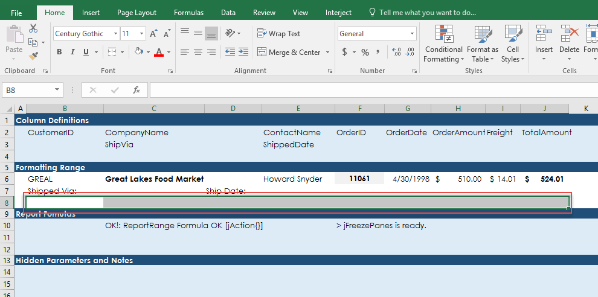

1. Click on the **Borders** dropdown menu.
2. Choose **Top Border**.

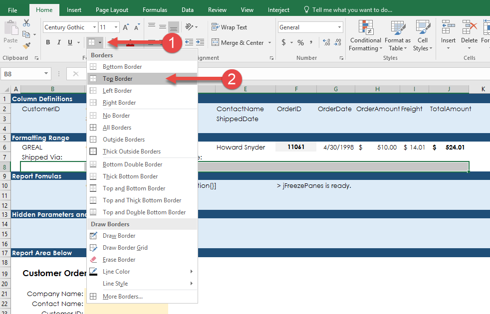

Lastly, reduce **row 8** to provide a small padding under the border we just added.

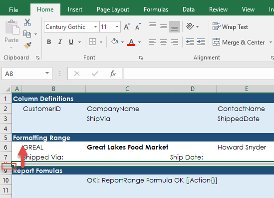

#### 8.8 - Testing ReportRange() with a Data PULL

You now have all the components in place for ReportRange() to be functional. This section will walk you through testing ReportRange(). It is always good practice to test each individual formula you add to the report you’re building once it’s done, before you move on to building the next part/formula on the report. This ensures that at the end when you’re ready to test the finished report, you know that all the constituent parts work by themselves.

**Step 1:** Enter some sample filter text into the one of the filter parameter input fields.

Enter **market** into the Company Name filter parameter in cell **C21**.

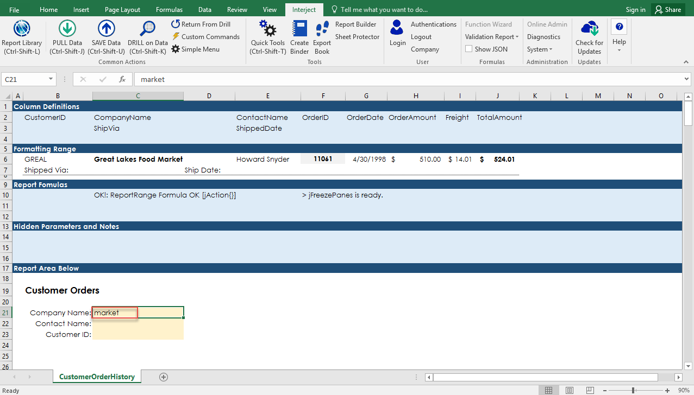

**Step 2:** Run a data PULL on the report.

1. Press **CTRL + SHIFT + J** together on your keyboard or click the **PULL Data** button.
2. Press **Enter** or click **Pull Data**.

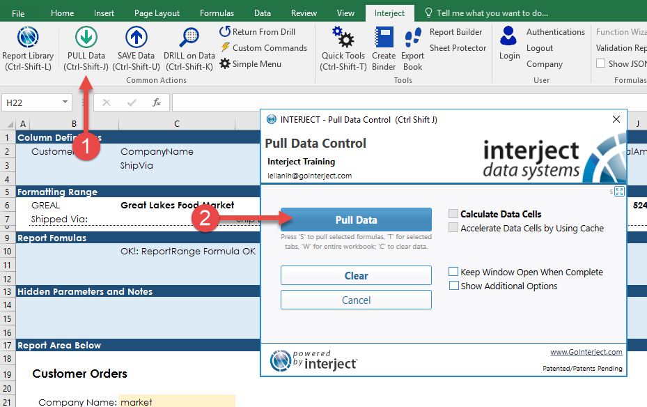

**Step 3:** Unfreeze the panes to view the data in the same format that the end user would.

1. Press **CTRL + SHIFT + T** together on your keyboard or click the **Quick Tools** button.
2. Press **Enter** or click on **Freeze/Unfreeze Panes (current tab)** in the menu.

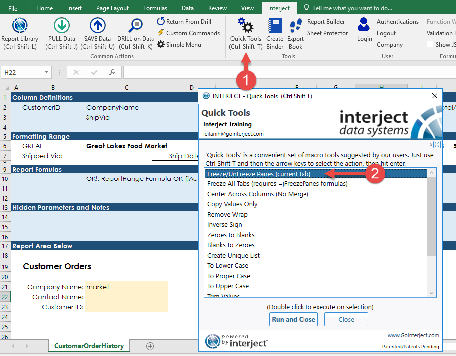

Your data should look like the following screenshot:

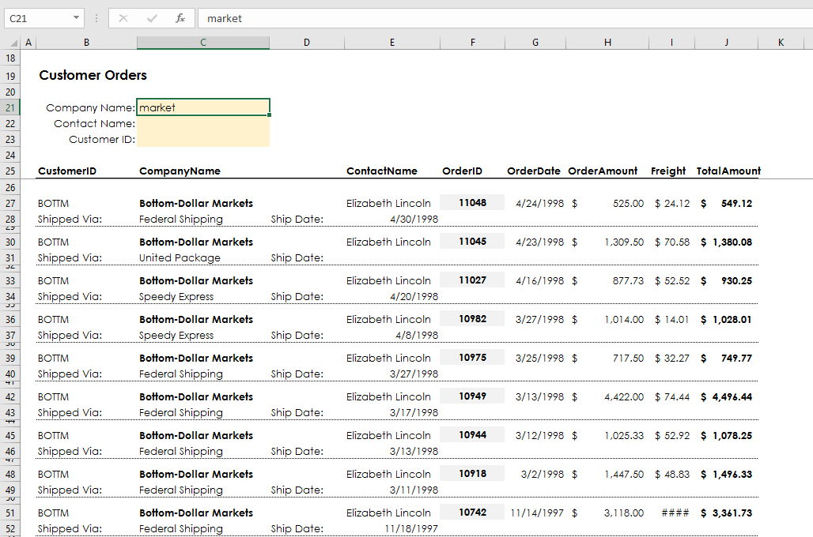

#### 8.9 - Adding ReportDefaults() to the Sheet

This section will walk you through writing the ReportDefaults() function for this sheet. You are using ReportDefaults here to clear out the filter values in cells C21-C23 after a CLEAR is run on the report. CLEAR does not do this by default, because its scope of control over the report is limited to the *results* of the data pull (CLEAR is only allowed to modify the data that a PULL action brings in, because a CLEAR reverses a PULL).

**Step 1:** Add the formula to the report.

1. Type **=ReportDefaults()** into cell **C11**.
2. Open the function builder.

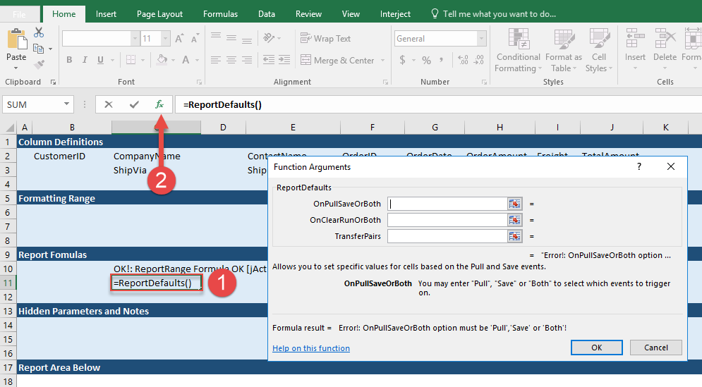

**Step 2:** Fill in the formula arguments.
<!-- does is make sense to have this explanation here? -->
For the arguments OnPullSaveOrBoth and OnClearRunOrBoth, you want ”Pull” and ”Clear” respectively. This is because you want to execute “Trigger 2” explained in [the ReportDefaults() documentation](https://docs.gointerject.com/wIndex/ReportDefaults.html#trigger-combination-list). With these arguments, ReportDefaults() will trigger when the user performs a Pull-Clear event-action sequence.

Enter **”Pull”** into the **OnPullSaveOrBoth** field, and **”Clear”** into **OnClearRunOrBoth**.

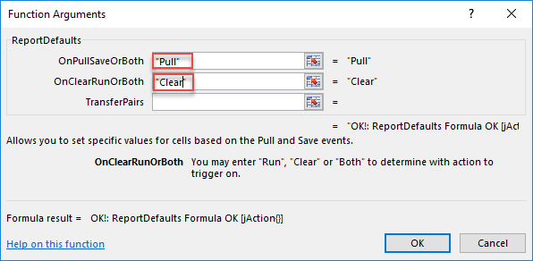

The TransferPairs argument is what decides the default values to place in the selected cells. We want to clear out our filter parameter cells, so we will pair each of these cells (C21-C23) with a blank string ("") to pass in when a Pull-Clear occurs.

Each of these pairs (a cell and a blank string (“”)) needs its own Pair() function inside the overarching PairGroup() function that ReportDefaults() takes as a parameter. Learn more about PairGroup() and Pair()  [here]().

Input **PairGroup()** into **TransferPairs**, then press **Ok**.

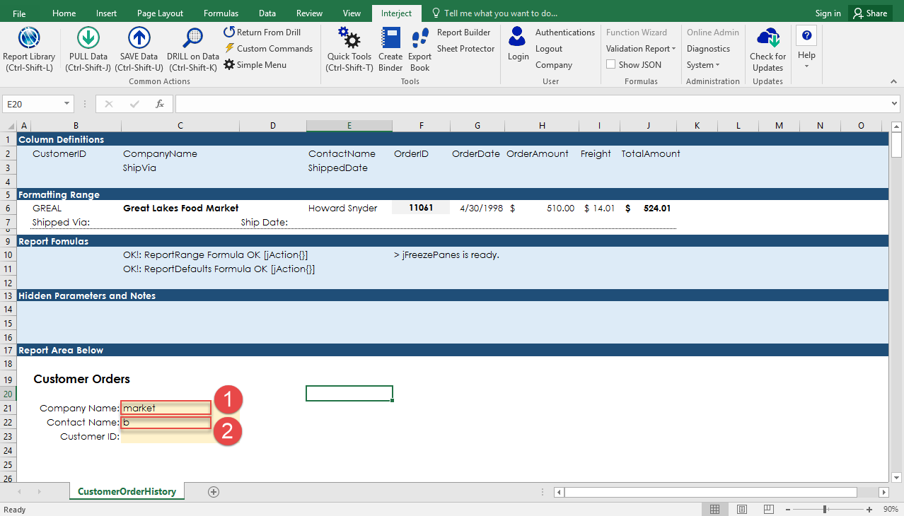

Now, to give arguments to the PairGroup() function, click inside the PairGroup() function within ReportDefaults() and open the function builder.

1. Click in cell C11.
2. In the **Formula Bar**, place the cursor somewhere in the function name text “PairGroup().”
3. Click the function builder icon.

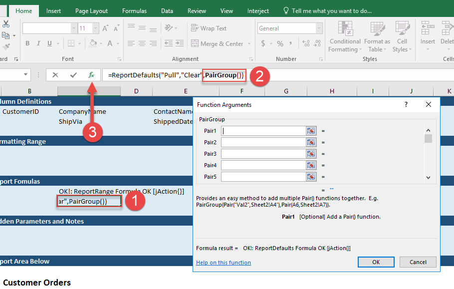

The parameters to Pair() are **From, Target**, or, if you do not have a “From” cell, as in our case, they can be thought of as "SourceValue", and "Target". Our “Source Value” is “” (an empty string) and our Targets are cells C21-C23.

Type **Pair(””, C21)** into **Pair1**, **Pair(””, C22)** into **Pair2** and **Pair(””, C23)** into **Pair3**.

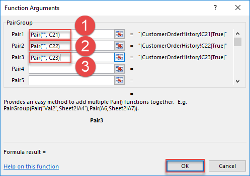

Your ReportDefaults() function should now look like the following:

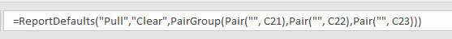

#### 8.10 - Testing ReportDefaults()

This sections walks you through testing ReportDefaults(). It should clear any filter arguments from cells C21-C23 after a PULL-CLEAR.

**Step 1:** Enter some filters into the filter fields.

Enter **market** into cell **C21**, and **b** into cell **C22**.

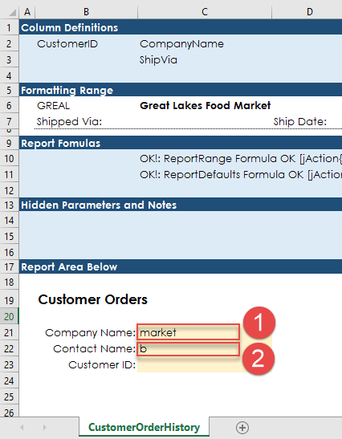

**Step 2:** PULL in the data.

1. Press **CTRL + SHIFT + J** OR click the **PULL Data** menu button.
2. Press **Enter** OR click **Pull Data**.

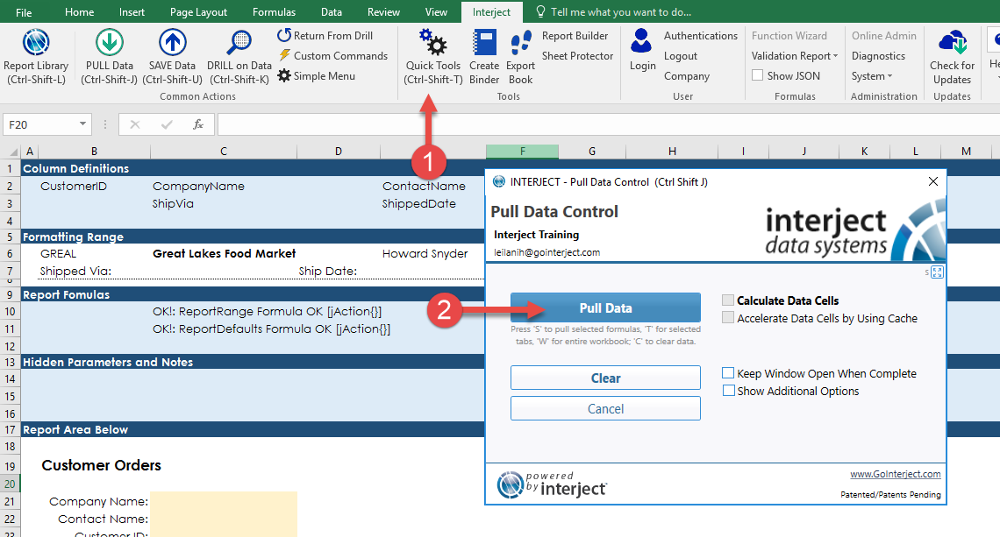

**Step 3:** CLEAR the data.

1. Press **CTRL + SHIFT + T** or click the **Quick Tools** menu button.
2. Press **Down Arrow** once then **Enter** OR click **Clear**.

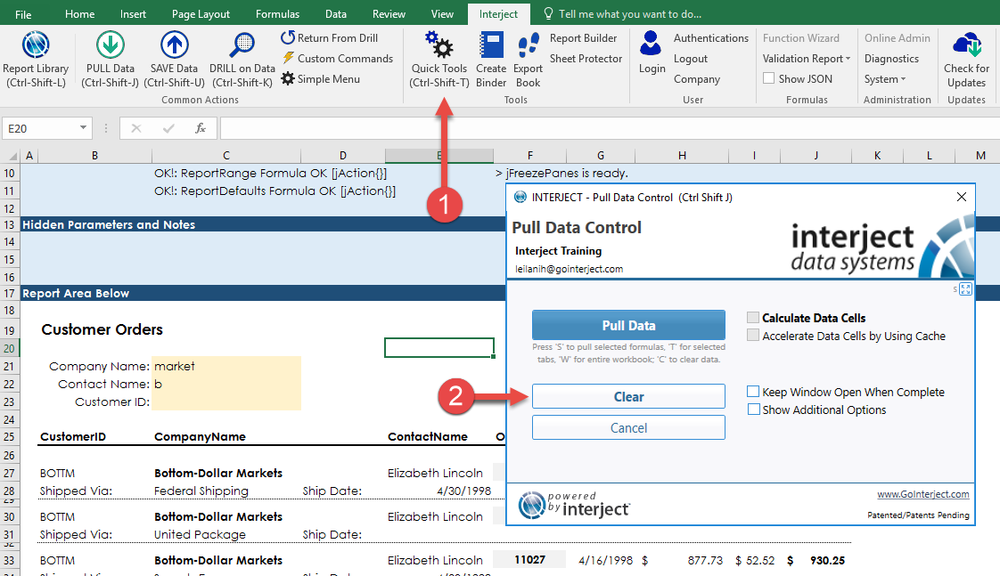

Now you should see that, as well as the data in the Target Data Range being cleared, the filter values in cells C21-C23 will also clear out.

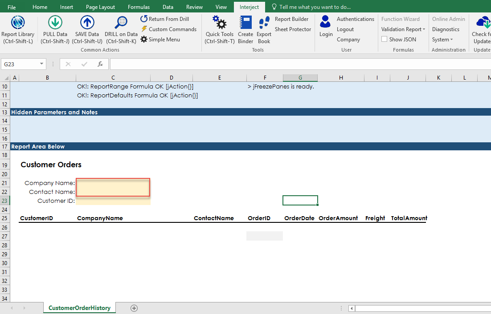

#### 8.11 - Setting the Focused Cell with jFocus()

As a finishing touch, set the active cell for the sheet. It is standard to set the Excel active focused cell on a user input cell when one exists. Set the active focused cell on the input field for the first filter parameter, Company Name.

Type **=jFocus(C21)** into cell **F11**.

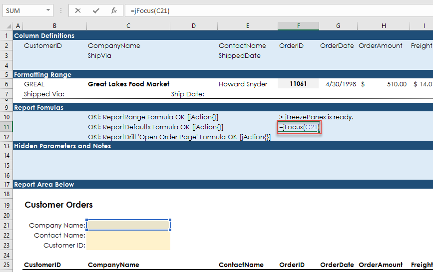

You have now completed the standalone CustomerOrderHistory sheet; the only thing left to implement is the DRILL from the CustomerOrderHistory sheet to the SalesOrder sheet, which will be done after the SalesOrder sheet has been made.

## Section 9: Writing the SQL Stored Procedure for the SalesOrder Data PULL

#### Introduction

This section will walk you through writing the stored procedure for the Data PULL on the SalesOrder sheet.

Using a SQL editor, create a new query file and copy-paste in the following code:

<button class="collapsible">\[demo\].\[northwind_customer_single_order_myname\]</button>
<div markdown="1" class="panel">

```sql
USE [mydatabase]

CREATE PROC [dbo].[northwind_customer_single_order_myname]

    	 @OrderID	NVARCHAR(100)
    	,@Interject_RequestContext NVARCHAR(MAX)

    AS
    BEGIN

    SET NOCOUNT ON  -- helps reduce conflicts with ADO

    DECLARE @ErrorMessage VARCHAR(100)

    IF LEN(@OrderID)>40
    BEGIN
    	SET @ErrorMessage = 'Usernotice:The OrderID must not be more than 40 characters.'
    	RAISERROR (@ErrorMessage, 18, 1)
    	RETURN		
    END

    EXEC []

    SELECT
    	 c.[CustomerID]
    	,c.[ContactName]
    	,c.[CompanyName]
	  	,o.[ShipAddress]
    	,o.[ShipCity]
	  	,o.[ShipPostalCode]
    	,o.[ShipCountry]
	  	,c.[Phone]
	  	,c.[Fax]
    	,o.[OrderDate]
	  	,o.[RequiredDate]
    	,o.[ShippedDate]
    	,s.[CompanyName] AS ShipVia
    	,o.[Freight]
    FROM [dbo].[Northwind_Orders] o
    	INNER JOIN [dbo].[Northwind_Customers] c
    		ON o.[CustomerID] = c.[CustomerID]
    	INNER JOIN [dbo].[Northwind_Shippers] s
    		ON o.[ShipVia] = s.[ShipperID]
    	INNER JOIN [dbo].[Northwind_Order Details] d
    		ON o.[OrderID] = d.[OrderID]
    WHERE o.[OrderID] = @OrderID

    END
```

</div>

<button class="collapsible">Example Test Script</button>
<div markdown="1" class="panel">

```sql
EXECUTE [dbo].[northwind_customer_single_order_myname]
@OrderID = 11061
```
</div>

**Step 2:** Modify the stored procedure.

Change "myname" in the following portion of code to your name (here "mary").

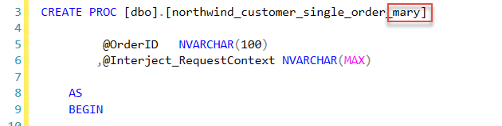

## Section 10: Creating the Data Portal for the SalesOrder Spreadsheet

#### Introduction

This section will walk you through creating the Data Portal that will connect to the [northwind_customer_single_order_myname] stored procedure. This Data Portal will be used to populate data into the SalesOrder spreadsheet upon a data PULL.

*In this section:*

##### [10.1 - Create the Data Portal](#101--create-the-data-portal-1)
##### [10.2 - Add the Formula Parameters](#102---add-the-formula-parameters-1)
##### [10.3 - Add the System Parameters](#103---add-the-system-parameters-1)

#### 10.1 - Create the Data Portal

**Step 1:** Create the Data Portal.

Navigate to [the portal site](https://portal.gointerject.com/) and choose Data Portals.

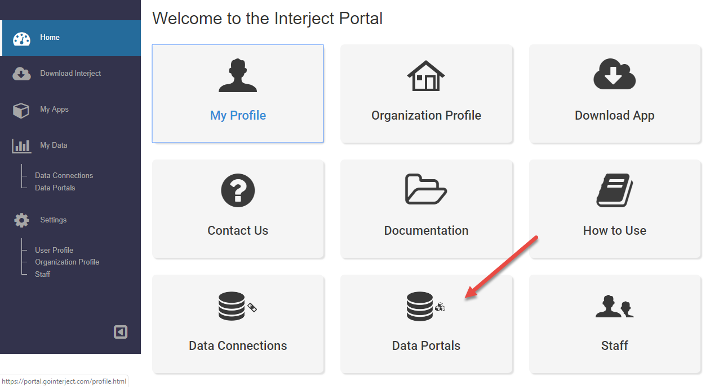

Create a new data portal by clicking the **NEW DATA PORTAL** button.

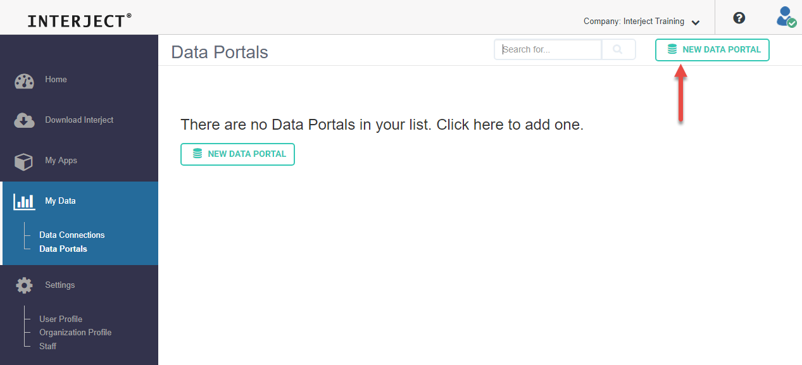

**Step 2:** Edit the data portal details.

1. Enter a name for your Data Portal (**”NorthwindCustomerSingleOrder_MyName”** with your name substituted in for MyName) in the **Name** field.
2. Enter a brief description in the **Description** field.

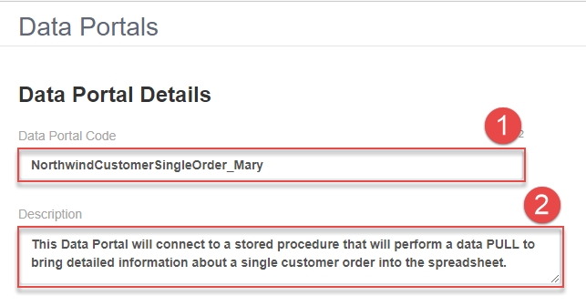

Under **connection**, you will need to find the name of the Data Connection that you created for this lab in Section 10.

1. Click on the dropdown menu next to the word "none".
2. Start typing your name in the **Filter** box to filter for all Data Connections that contain your name.
3. Select **NorthwindDB_MyName**.

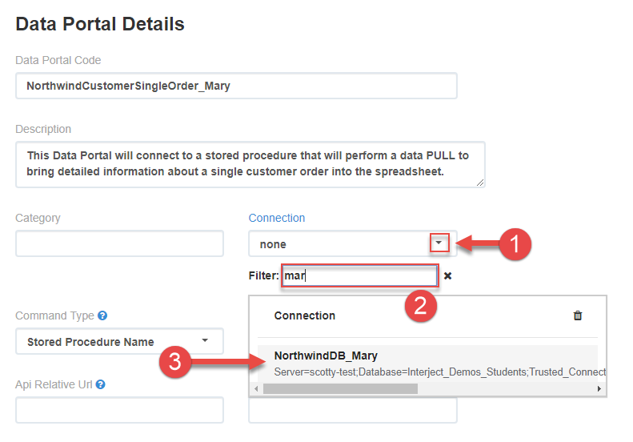

Now, set some of the descriptive attributes of the Data Portal and specify the stored procedure you created in Section 9.

1. Optionally, you can include **Demo** for the **Category** field (it can also be left blank).
2. Under **Command Type**, click the dropdown menu.
3. Select **Stored Procedure Name** from the dropdown list that appears.
4. Type in the name of the stored procedure you created in Section 9, **[dbo].[northwind_customer_single_order_myname]** with your name substituted for "myname".

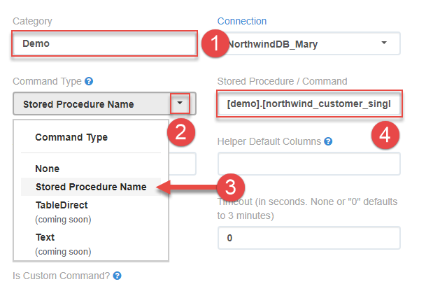

1. For **Data Portal Status**, choose **Enabled**.
2. For **Is Custom Command?**, choose **No**
3. Save your new data portal by clicking **CREATE NEW DATA PORTAL**.

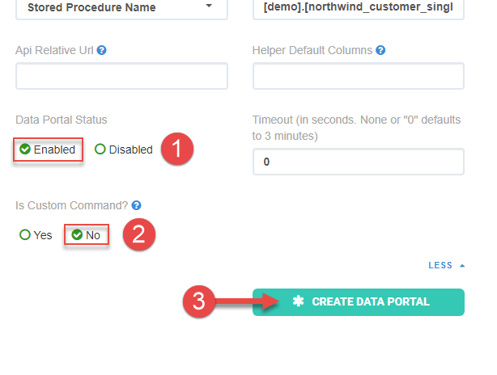

#### 10.2 - Add the Formula Parameters

Once you save your Data Portal, you will be able to add parameters to your Data Portal.

Press **Click here to add a Formula Parameter**.

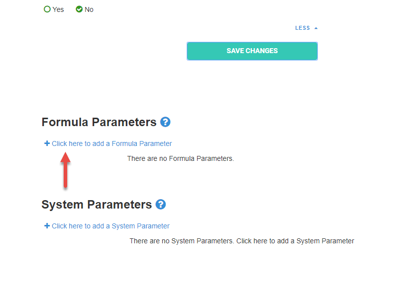

The first Formula Parameter you add will be an input parameter. It will be the OrderID that the SalesOrder spreadsheet will receive when it is drilled into from CustomerOrderHistory.

1. Enter **OrderID** into the **NAME** field.
2. Enter **int** into the **TYPE** field.
3. Enter **input** into the **DIRECTION** field.
4. Press the save icon and wait for it to turn green.

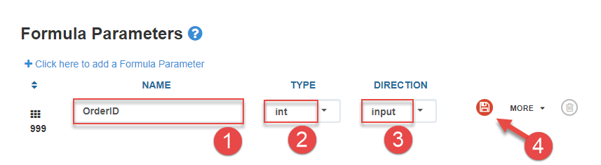

This Data Portal will have many output parameters since SalesOrder is a detailed sheet that requires many data fields.

<!-- fix spacing -->
1. Press **Click here to add a Formula Parameter** 5 times to create 5 blank parameter entry fields.
3. Enter **nvarchar** in all 5 of the highlighted **TYPE** fields.
4. Enter **output** in all 5 of the highlighted **DIRECTION** fields.
4. Enter the following:
    * **CustomerID** in the 2nd **NAME** field.
    * **ContactName** in the 3rd **NAME** field.
    * **CompanyName** in the 4th **NAME** field.
    * **ShipAddress** in the 5th **NAME** field.
    * **ShipCity** in the 6th **NAME** field.
5. Press the save icon following the last parameter added (the other 4 should have saved automatically).

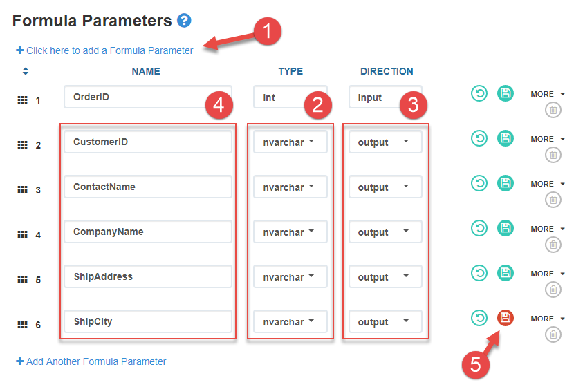

1. Press **Click here to add a Formula Parameter** 4 times to create 4 new fields.
3. Enter **nvarchar** in all 4 of the highlighted **TYPE** fields.
4. Enter **output** in all 4 of the highlighted **DIRECTION** fields.
4. Enter the following:
    * **ShipPostalCode** in the 7th **NAME** field.
    * **ShipCountry** in the 8th **NAME** field.
    * **Phone** in the 9th **NAME** field.
    * **Fax** in the 10th **NAME** field.
5. Press the save icon following the last parameter added.

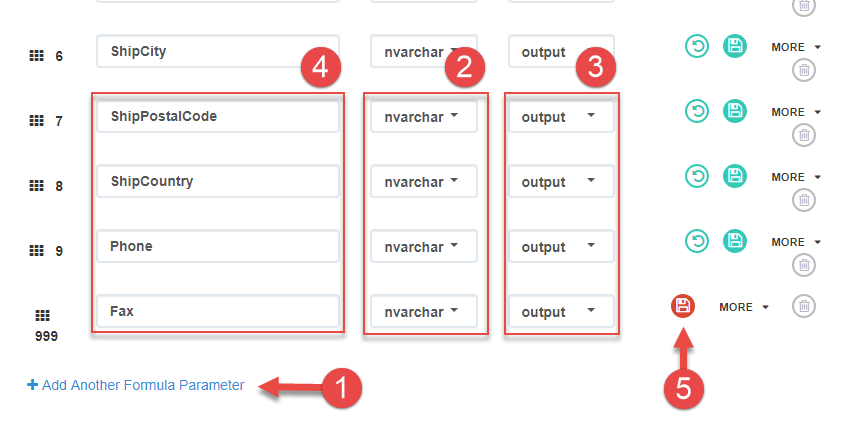

Now, add the necessary date parameters.

1. Press **Click here to add a Formula Parameter** 3 times to create 3 new fields.
3. Enter **date** in all 3 of the highlighted **TYPE** fields.
4. Enter **output** in all 3 of the highlighted **DIRECTION** fields.
4. Enter the following:
    * **OrderDate** in the 11th **NAME** field.
    * **RequiredDate** in the 12th **NAME** field.
    * **ShippedDate** in the 13th **NAME** field.
5. Press the save icon following the last parameter added.

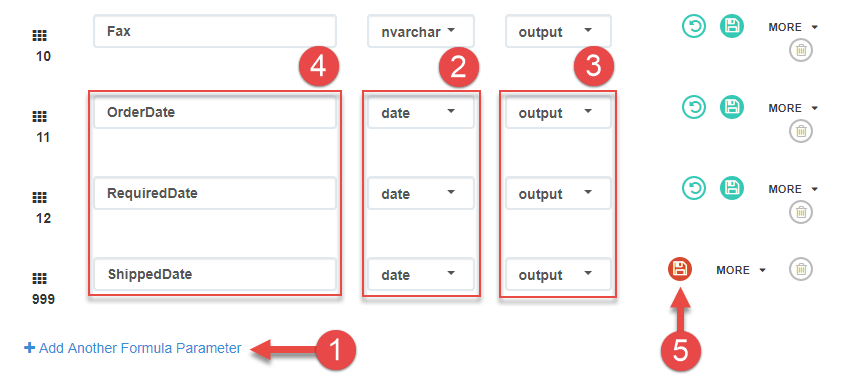

Add the last 2 Forumula Parameters.

1. Press **Click here to add a Formula Parameter** 2 times to create 2 new fields.
3. Enter the following:
    * **nvarchar** in the 14th **TYPE** field.
    * **money** in the 15th **TYPE** field.
4. Enter **output** in both of the highlighted **DIRECTION** fields.
4. Enter the following:
    * **ShipVia** in the 14th **NAME** field.
    * **Freight** in the 15th **NAME** field.
5. Press the save icon following the last parameter added.

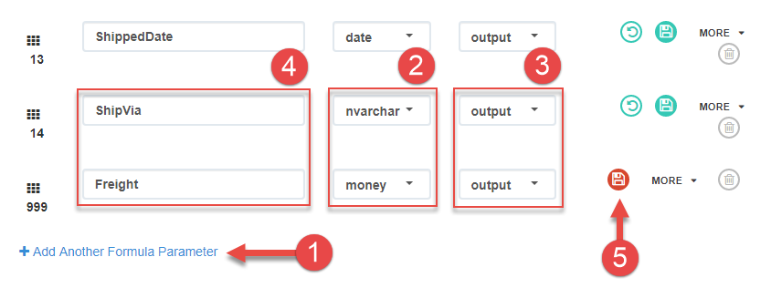

#### 10.3 - Add the System Parameters

In this Data Portal, we will use the Interject_RequestContext system parameter.

1. Scroll down to the System Parameters section and click **Click here to add a System Parameter**.
2. Select **Interject_RequestContext** from the list.

Click the save icon to save if it does not save automatically.

The TYPE and DIRECTION are preset for System Parameters.

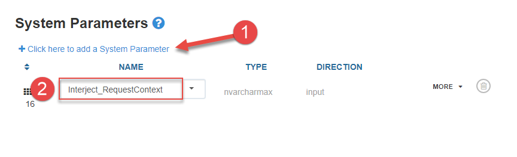

## Section 11: Building the SalesOrder Spreadsheet

#### Introduction

This section will walk you through creating the SalesOrder spreadsheet, which is a detailed look at a single customer order.

*In this section:*

##### [11.1 - Creating the SalesOrder Worksheet](#111---creating-the-salesorder-worksheet-1)
##### [11.2 - Creating the Worksheet Definitions Area](#112---creating-the-worksheet-definitions-area-1)
##### [11.3 - Setting the Frozen Panes with jFreezePanes()](#113---setting-the-frozen-panes-with-jfreezepanes-1)
##### [11.4 - Formatting the Report Area](#114---formatting-the-report-area-1)
##### [11.5 - Adding ReportRange() to the Sheet](#115---adding-reportrange-to-the-sheet-1)
##### [11.6 - Adding ReportDefaults() to the Sheet](#116---adding-reportdefaults-to-the-sheet-1)
##### [11.7 - Setting the Focused Cell with jFocus()](#117---setting-the-focused-cell-with-jfocus-1)
##### [11.8 - Final Formatting of the Report Area](#118---final-formatting-of-the-report-area-1)

#### 11.1 - Creating the SalesOrder Worksheet

**Step 1:** Create another worksheet in the workbook and name it SalesOrder.

Click the plus sign to add another worksheet.

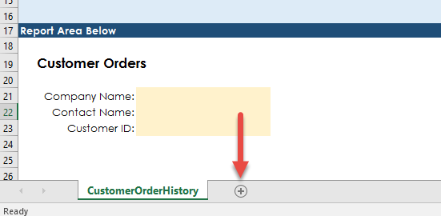

1. Right-click on the new worksheet.
2. Select **Rename** from the list that appears.

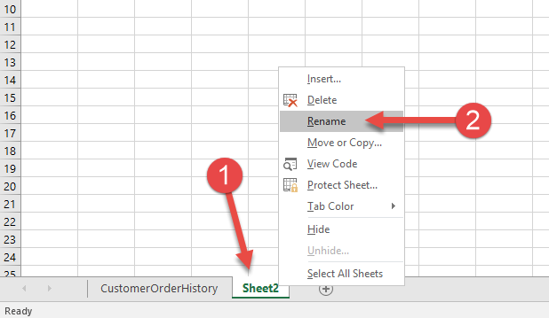

Enter **SalesOrder** in the input field.

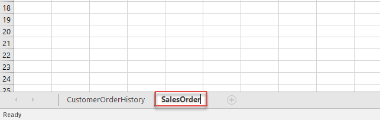

#### 11.2 - Creating the Worksheet Definitions Area

You will start by setting up the bare bones of the Worksheet Definitions Area, then switch to formatting the Report Area. You will start with the Worksheet Definitions Area because its configuration will impact how the Report Area will look.

**Step 1:** Format the report definitions area.

The report definitions area for this report will have very similar formatting to the one used in CustomerOrderHistory. You can thus start by copying and pasting the report definitions area from CustomerOrderHistory to the SalesOrder worksheet.

Switch workbooks back to CustomerOrderHistory.

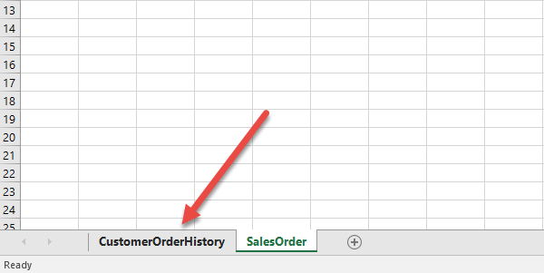

Copy **rows 1-17**.

1. Select **rows 1-17**.
2. Right-click on the selected rows and select **Copy**.

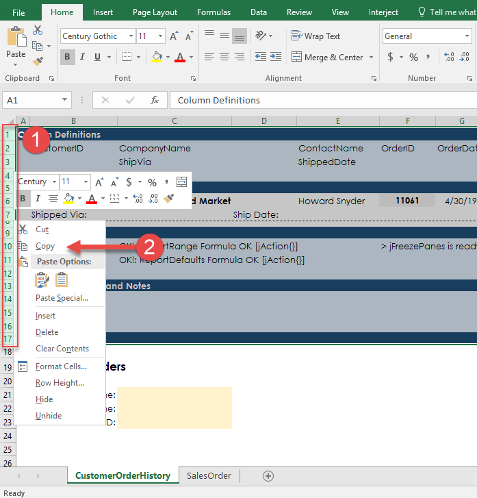

Go back to the SalesOrder tab.

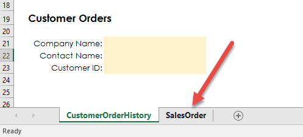

1. Right-click on **row 1** of the report.
2. Select the first **Paste** option form the list on icons.

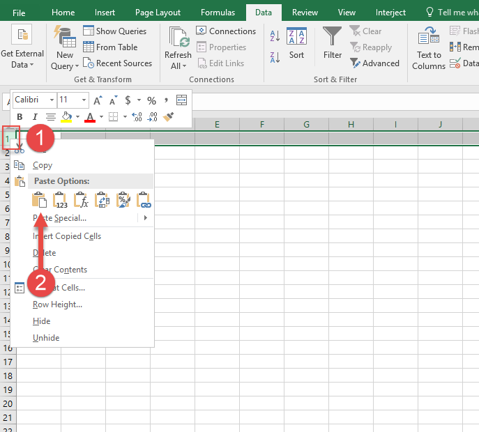

The SalesOrder report doesn’t need a Formatting range, so you can delete the Formatting Range altogether.

1. Select **rows 5-8** and right click on them.
2. Select **Delete**.

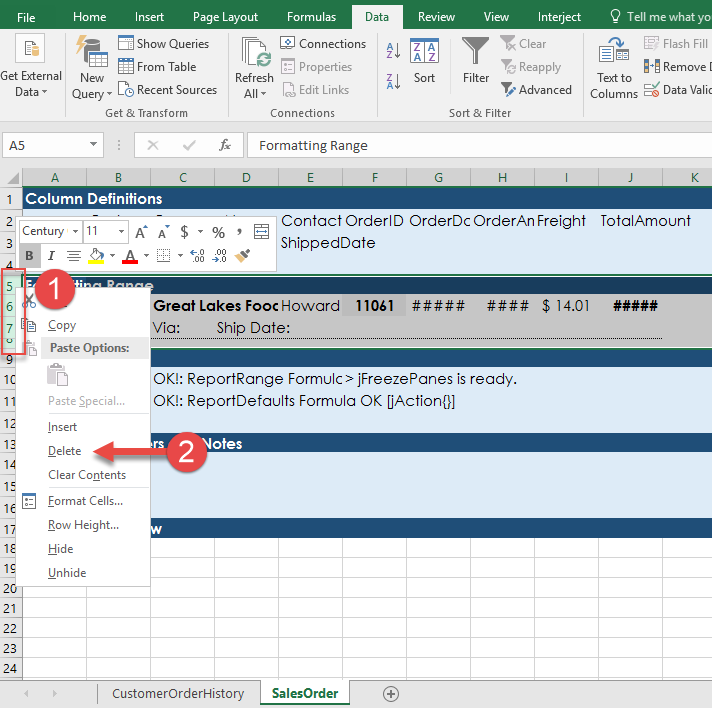

The Column Definitions area only needs one row, so delete the other 2.

1. Select **rows 2 and 3** (the rows with unneeded text in them) and right-click on them.
2. Select **Delete**.

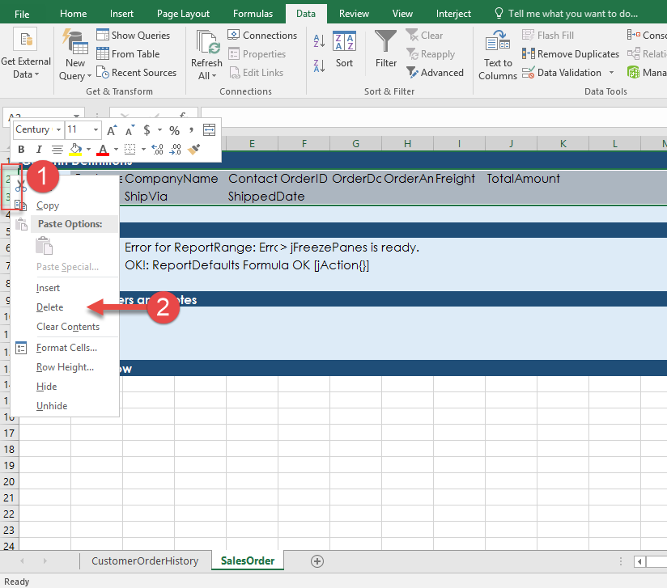

The Hidden Parameters and Notes section only needs 2 rows, so, delete one of them.

1. Select **row 8** and right-click on it.
2. Select **Delete**.

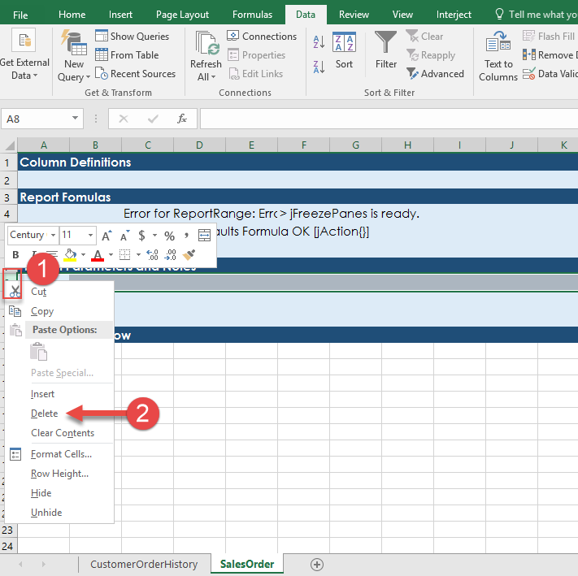

Now that all of the sections are the right size, remove the excess text.

1. Right-click on one of the light blue rows that has no text in it (in this case, **row 6**).
2. Select **Copy**.

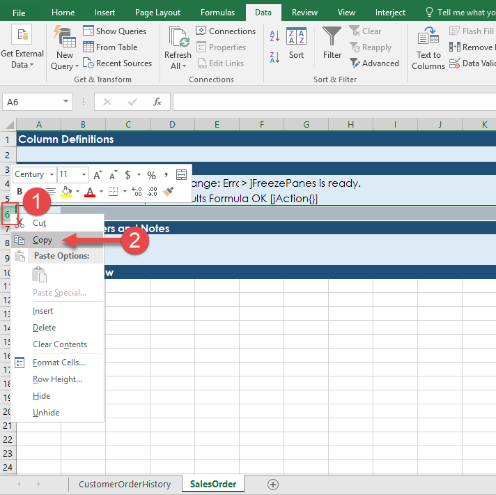

1. Select **rows 4 and 5** and right-click on them.
2. Select the first **Paste** option from the list of icons.

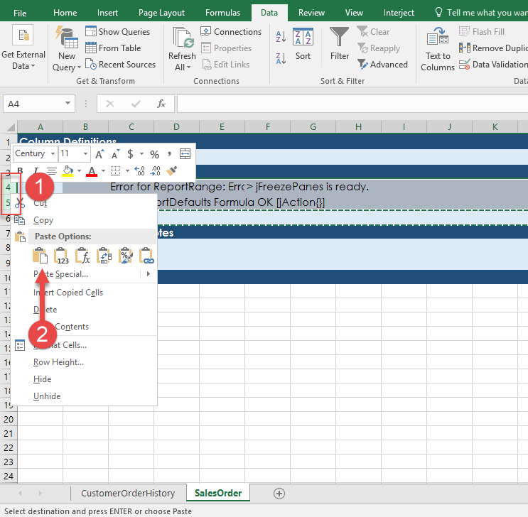

**Step 2:** Add the Column Definition values.

You can optionally change the sizes of the columns to roughly match the ones in the screenshot as you go along.

1. Enter **CategoryName** into cell **B2**.
2. Enter **ProductID** into cell **C2**.
3. Enter **ProductName** into cell **D2**.
4. Enter **Discount** into cell **E2**.
5. Enter **Quantity** into cell **F2**.
6. Enter **UnitPrice** into cell **G2**.
7. Enter **ExtendedPrice** into cell **H2**.

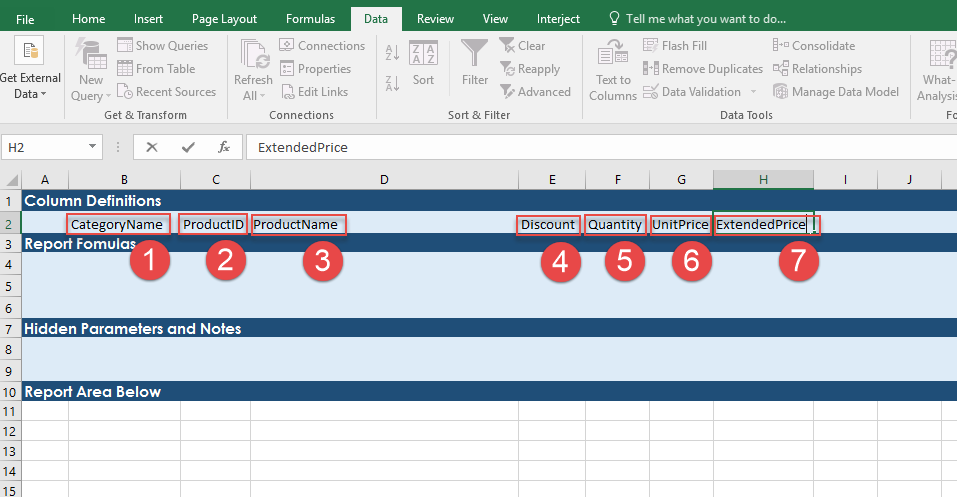

1. Enter **OrderID** into cell **J2**.
2. Enter **ProductID** into cell **K2**.
3. Enter **CategoryID** into cell **L2**.

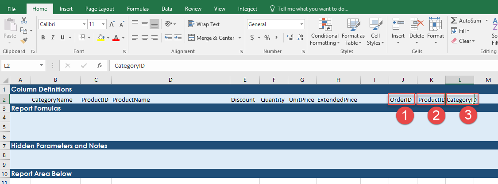

Collapse columns J-M because they are not going to be displayed in the report area directly under the column definitions section like most of the column definition values are. This would be done in a business use case to ensure that users are not confused.

Select **columns J-M**.

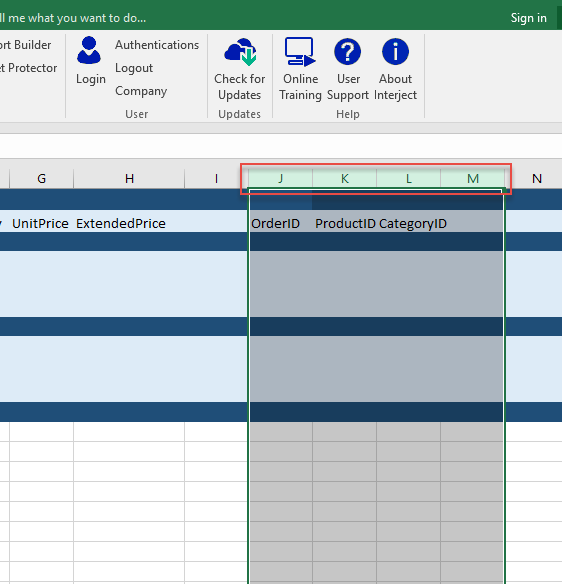

Click the edge of column M while columns J-M are selected, and drag the edge all the way into the start of column J until the columns are collapsed and hidden as shown below.

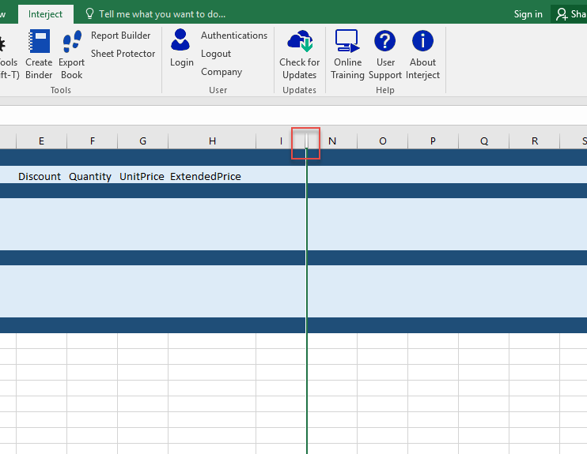

#### 11.3 - Setting the Frozen Panes with jFreezePanes()

In the Report Formulas section in **cell G4**, type **=jFreezePanes(A24, A11)** to set the cells between A11-A24 as the frozen section at the top of the report, and cells above A11 as the hidden section when panes are frozen.

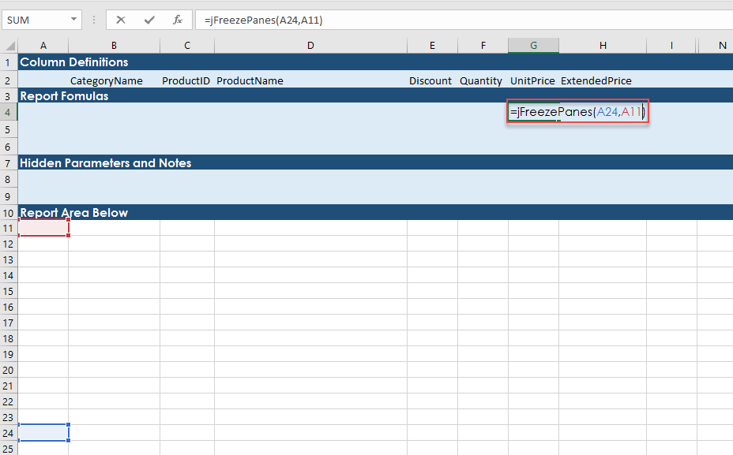

Now, activate the freeze panes so that you can focus on formatting the Report Area for now.

1. Press **CTRL + SHIFT + T** OR click on the **Quick Tools** menu in the INTERJECT ribbon.\
2. Select **Freeze/UnFreeze Panes (current tab)**.
3. Press **ENTER** OR click on **Run and Close**.

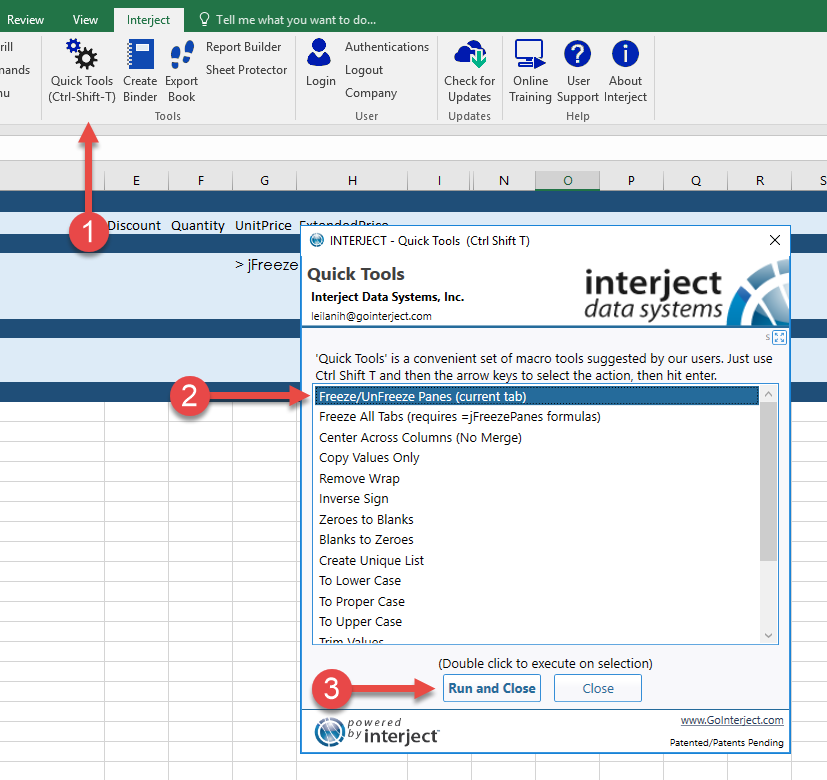

#### 11.4 - Formatting the Report Area

Next, you will format the Report Area. You will do this before writing the Report Formulas for this report because the formatting of the Report Area will help to determine which cells will be inputs/outputs to the Report Formulas.

**Step 1:** Start by turning off gridlines in this workbook to temporarily move them out of the way.

Click into the **File** tab above the Excel ribbon.

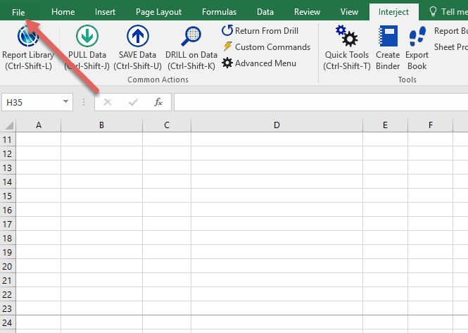

Click **Options**


1. In the window that pops up, click the **Advanced** tab.
2. Scroll down until you see the header **Display options for this worksheet**.
3. **Uncheck** the **Show gridlines** box.

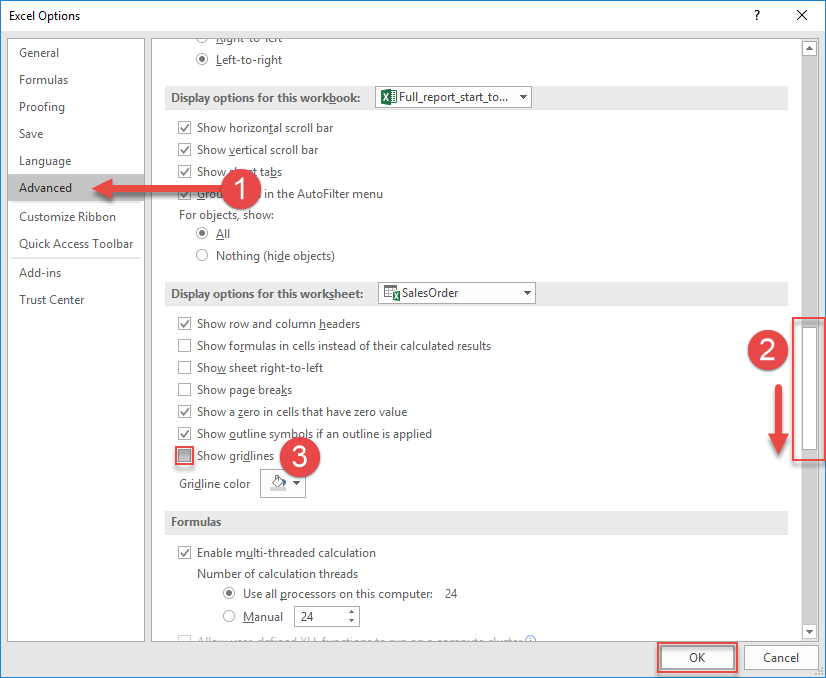

**Step 2:** Add a title to the report area.

1. Type **SALES ORDER** into cell **B12**  then **select the text**.
2. Type **Arial Black** into the **Font** selection box.
3. Type **20** into the **Font Size** selection box.
4. Click on the **Text Color** selector.
5. Select the second from last blue color (#4B758B).

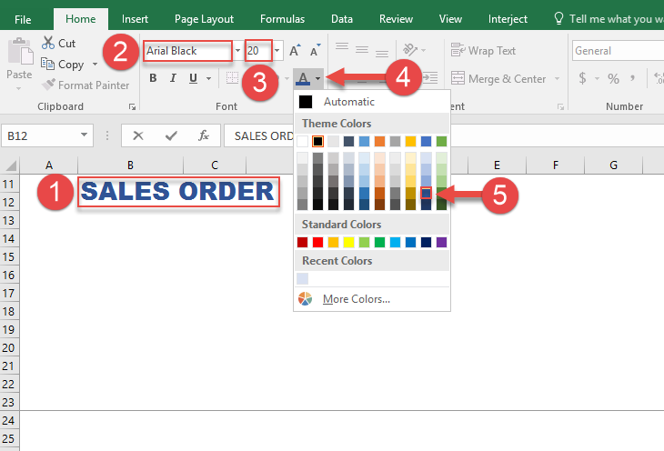

Now, drag **row 12** down to be about **42 pixels** tall.

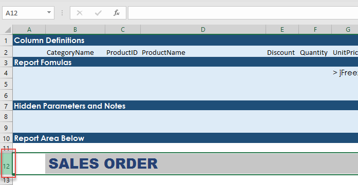

**Step 3:** Format the customer information section.

Now you will format the first section of the report area, the customer information section.

First, add a title to the section.

1. In cell **B14**, enter **CUSTOMER:** then **select the text**.
2. Enter **Arial** in the **Font** selection box.
3. Enter **10** in the **Font Size** box.
4. Select **Bold**.

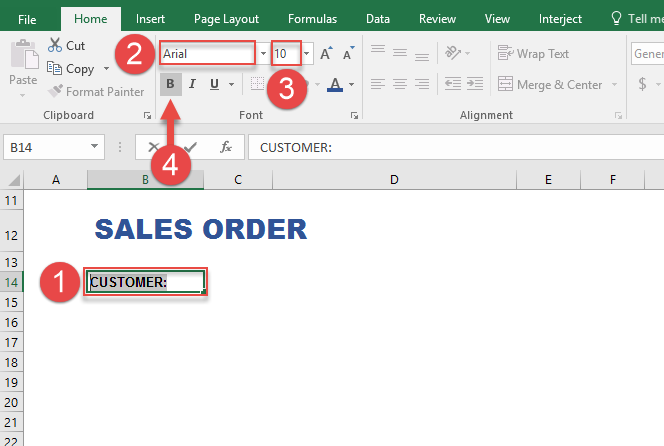

Apply a background color to the customer information section.

1. Select the block of cells **B15-D19**.
2. Click the paint bucket to open the fill color selector.
3. Select the lightest blue color (#D9E1F2).

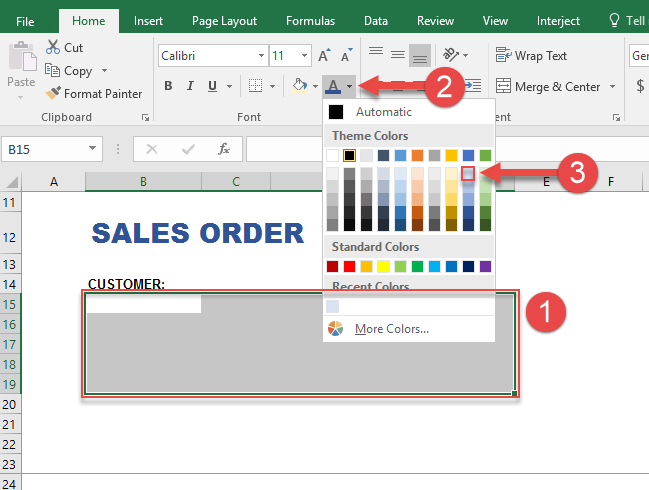

**Step 4:** Format the order information section.

Add the cell titles for the different pieces of order information that will be displayed.

Type **ORDER DATE:** into cell **G14**, **ORDER NUMBER:** into cell **G15**, **REQUIRED DATE:** into cell **G16**, **SHIPPED DATE:** into cell **G17**, and **SHIPPED VIA:** into cell **G18**.

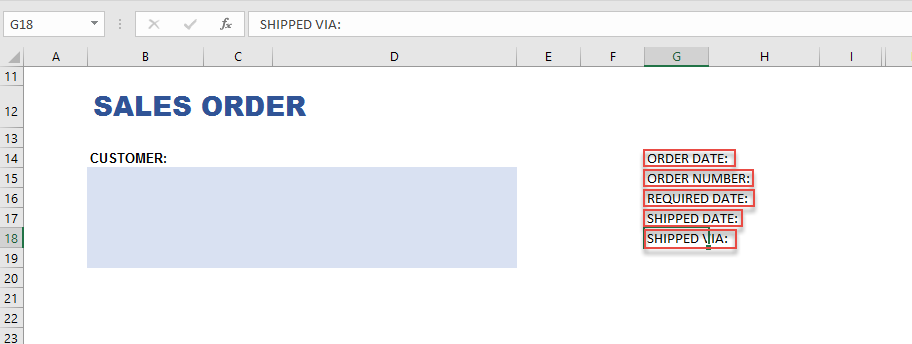

Right-align the title cells so that they don't overlap the cells to the right, where the data will be displayed.

1. Select **cells G14-G18**.
2. Toggle the right-align option.

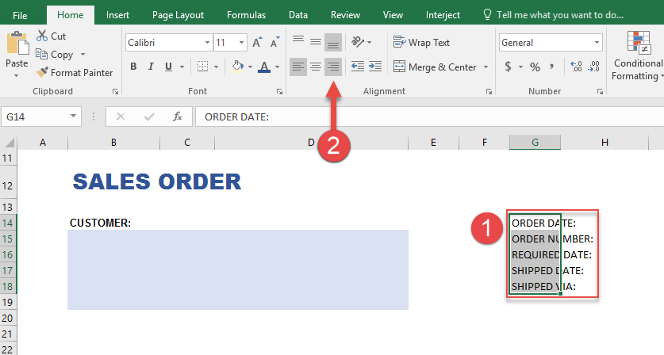

Add a background highlight color to the order number display cell so that users can see this important piece of information clearly.

1. Select cell **H15**.
2. Click the paint bucket.
3. Select the lighest orange color ().

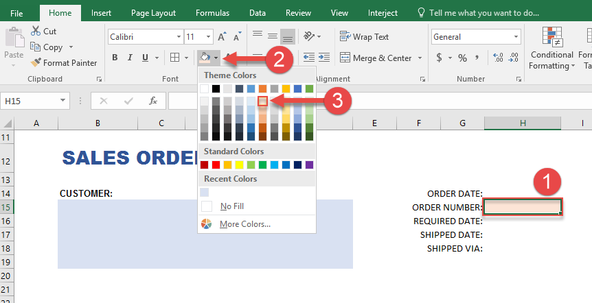

**Step 5:** Format the order contents section.

1. Select **cells B23-H23**.
2. Click the dropdown menu button next to the paint bucket icon.
3. Select the third blue color from the top ().

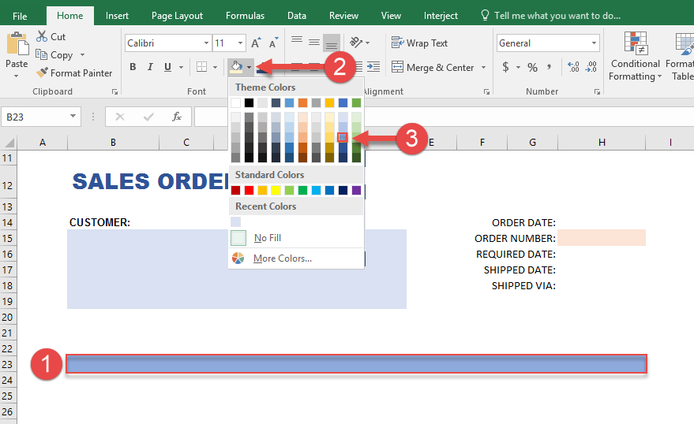

Enter **CATEGORY** into cell **B23**, **Prod #** into cell **C23**, **DESCRIPTION** into cell **D23**, **DISC** into cell **E23**, **QTY** into cell **F23**, **PRICE** into cell **G23**, and **AMOUNT** into cell **H23**.

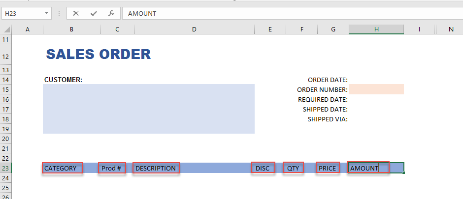

Place a border around the set of cells that makes up the main portion of of the order contents section.

1. Select **cells B23-H27**.
2. Click on the dropdown menu next to the borders button in the Home ribbon.
3. Select **Outside Borders**.

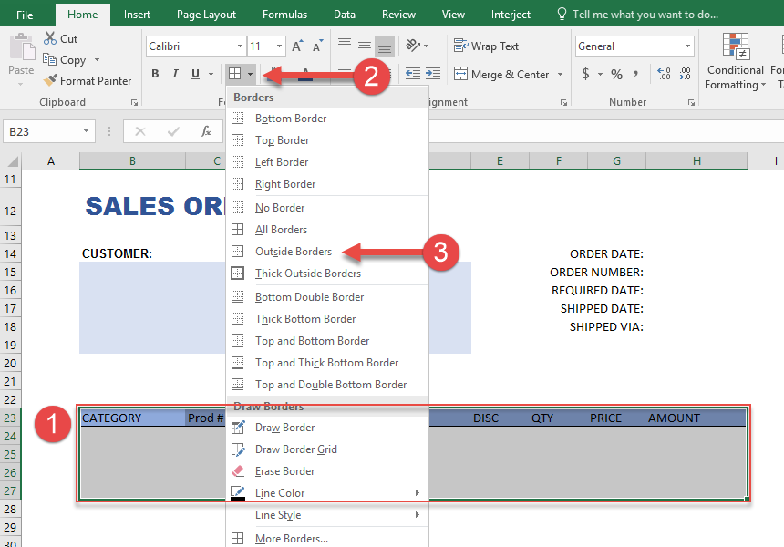

1. Click on the dropdown menu next to the borders button in the Home ribbon.
2. Select **Draw Border**.

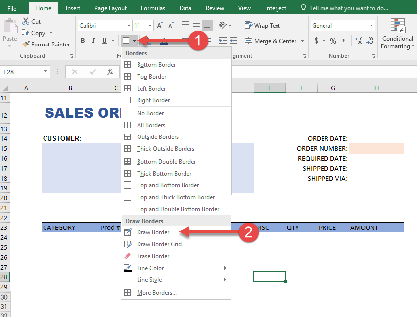

Draw the borders as shown below.

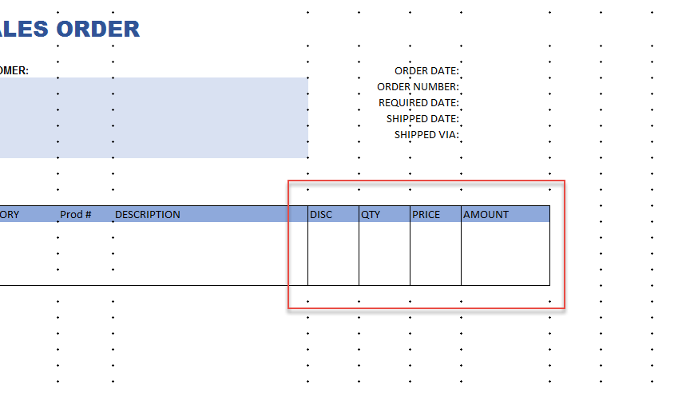

Now, format the title text for the cells.

1. Select **cells B23-H27**.
2. Enter **Arial** in the **Font** selection box.
3. Enter **10** in the **Font Size** box.
4. Select **Bold**.
5. Click on the dropdown menu next to the text color option.
6. Choose **true white**.

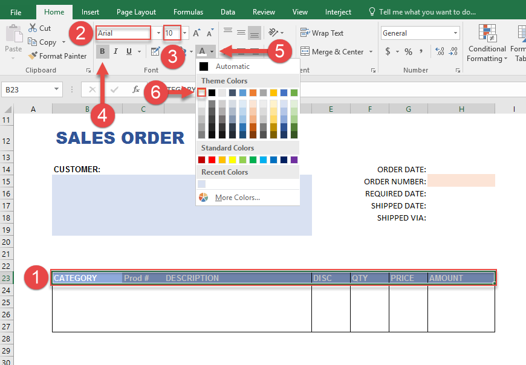

Next, add 3 more cells to the order contents section.

1. Select **cells H24-H28 and H30**.
2. Click on the dropdown menu next to the paint bucket option.
3. Select the lightest blue color ().

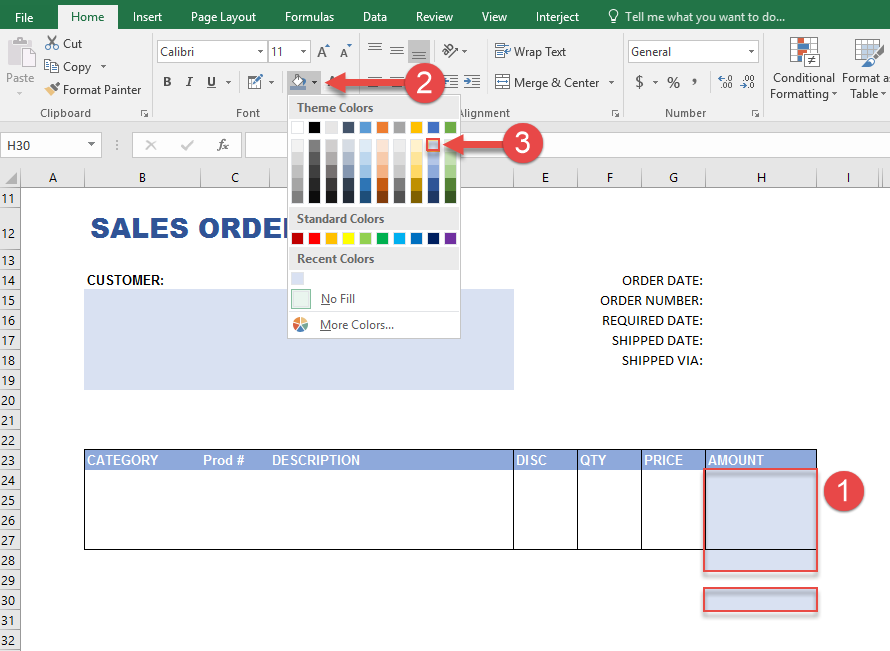

1. Select **cells H28-H30**.
2. Click on the dropdown menu next to the borders button in the Home ribbon.
3. Select **All Borders**.

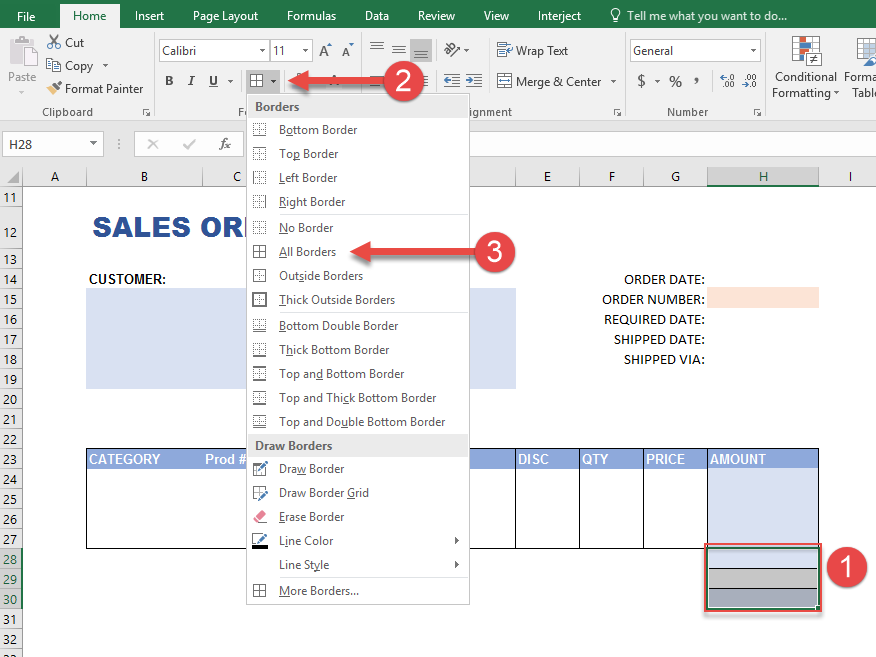

1. Enter **SUBTOTAL** into cell **G28**, **FREIGHT** into cell **G29** and **TOTAL** into cell **G30**.
2. Toggle the **Align Right** option.
3. Choose **Century Gothic** from the font list, or enter it into the input.

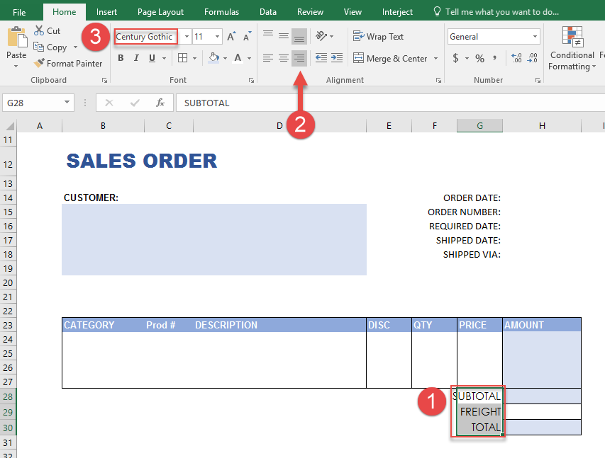

Next, you will format the output cells to represent the data type that they will contain.

Since you don't have a column definitions section for this sheet, the formatting of the first row in the TargetDataRange, row 24, will be copied down to al subsequent rows of output data. Start by formatting the first row.

Format cell **E24**, the output for DISC (discount), to display as a percentage.

1. Select cell **E24**.
2. Click the dropdown menu to the right of the format selection box in the Home ribbon.
3. Choose **Percentage**.

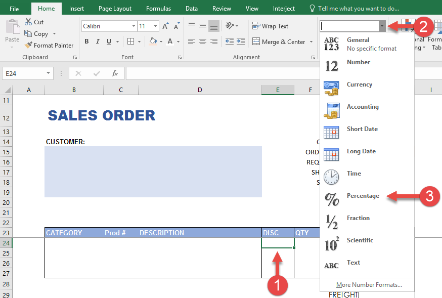

Format the QTY (quantity) cell to display as a number.

1. Select cell **F24**.
2. Click the dropdown menu to the right of the format selection box in the Home ribbon.
3. Choose **Number**.

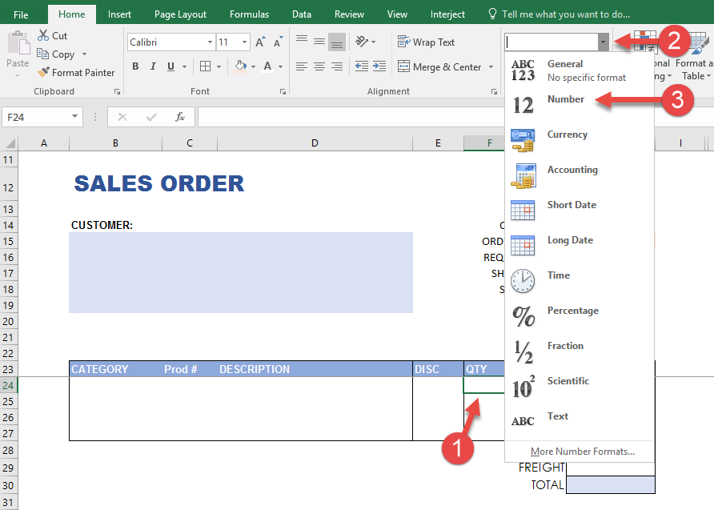

Format the PRICE and AMOUNT cells to display in the Excel Accounting format.

1. Select **cells G24 and H24**.
2. Click the dropdown menu to the right of the format selection box in the Home ribbon.
3. Choose **Accounting**.

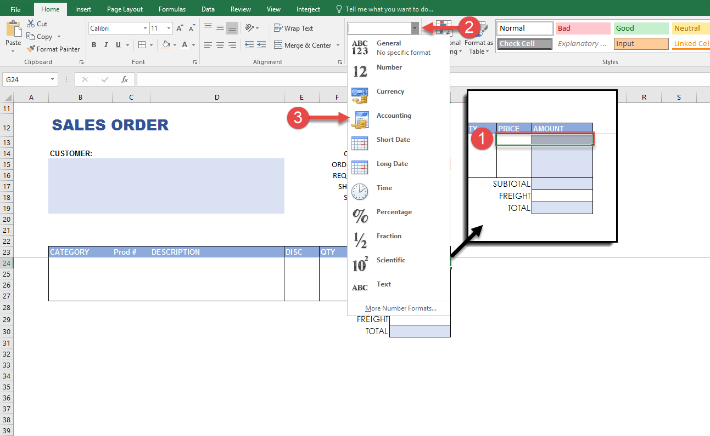

Format the totals section to display in the Excel Accounting format.

1. Select **cells H28-H30**.
2. Click the dropdown menu to the right of the format selection box in the Home ribbon.
3. Choose **Accounting**.

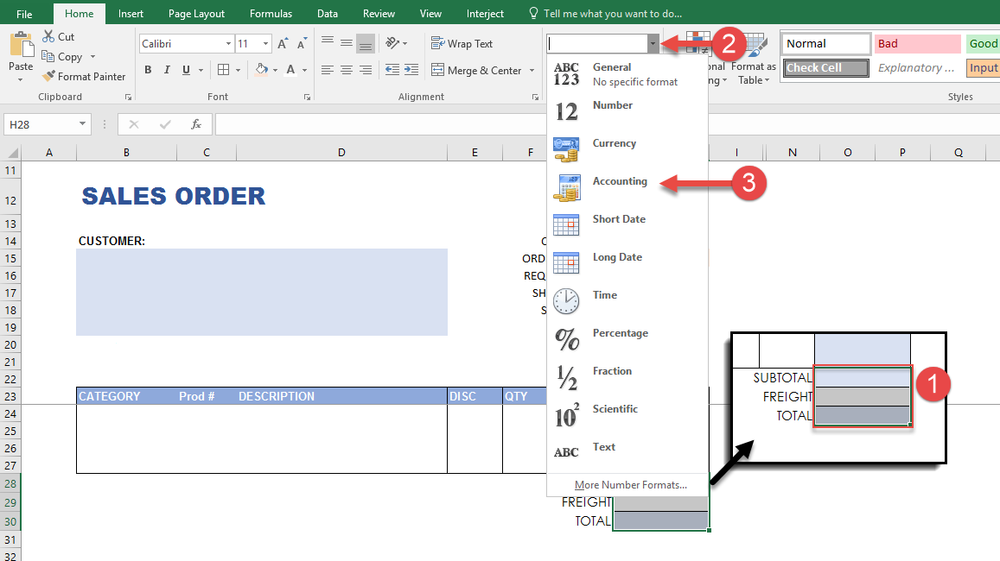

Apply the Century Gothic font to all output cells.
<!-- make hideable -->
How to multi-select groups of cells: select the first group, hold down CTRL, then drag a box around the next group of cells to select with the mouse.

1. Select cells:
    * **B15-D19**,
    * **H14-H19**,
    * **B24-H27**,
    * and **H28-H30**.
2. Type **Century Gothic** into the text selection box.

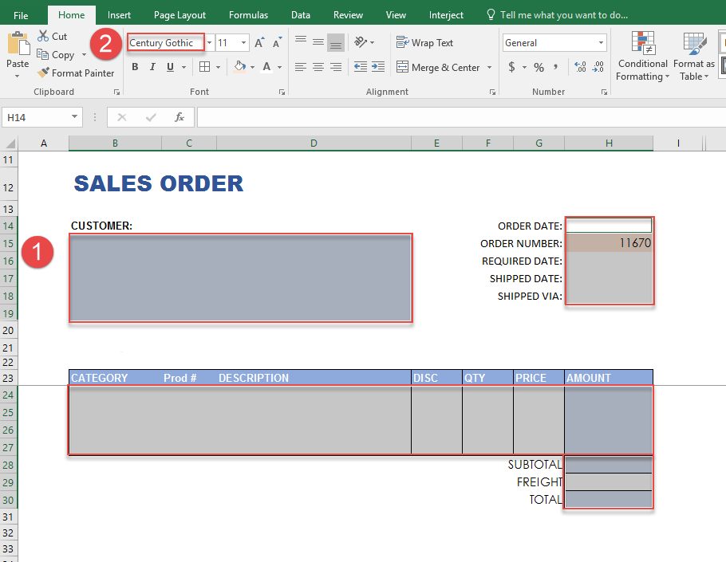

#### 11.5 - Adding ReportRange() to the Sheet

**Step 1:** Unfreeze panes.

Unfreeze the panes so that you can work on the Worksheet Definitions Area.

1. Press **CTRL + SHIFT + T** OR click on the **Quick Tools** menu in the INTERJECT ribbon.
2. Select **Freeze/UnFreeze Panes (current tab)**.
3. Press **ENTER** OR click on **Run and Close**.

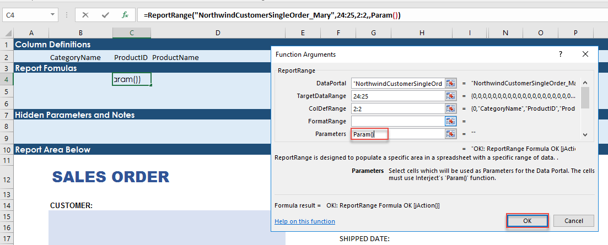

1. Type **=ReportRange()** into cell **C4**.
2. Click on the function builder.

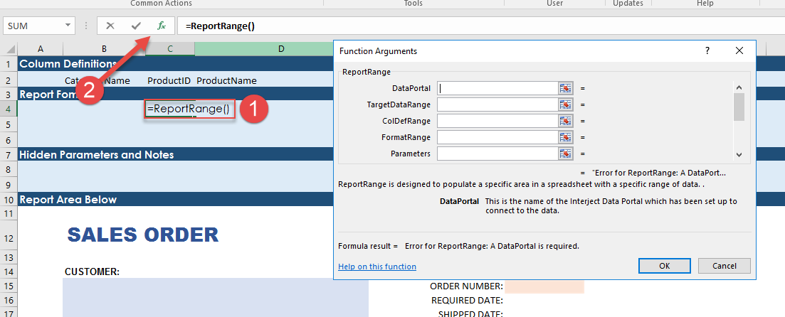

For the **DataPortal** argument, enter the name of the Data Portal you created for SalesOrder, **"NorthwindCustomerSingleOrder_MyName"**.

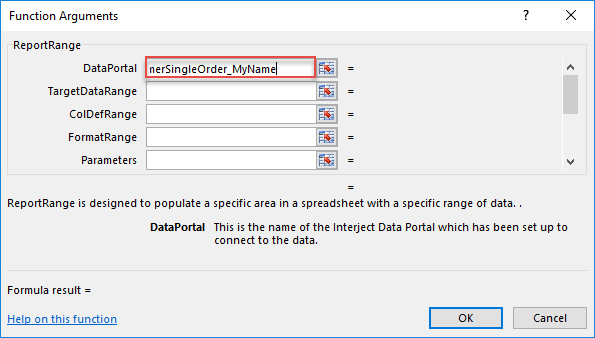

For the **TargetDataRange** argument, enter **24:25**.
<!-- read more -->
This instructs ReportRange() to insert data records between rows 24 and 25, creating new rows as necessary to fit the number of records. Keep in mind that, since this sheet has no formatting range, the formatting of the first row in the TargetDataRange gets copied to all subsequent rows. In this case, this copies the side-borders down nicely to preserve the box around the data. This will also keep a padding of 3 rows below any data inserted between.

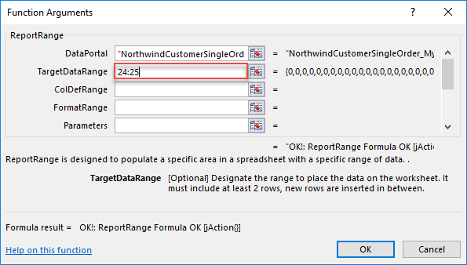

For the **ColDefRange**, enter **2:2**, where the Column Definition section is on the sheet.

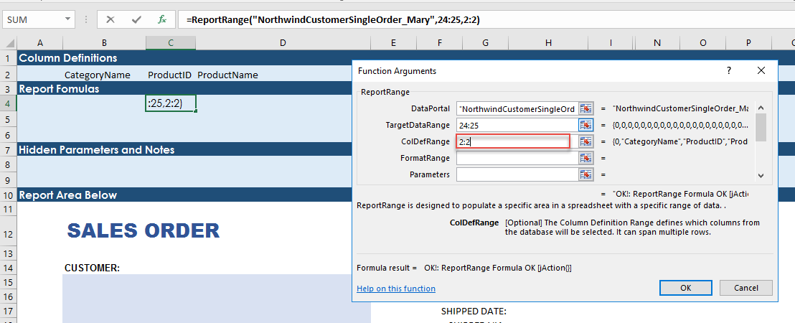

In **Parameters**, enter **Param()** then click **OK** to close the window.
<!-- move this to definitions section? -->
Entering Param() calls the INTERJECT Param() helper function to which you will provide the actual parameter cells to. Param() concatenates all of the cell names provided to it with the correct delimiting characters in the way that the Data Function (ReportRange() in this case) accepts. Read more about [helper function]() [Param()]().

All input and output parameters to the Data Portal and stored procedure that end up on the spreadsheet must be reported to the Parameters argument of the Data Function (ReportRange() here). This is because the Data Function must know where to place the output cells or which cells to receive input from inside the spreadsheet.

Take note that the order in which you are being instructed to enter the cell values into Param() here is significant, because it must match the order that the Formula Parameters were entered into the Data Portal and the order of parameters given to the SQL stored procedure. The Data Portal knows which parameters are which *only* based on the order in which they are passed to the Data Portal. This means that if parameters are passed in the wrong order from the spreadsheet, this will pass the wrong values into the Data Portal and the names in the Data Portal will refer to different values than intended.

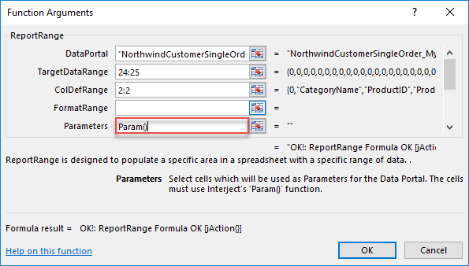

In order to provide Param() with its arguments, you must open the function builder on Param() within ReportRange().

1. Click inside cell **C4**.
2. Position the cursor on the word **Param**.
3. Click on the **Function Builder**.

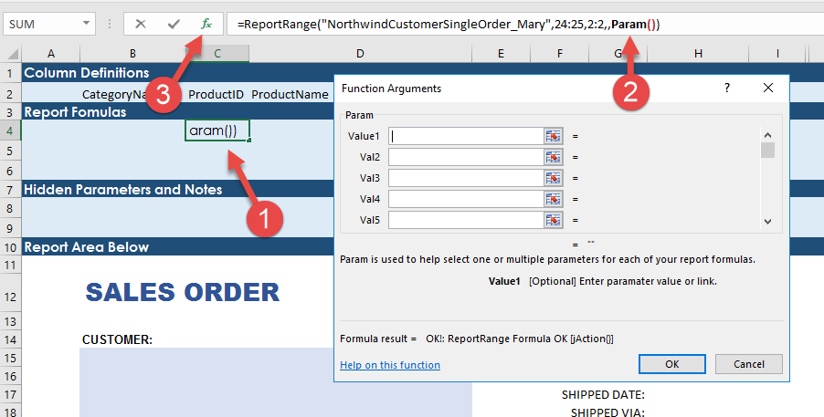

Provide the first 5 cell values to Param()s arguments.

Enter the following:
* Into **Value1**, enter **H15**.
* Into **Val2**, enter **K14**.
* Into **Val3**, enter **B15**.
* Into **Val4**, enter **B16**.
* Into **Val5**, enter **B17**.

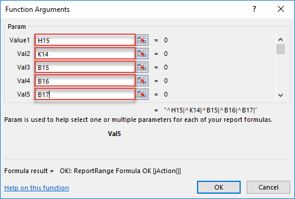

Enter the following:
* Into **Val6**, enter **K17**.
* Into **Val7**, enter **K18**.
* Into **Val8**, enter **K19**.
* Into **Val9**, enter **K15**.
* Into **Val10**, enter **K16**.

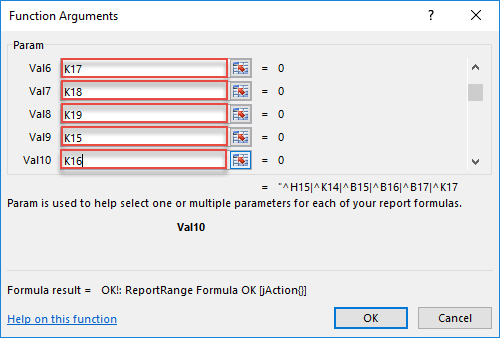

Provide the last 5 arguments to Param().

Enter the following:
* Into **Val11**, enter **H14**.
* Into **Val12**, enter **H16**.
* Into **Val13**, enter **H17**.
* Into **Val14**, enter **H18**.
* Into **Val15**, enter **H32**.

Save by pressing **OK**.

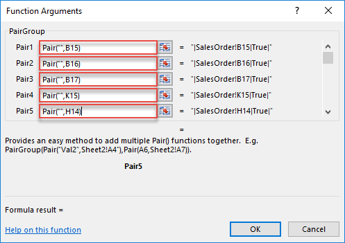

Add the last 2 arguments to ReportRange().

1. Click in cell **C4**.
2. Position the cursor in the word ReportRange.
3. Click the **Function Builder**.
4. For **UseEntireRow**, enter **TRUE**.
5. For **PutFieldNamesAtTop**, enter **FALSE**.
6. Press **OK** to save.

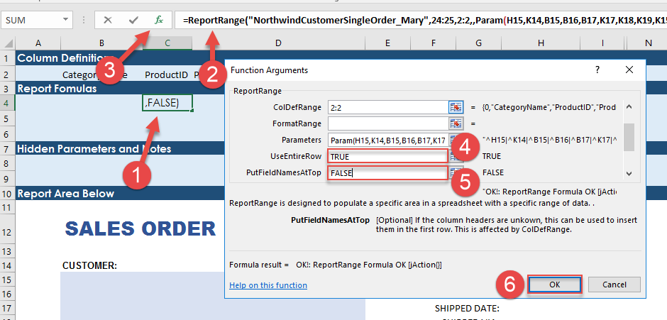

#### 11.6 - Adding ReportDefaults() to the Sheet

As in CustomerOrderHistory, you will use ReportDefaults() to clear the outputs and some of the inputs from the sheet on a PULL-CLEAR action.

1. Type **=ReportDefaults()** into cell **C5**.
2. Click on the **Function Builder** icon.

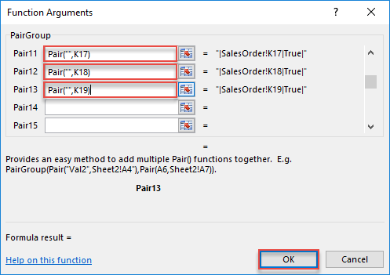

Provide the necessary arguments to ReportDefaults().

Enter the following into the arguments:
* Into **OnPullSaveOrBoth**, enter **"Pull"**.
* Into **OnClearRunOrBoth**, enter **"Clear"**.
* Into **TransferPairs**, enter **PairGroup()**.

Press **OK** to save.

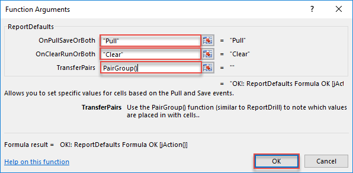

Open the Function Builder for PairGroup().

1. Click inside cell **C5**.
2. Position the cursor on the word **PairGroup**.
3. Click on the **Function Builder** icon.

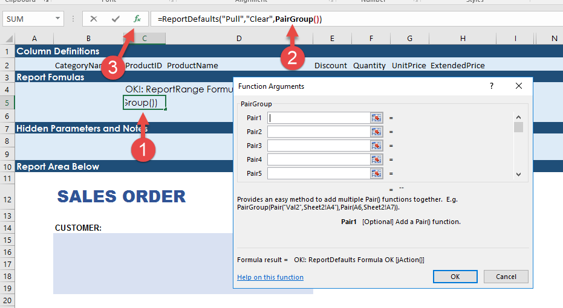

(Hint: you can make the typing that follows easier by copy-pasting **Pair("",B15)** into each block of 5 Pair parameters and then modifying each to have the correct cell address.)

Enter the following arguments for PairGroup():
* In **Pair1**, enter **Pair("",B15)**.
* In **Pair2**, enter **Pair("",B16)**.
* In **Pair3**, enter **Pair("",B17)**.
* In **Pair4**, enter **Pair("",K15)**.
* In **Pair5**, enter **Pair("",H14)**.


Scroll down to **Pair6** and enter the following arguments:
* In **Pair6**, enter **Pair("",H15)**.
* In **Pair7**, enter **Pair("",H16)**.
* In **Pair8**, enter **Pair("",H17)**.
* In **Pair9**, enter **Pair("",H18)**.
* In **Pair10**, enter **Pair("",K16)**.

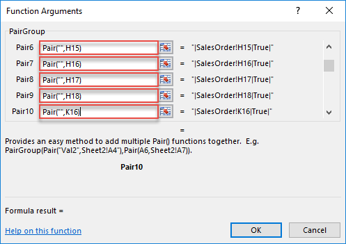

Scroll down to **Pair11** and enter the following arguments:
* In **Pair11**, enter **Pair("",K17)**.
* In **Pair12**, enter **Pair("",K18)**.
* In **Pair13**, enter **Pair("",K19)**.

Click **OK** to save.


You have now configured the ReportDefaults() function for the SalesOrder report.

#### 11.7 - Setting the Focused Cell with jFocus()

In this subsection you will set the Excel active focused cell for the sheet. Set the active cell to the OrderID cell, since this should be highlighted to the user as it is the value which was drilled on.

1. Type **=jFocus()** into cell **G5**.
2. Click on the function builder.
3. Into the **Target** argument, type **H15**.
4. Click **OK** to save.

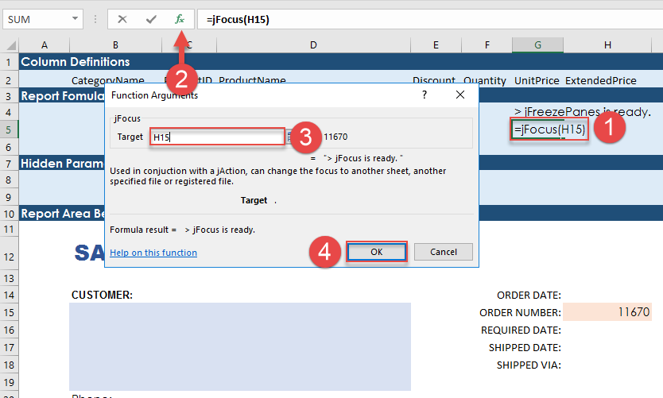


#### 11.8 - Final Formatting of the Report Area

Now that you have finished the Worksheet Definitions Area and set up the necessary Report Formulas, you can finish some final touch-ups in the Report Area which require referencing cells in the Column Definitions.

Start by adding customer Phone and Fax display cells in the "customer info" section of the report.

In cell **B20**, type **="Phone: " & K15**. This combines the label "Phone: " with the phone number value placed into cell K15 by ReportRange().

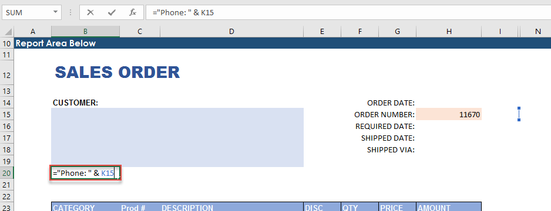

In cell **B21**, type **="Fax: " & K16** to do the same for Fax number.

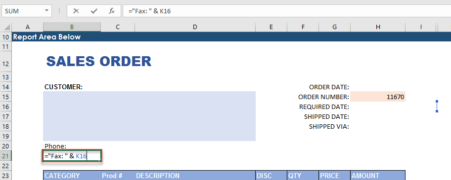

Lastly, change the font of these two cells to Century Gothic.

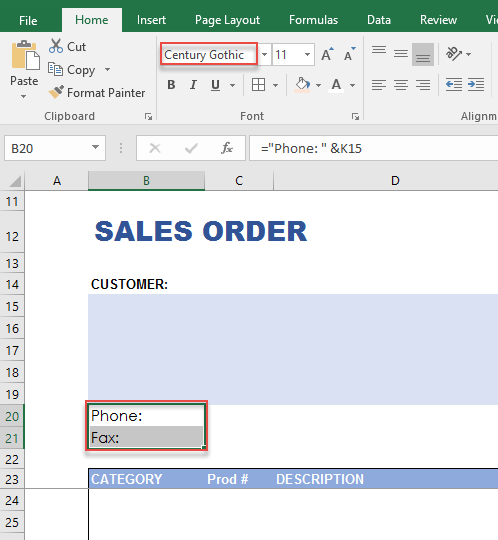

You have now finished the standalone SalesOrder spreadsheet.

## Section 12: Connecting CustomerOrderHistory and SalesOrder with ReportDrill()

#### Introduction

This section will walk you through setting up the DRILL between the two spreadsheets previously created. After this section, you will have finished the report.

*In this section:*

##### [12.1 - Setting up the ReportDrill() Formula](#121---setting-up-the-reportdrill-formula-1)
##### [12.2 - Testing ReportDrill()](#122---testing-reportdrill-1)
##### [12.3 -  Adding a "Return from Drill" Hyperlink](#123---adding-a-return-from-drill-hyperlink-1)

#### 12.1 - Setting up the ReportDrill() Formula

**Step 1:** Add the formula to the CustomerOrderHistory sheet.

1. Type **=ReportDefaults()** into cell **C12**.
2. Click on the function builder icon.

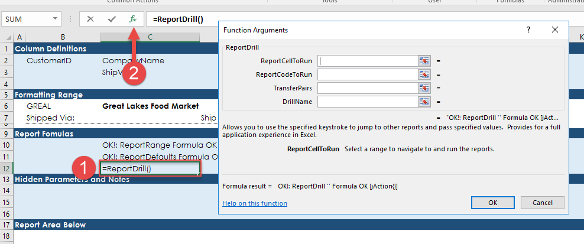

**Step 2:** Provide the function arguments to ReportDrill().

The first argument to provide is the cell address of the data function to run on SalesOrder.

Type **SalesOrder!C4** into the **ReportCellToRun** argument.

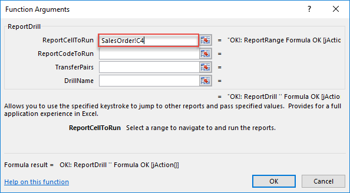

The next argument you need is TransferPairs, which tells ReportDrill() which range of cells can be transferred from CustomerOrderHistory to SalesOrder.

Type **PairGroup(Pair())** into the **TransferPairs** argument to set up one Pair() function. You will fill in the input to the Pair() function shortly.

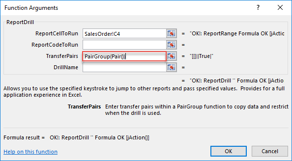

For **DrillName**, enter **"Open Order Page"** then press **OK** to close the window.

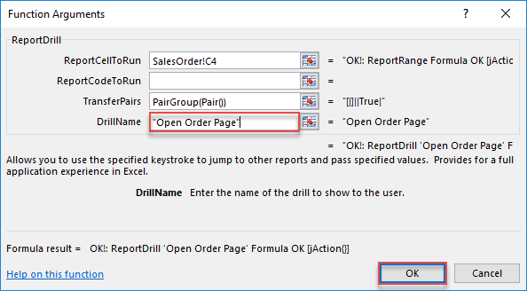

1. Click on cell **C12**.
2. Click inside the word **Pair**.
3. Click on the function builder.

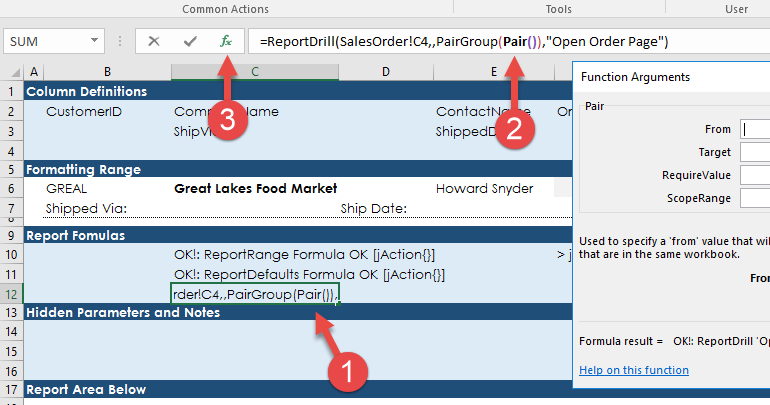

Enter **F27:F28** into the **From** argument to specify that the cell being drilled on must be in column F (where OrderID is) of the TargetDataRange in CustomerOrderHistory.

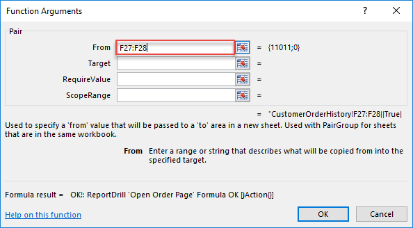

Enter **SalesOrder!H15** into the **Target** argument to specify where the OrderID drilled on will be placed in the SalesOrder sheet.

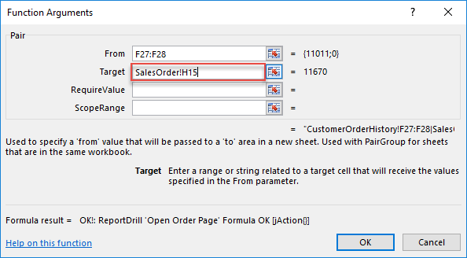

Lastly, enter **TRUE** into the **RequireValue** argument then press **OK** to save.

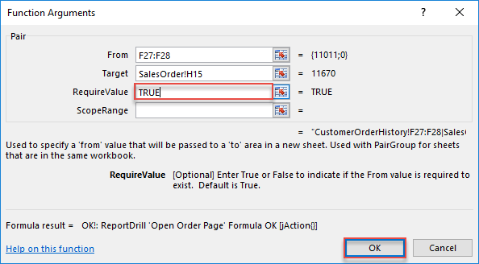

#### 12.2 - Testing ReportDrill()

To test ReportDrill(), you can use the INTERJECT DRILL command.

1. Select one of the **OrderID** cells in column F.
2. Click on the **DRILL on Data** button in the INTERJECT ribbon OR press **CTRL + SHIFT + K** on your keyboard.
3. Click **Do Drill** OR press **ENTER** on your keyboard.

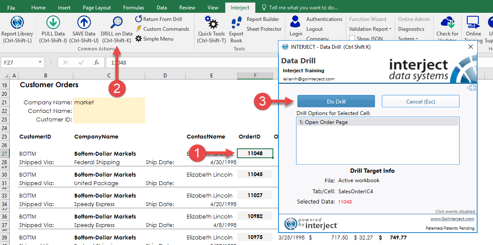

The SalesOrder sheet should now open, and pull data for OrderID = 11011.

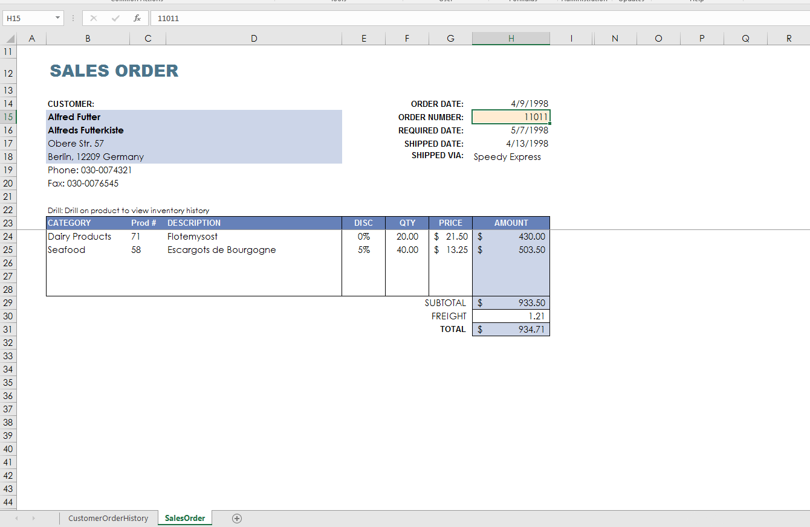

#### 12.3 -  Adding a "Return from Drill" Hyperlink

Hyperlinks can be used with DRILLs either to drill on a specific item or to return from the drill sheet back to the main sheet. In this case, you will create a hyperlink on the SalesOrder page that takes the user back to the CustomerOrderHistory sheet.

**Step 1:** Add the hyperlink text.

Type **Return from Drill** into cell **H12** and then press **ENTER** on your keyboard.

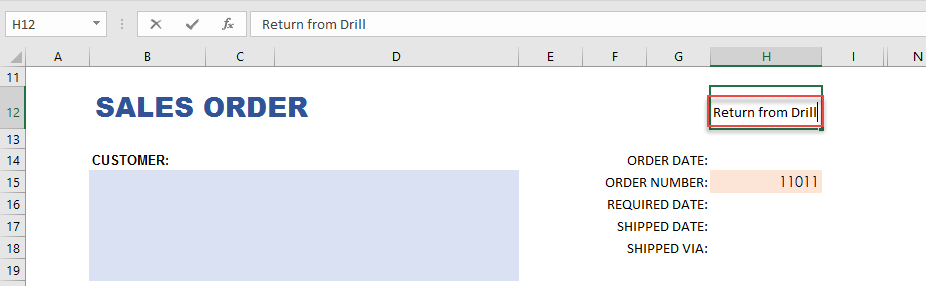

1. Right-click on the cell after entering the text.
2. Select **Hyperlink** or **Link**, depending on your version on Excel, from the menu.

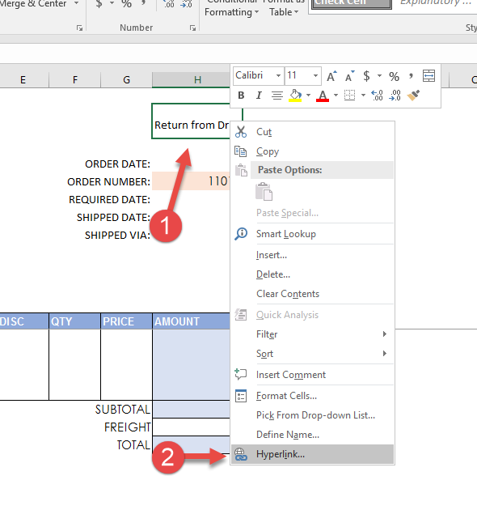

In the window that pops up, do the following.

1. Select **Place in This Document**.
2. Type **H12** into the **Type the cell reference** input field.
3. Click on the **ScreenTip** button.
4. Type **Interject Return from Drill** into the **ScreenTip text** field, then click **OK** to save.

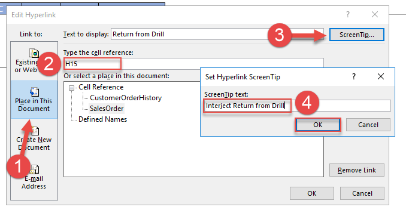

The hyperlink uses the ReportDrill() function to direct back to the CustomerOrderHistory sheet.

Test the hyperlink by doing the following.

Click on the hyperlink.


You should now be taken back to the CustomerOrderHistory sheet.

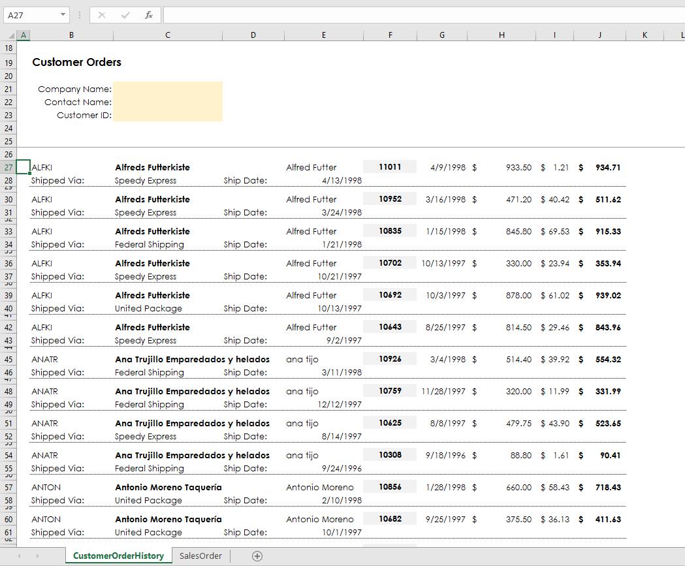

## Conclusion

Congratulations! You have now finished the walkthrough and have created a fully functional INTERJECT report.
